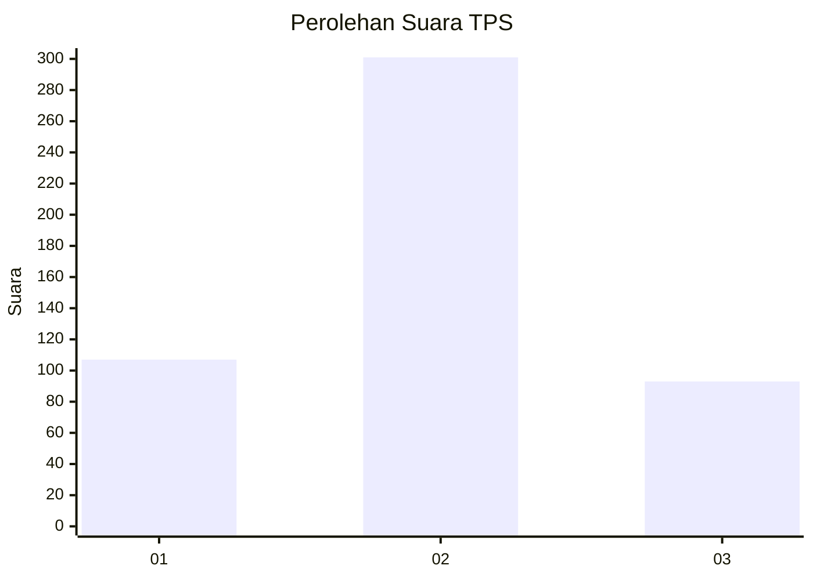
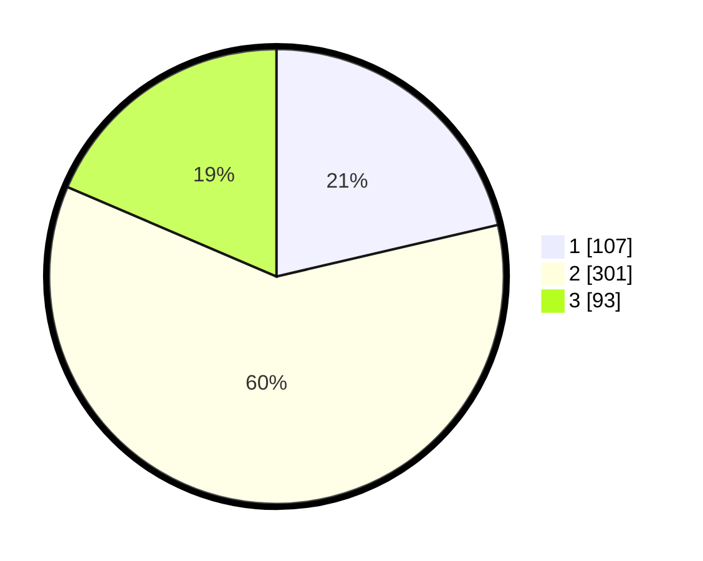

# Hasil

## Grafik

## Tabel

| No. | Nama Paslon    | Suara | Suara (raw) | Persentase |
|:--- |:-------------- | -----:| -----------:| ----------:|
| 1   | ANIES MUHAIMIN | 107   | [107][p-1]  | 21,36      |
| 2   | PRABOWO GIBRAN | 301   | [301][p-2]  | 60,08      |
| 3   | GANJAR MAHFUD  | 93    | [93][p-3]   | 18,56      |

[p-1]: https://github.com/gigit-pemilu/pemilu-2024-99-luar-negeri/blob/main/pilpres/hitung-suara/sub/99-luar-negeri/sub/12-bandar-seri-begawan-brunei-darussalam/sub/01-bandar-seri-begawan-brunei-darussalam/sub/0001-bandar-seri-begawan-brunei-darussalam/sub/013-tps-012/sub/paslon-1.txt
[p-2]: https://github.com/gigit-pemilu/pemilu-2024-99-luar-negeri/blob/main/pilpres/hitung-suara/sub/99-luar-negeri/sub/12-bandar-seri-begawan-brunei-darussalam/sub/01-bandar-seri-begawan-brunei-darussalam/sub/0001-bandar-seri-begawan-brunei-darussalam/sub/013-tps-012/sub/paslon-2.txt
[p-3]: https://github.com/gigit-pemilu/pemilu-2024-99-luar-negeri/blob/main/pilpres/hitung-suara/sub/99-luar-negeri/sub/12-bandar-seri-begawan-brunei-darussalam/sub/01-bandar-seri-begawan-brunei-darussalam/sub/0001-bandar-seri-begawan-brunei-darussalam/sub/013-tps-012/sub/paslon-3.txt

## Foto C Plano

https://sirekap-obj-formc.kpu.go.id/8fe6/pemilu/ppwp/99/12/01/00/01/9912010001013-20240218-104034--b076bd76-c828-4ed5-9a24-3e9111ff63d5.jpg

https://sirekap-obj-formc.kpu.go.id/8fe6/pemilu/ppwp/99/12/01/00/01/9912010001013-20240214-213816--7eb66691-2e89-46a0-ae6e-338ba083a0da.jpg

https://sirekap-obj-formc.kpu.go.id/8fe6/pemilu/ppwp/99/12/01/00/01/9912010001013-20240214-214040--63f34e6d-704d-4359-acb8-d3d92f750665.jpg

## Metadata

| Key        | Value               |
| ---------- | ------------------- |
| Time Stamp | 2024-02-19 06:16:00 |

## DATA PEMILIH TETAP

Jumlah pemilih dalam DPT: **1225**.
 * L: **786**.
 * P: **439**.

## DATA PENGGUNA HAK PILIH

Jumlah pengguna hak pilih dalam DPT: **292**.
 * L: **206**.
 * P: **86**.

Jumlah pengguna hak pilih dalam DPTb: **40**.
 * L: **34**.
 * P: **6**.

Jumlah pengguna hak pilih dalam DPK: **172**.
 * L: **121**.
 * P: **51**.

Jumlah pengguna hak pilih: **504**.
 * L: **361**.
 * P: **143**.

## JUMLAH SUARA SAH DAN TIDAK SAH

JUMLAH SELURUH SUARA SAH: **501**.

JUMLAH SUARA TIDAK SAH: **3**.

JUMLAH SELURUH SUARA SAH DAN SUARA TIDAK SAH: **504**.

