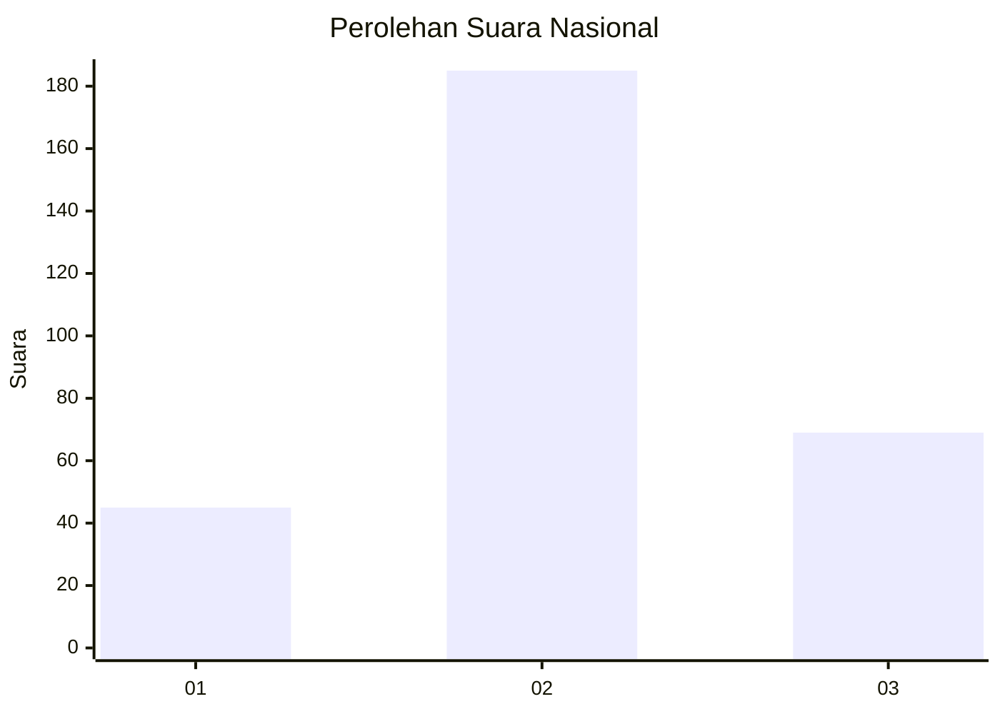
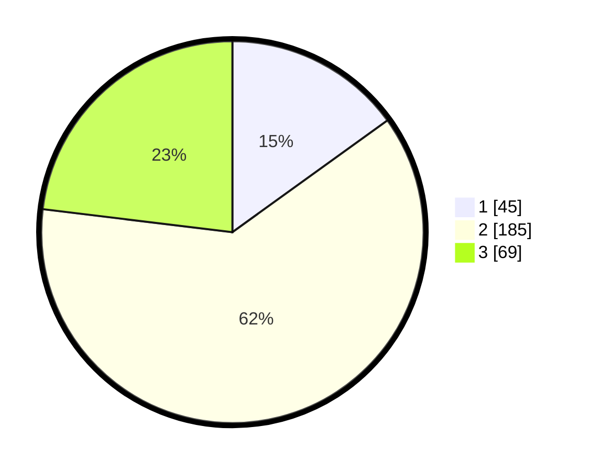

# Hasil

## Grafik

## Tabel

| No. | Nama Paslon    | Suara | Suara (raw) | Persentase |
|:--- |:-------------- | -----:| -----------:| ----------:|
| 1   | ANIES MUHAIMIN | 45    | [45][p-1]   | 15,05      |
| 2   | PRABOWO GIBRAN | 185   | [185][p-2]  | 61,87      |
| 3   | GANJAR MAHFUD  | 69    | [69][p-3]   | 23,08      |

[p-1]: https://github.com/gigit-pemilu/pemilu-2024/blob/main/pilpres/hitung-suara/sub/99-luar-negeri/sub/12-bandar-seri-begawan-brunei-darussalam/sub/01-bandar-seri-begawan-brunei-darussalam/sub/0001-bandar-seri-begawan-brunei-darussalam/sub/015-tps-014/sub/paslon-1.txt
[p-2]: https://github.com/gigit-pemilu/pemilu-2024/blob/main/pilpres/hitung-suara/sub/99-luar-negeri/sub/12-bandar-seri-begawan-brunei-darussalam/sub/01-bandar-seri-begawan-brunei-darussalam/sub/0001-bandar-seri-begawan-brunei-darussalam/sub/015-tps-014/sub/paslon-2.txt
[p-3]: https://github.com/gigit-pemilu/pemilu-2024/blob/main/pilpres/hitung-suara/sub/99-luar-negeri/sub/12-bandar-seri-begawan-brunei-darussalam/sub/01-bandar-seri-begawan-brunei-darussalam/sub/0001-bandar-seri-begawan-brunei-darussalam/sub/015-tps-014/sub/paslon-3.txt

## Foto C Plano

https://sirekap-obj-formc.kpu.go.id/768e/pemilu/ppwp/99/12/01/00/01/9912010001015-20240214-192636--41087695-26e7-4c5c-962d-c92421212ed3.jpg

https://sirekap-obj-formc.kpu.go.id/768e/pemilu/ppwp/99/12/01/00/01/9912010001015-20240214-193052--3f16b3bd-b4fe-44d8-81d2-e678a17e5cad.jpg

https://sirekap-obj-formc.kpu.go.id/768e/pemilu/ppwp/99/12/01/00/01/9912010001015-20240214-193310--4c3f0d4b-4cd0-48ed-a781-ab13b8bd1a57.jpg

## Metadata

| Key        | Value               |
| ---------- | ------------------- |
| Time Stamp | 2024-02-15 17:30:25 |

## DATA PEMILIH TETAP

Jumlah pemilih dalam DPT: **835**.
 * L: **680**.
 * P: **155**.

## DATA PENGGUNA HAK PILIH

Jumlah pengguna hak pilih dalam DPT: **211**.
 * L: **175**.
 * P: **36**.

Jumlah pengguna hak pilih dalam DPTb: **48**.
 * L: **38**.
 * P: **10**.

Jumlah pengguna hak pilih dalam DPK: **45**.
 * L: **34**.
 * P: **11**.

Jumlah pengguna hak pilih: **304**.
 * L: **247**.
 * P: **57**.

## JUMLAH SUARA SAH DAN TIDAK SAH

JUMLAH SELURUH SUARA SAH: **299**.

JUMLAH SUARA TIDAK SAH: **5**.

JUMLAH SELURUH SUARA SAH DAN SUARA TIDAK SAH: **304**.

