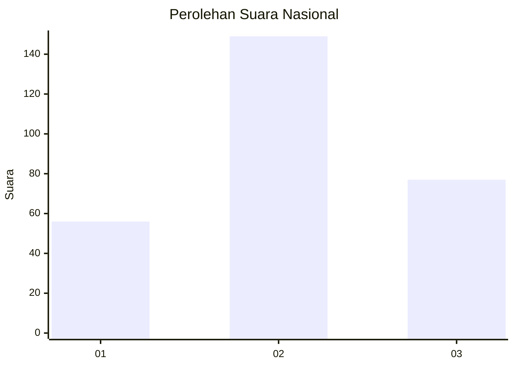
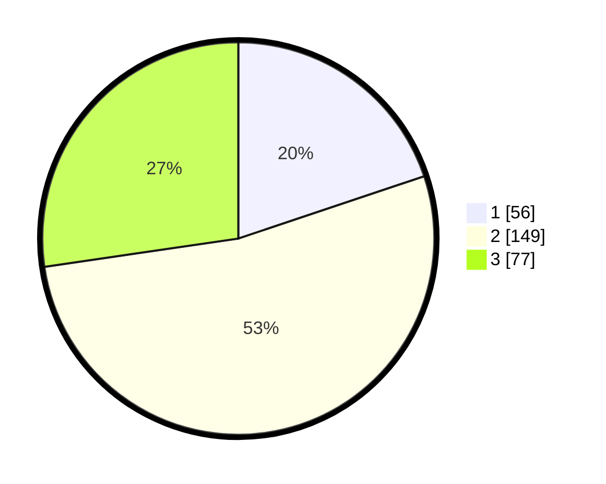

# Hasil

## Grafik

## Tabel

| No. | Nama Paslon    | Suara | Suara (raw) | Persentase |
|:--- |:-------------- | -----:| -----------:| ----------:|
| 1   | ANIES MUHAIMIN | 56    | [56][p-1]   | 19,86      |
| 2   | PRABOWO GIBRAN | 149   | [149][p-2]  | 52,84      |
| 3   | GANJAR MAHFUD  | 77    | [77][p-3]   | 27,30      |

[p-1]: https://github.com/gigit-pemilu/pemilu-2024/blob/main/pilpres/hitung-suara/sub/99-luar-negeri/sub/12-bandar-seri-begawan-brunei-darussalam/sub/01-bandar-seri-begawan-brunei-darussalam/sub/0001-bandar-seri-begawan-brunei-darussalam/sub/016-tps-015/sub/paslon-1.txt
[p-2]: https://github.com/gigit-pemilu/pemilu-2024/blob/main/pilpres/hitung-suara/sub/99-luar-negeri/sub/12-bandar-seri-begawan-brunei-darussalam/sub/01-bandar-seri-begawan-brunei-darussalam/sub/0001-bandar-seri-begawan-brunei-darussalam/sub/016-tps-015/sub/paslon-2.txt
[p-3]: https://github.com/gigit-pemilu/pemilu-2024/blob/main/pilpres/hitung-suara/sub/99-luar-negeri/sub/12-bandar-seri-begawan-brunei-darussalam/sub/01-bandar-seri-begawan-brunei-darussalam/sub/0001-bandar-seri-begawan-brunei-darussalam/sub/016-tps-015/sub/paslon-3.txt

## Foto C Plano

https://sirekap-obj-formc.kpu.go.id/4794/pemilu/ppwp/99/12/01/00/01/9912010001016-20240214-200935--2e07c971-3835-45ba-8a0c-4c415424b44f.jpg

https://sirekap-obj-formc.kpu.go.id/4794/pemilu/ppwp/99/12/01/00/01/9912010001016-20240214-201148--22c1ddf8-bcd7-4273-963c-2fc402cc3cca.jpg

https://sirekap-obj-formc.kpu.go.id/4794/pemilu/ppwp/99/12/01/00/01/9912010001016-20240214-202858--22eb039c-93c8-46da-96f0-5a8cf2496924.jpg

## Metadata

| Key        | Value               |
| ---------- | ------------------- |
| Time Stamp | 2024-02-14 21:46:01 |

## DATA PEMILIH TETAP

Jumlah pemilih dalam DPT: **686**.
 * L: **480**.
 * P: **206**.

## DATA PENGGUNA HAK PILIH

Jumlah pengguna hak pilih dalam DPT: **153**.
 * L: **117**.
 * P: **36**.

Jumlah pengguna hak pilih dalam DPTb: **42**.
 * L: **31**.
 * P: **11**.

Jumlah pengguna hak pilih dalam DPK: **88**.
 * L: **64**.
 * P: **24**.

Jumlah pengguna hak pilih: **283**.
 * L: **212**.
 * P: **71**.

## JUMLAH SUARA SAH DAN TIDAK SAH

JUMLAH SELURUH SUARA SAH: **282**.

JUMLAH SUARA TIDAK SAH: **1**.

JUMLAH SELURUH SUARA SAH DAN SUARA TIDAK SAH: **283**.

