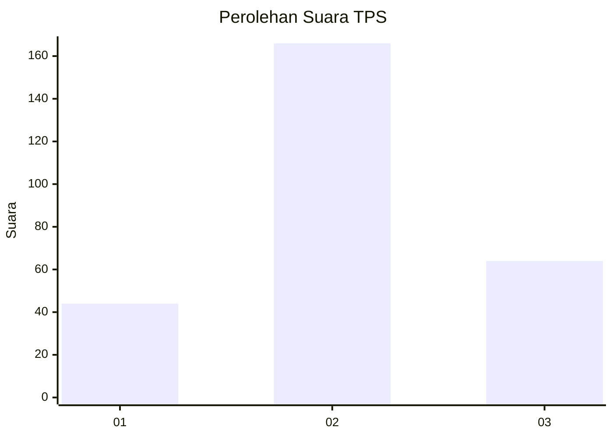
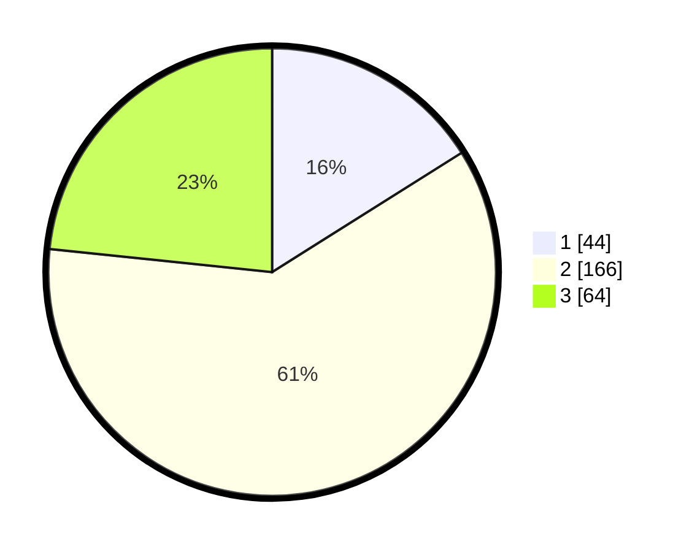

# Hasil

## Grafik

## Tabel

| No. | Nama Paslon    | Suara | Suara (raw) | Persentase |
|:--- |:-------------- | -----:| -----------:| ----------:|
| 1   | ANIES MUHAIMIN | 44    | [44][p-1]   | 16,06      |
| 2   | PRABOWO GIBRAN | 166   | [166][p-2]  | 60,58      |
| 3   | GANJAR MAHFUD  | 64    | [64][p-3]   | 23,36      |

[p-1]: https://github.com/gigit-pemilu/pemilu-2024-99-luar-negeri/blob/main/pilpres/hitung-suara/sub/99-luar-negeri/sub/12-bandar-seri-begawan-brunei-darussalam/sub/01-bandar-seri-begawan-brunei-darussalam/sub/0001-bandar-seri-begawan-brunei-darussalam/sub/019-tps-018/sub/paslon-1.txt
[p-2]: https://github.com/gigit-pemilu/pemilu-2024-99-luar-negeri/blob/main/pilpres/hitung-suara/sub/99-luar-negeri/sub/12-bandar-seri-begawan-brunei-darussalam/sub/01-bandar-seri-begawan-brunei-darussalam/sub/0001-bandar-seri-begawan-brunei-darussalam/sub/019-tps-018/sub/paslon-2.txt
[p-3]: https://github.com/gigit-pemilu/pemilu-2024-99-luar-negeri/blob/main/pilpres/hitung-suara/sub/99-luar-negeri/sub/12-bandar-seri-begawan-brunei-darussalam/sub/01-bandar-seri-begawan-brunei-darussalam/sub/0001-bandar-seri-begawan-brunei-darussalam/sub/019-tps-018/sub/paslon-3.txt

## Foto C Plano

https://sirekap-obj-formc.kpu.go.id/3159/pemilu/ppwp/99/12/01/00/01/9912010001019-20240214-205508--088852a3-8cd8-4ff7-ad6a-40c5b85ce575.jpg

https://sirekap-obj-formc.kpu.go.id/3159/pemilu/ppwp/99/12/01/00/01/9912010001019-20240214-205332--3a61dc7d-e2e5-48a1-a7f2-b5b0241df937.jpg

https://sirekap-obj-formc.kpu.go.id/3159/pemilu/ppwp/99/12/01/00/01/9912010001019-20240214-205310--c0b19619-b384-4729-85e2-1a3234a6e0c4.jpg

## Metadata

| Key        | Value               |
| ---------- | ------------------- |
| Time Stamp | 2024-02-15 15:00:29 |

## DATA PEMILIH TETAP

Jumlah pemilih dalam DPT: **809**.
 * L: **602**.
 * P: **207**.

## DATA PENGGUNA HAK PILIH

Jumlah pengguna hak pilih dalam DPT: **181**.
 * L: **140**.
 * P: **41**.

Jumlah pengguna hak pilih dalam DPTb: **47**.
 * L: **37**.
 * P: **10**.

Jumlah pengguna hak pilih dalam DPK: **46**.
 * L: **40**.
 * P: **6**.

Jumlah pengguna hak pilih: **274**.
 * L: **217**.
 * P: **57**.

## JUMLAH SUARA SAH DAN TIDAK SAH

JUMLAH SELURUH SUARA SAH: **274**.

JUMLAH SUARA TIDAK SAH: **0**.

JUMLAH SELURUH SUARA SAH DAN SUARA TIDAK SAH: **274**.

