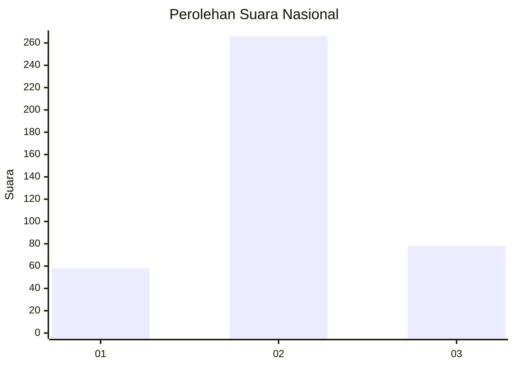
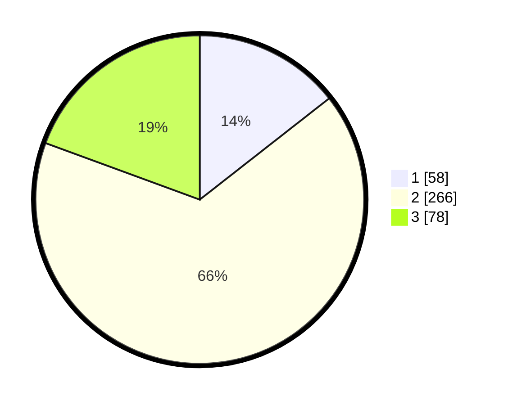

# Hasil

## Grafik

## Tabel

| No. | Nama Paslon    | Suara | Suara (raw) | Persentase |
|:--- |:-------------- | -----:| -----------:| ----------:|
| 1   | ANIES MUHAIMIN | 58    | [58][p-1]   | 14,43      |
| 2   | PRABOWO GIBRAN | 266   | [266][p-2]  | 66,17      |
| 3   | GANJAR MAHFUD  | 78    | [78][p-3]   | 19,40      |

[p-1]: https://github.com/gigit-pemilu/pemilu-2024/blob/main/pilpres/hitung-suara/sub/99-luar-negeri/sub/12-bandar-seri-begawan-brunei-darussalam/sub/01-bandar-seri-begawan-brunei-darussalam/sub/0001-bandar-seri-begawan-brunei-darussalam/sub/020-tps-019/sub/paslon-1.txt
[p-2]: https://github.com/gigit-pemilu/pemilu-2024/blob/main/pilpres/hitung-suara/sub/99-luar-negeri/sub/12-bandar-seri-begawan-brunei-darussalam/sub/01-bandar-seri-begawan-brunei-darussalam/sub/0001-bandar-seri-begawan-brunei-darussalam/sub/020-tps-019/sub/paslon-2.txt
[p-3]: https://github.com/gigit-pemilu/pemilu-2024/blob/main/pilpres/hitung-suara/sub/99-luar-negeri/sub/12-bandar-seri-begawan-brunei-darussalam/sub/01-bandar-seri-begawan-brunei-darussalam/sub/0001-bandar-seri-begawan-brunei-darussalam/sub/020-tps-019/sub/paslon-3.txt

## Foto C Plano

https://sirekap-obj-formc.kpu.go.id/3b91/pemilu/ppwp/99/12/01/00/01/9912010001020-20240214-201603--7d49b4c7-a4ed-4b7d-ae4d-14e0426b8307.jpg

https://sirekap-obj-formc.kpu.go.id/3b91/pemilu/ppwp/99/12/01/00/01/9912010001020-20240214-192614--634128d8-7551-4405-949f-d6b002b29d9b.jpg

https://sirekap-obj-formc.kpu.go.id/3b91/pemilu/ppwp/99/12/01/00/01/9912010001020-20240214-192628--49b3298f-aec9-4e03-ba24-7fd2af91def2.jpg

## Metadata

| Key        | Value               |
| ---------- | ------------------- |
| Time Stamp | 2024-02-14 21:46:01 |

## DATA PEMILIH TETAP

Jumlah pemilih dalam DPT: **1117**.
 * L: **840**.
 * P: **277**.

## DATA PENGGUNA HAK PILIH

Jumlah pengguna hak pilih dalam DPT: **294**.
 * L: **229**.
 * P: **65**.

Jumlah pengguna hak pilih dalam DPTb: **34**.
 * L: **25**.
 * P: **9**.

Jumlah pengguna hak pilih dalam DPK: **75**.
 * L: **45**.
 * P: **30**.

Jumlah pengguna hak pilih: **403**.
 * L: **299**.
 * P: **104**.

## JUMLAH SUARA SAH DAN TIDAK SAH

JUMLAH SELURUH SUARA SAH: **402**.

JUMLAH SUARA TIDAK SAH: **1**.

JUMLAH SELURUH SUARA SAH DAN SUARA TIDAK SAH: **403**.

