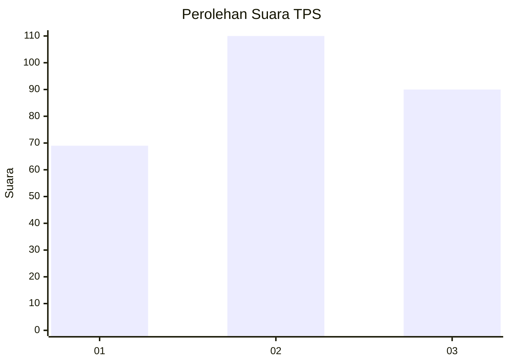
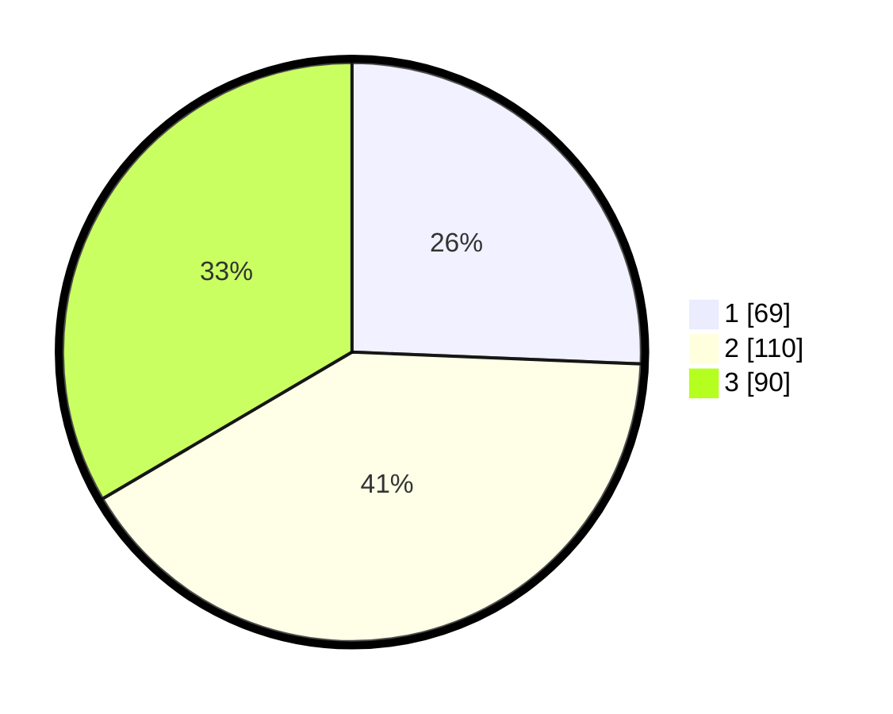

# Hasil

## Grafik

## Tabel

| No. | Nama Paslon    | Suara | Suara (raw) | Persentase |
|:--- |:-------------- | -----:| -----------:| ----------:|
| 1   | ANIES MUHAIMIN | 69    | [69][p-1]   | 25,65      |
| 2   | PRABOWO GIBRAN | 110   | [110][p-2]  | 40,89      |
| 3   | GANJAR MAHFUD  | 90    | [90][p-3]   | 33,46      |

[p-1]: https://github.com/gigit-pemilu/pemilu-2024-99-luar-negeri/blob/main/pilpres/hitung-suara/sub/99-luar-negeri/sub/13-bangkok-thailand/sub/01-bangkok-thailand/sub/0001-bangkok-thailand/sub/001-pos-001/sub/paslon-1.txt
[p-2]: https://github.com/gigit-pemilu/pemilu-2024-99-luar-negeri/blob/main/pilpres/hitung-suara/sub/99-luar-negeri/sub/13-bangkok-thailand/sub/01-bangkok-thailand/sub/0001-bangkok-thailand/sub/001-pos-001/sub/paslon-2.txt
[p-3]: https://github.com/gigit-pemilu/pemilu-2024-99-luar-negeri/blob/main/pilpres/hitung-suara/sub/99-luar-negeri/sub/13-bangkok-thailand/sub/01-bangkok-thailand/sub/0001-bangkok-thailand/sub/001-pos-001/sub/paslon-3.txt

## Foto C Plano

https://sirekap-obj-formc.kpu.go.id/5c99/pemilu/ppwp/99/13/01/00/01/9913010001001-20240218-112452--83fa0779-a94e-41e8-8e36-702d0ce1d85d.jpg

https://sirekap-obj-formc.kpu.go.id/5c99/pemilu/ppwp/99/13/01/00/01/9913010001001-20240218-112709--22a0efc7-3811-4400-bbea-2369d4fdcdc8.jpg

https://sirekap-obj-formc.kpu.go.id/5c99/pemilu/ppwp/99/13/01/00/01/9913010001001-20240218-112833--2fd95317-097d-452a-bf16-913f49e977d0.jpg

## Metadata

| Key        | Value               |
| ---------- | ------------------- |
| Time Stamp | 2024-02-19 06:16:00 |

## DATA PEMILIH TETAP

Jumlah pemilih dalam DPT: **385**.
 * L: **175**.
 * P: **210**.

## DATA PENGGUNA HAK PILIH

Jumlah pengguna hak pilih dalam DPT: **223**.
 * L: **88**.
 * P: **135**.

Jumlah pengguna hak pilih dalam DPTb: **29**.
 * L: **12**.
 * P: **17**.

Jumlah pengguna hak pilih dalam DPK: **17**.
 * L: **6**.
 * P: **11**.

Jumlah pengguna hak pilih: **269**.
 * L: **106**.
 * P: **163**.

## JUMLAH SUARA SAH DAN TIDAK SAH

JUMLAH SELURUH SUARA SAH: **269**.

JUMLAH SUARA TIDAK SAH: **0**.

JUMLAH SELURUH SUARA SAH DAN SUARA TIDAK SAH: **269**.

