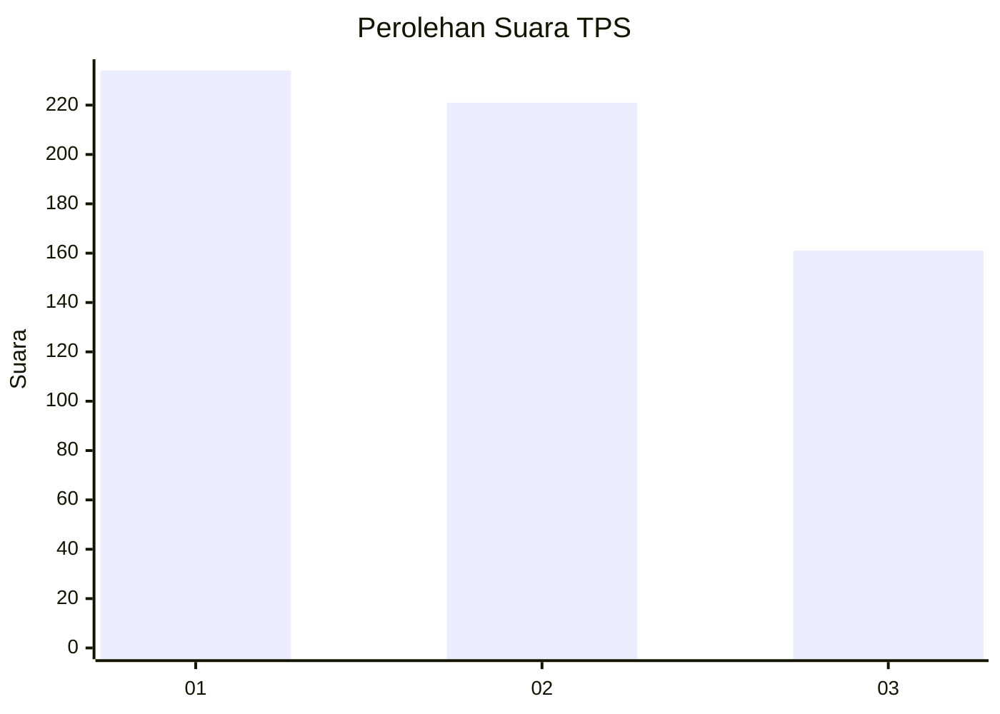
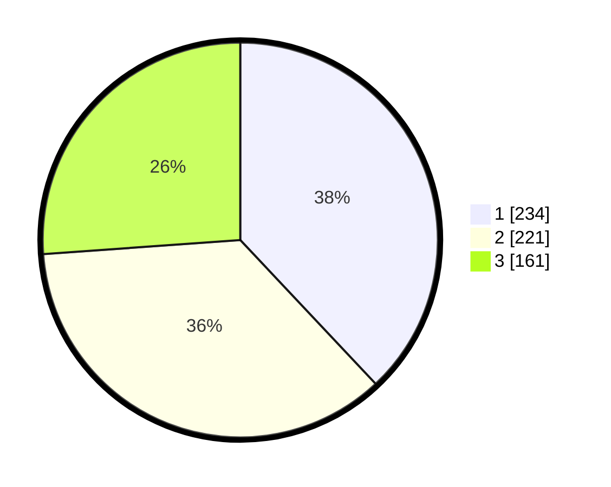

# Hasil

## Grafik

## Tabel

| No. | Nama Paslon    | Suara | Suara (raw) | Persentase |
|:--- |:-------------- | -----:| -----------:| ----------:|
| 1   | ANIES MUHAIMIN | 234   | [234][p-1]  | 37,99      |
| 2   | PRABOWO GIBRAN | 221   | [221][p-2]  | 35,88      |
| 3   | GANJAR MAHFUD  | 161   | [161][p-3]  | 26,14      |

[p-1]: https://github.com/gigit-pemilu/pemilu-2024-99-luar-negeri/blob/main/pilpres/hitung-suara/sub/99-luar-negeri/sub/13-bangkok-thailand/sub/01-bangkok-thailand/sub/0001-bangkok-thailand/sub/002-tps-001/sub/paslon-1.txt
[p-2]: https://github.com/gigit-pemilu/pemilu-2024-99-luar-negeri/blob/main/pilpres/hitung-suara/sub/99-luar-negeri/sub/13-bangkok-thailand/sub/01-bangkok-thailand/sub/0001-bangkok-thailand/sub/002-tps-001/sub/paslon-2.txt
[p-3]: https://github.com/gigit-pemilu/pemilu-2024-99-luar-negeri/blob/main/pilpres/hitung-suara/sub/99-luar-negeri/sub/13-bangkok-thailand/sub/01-bangkok-thailand/sub/0001-bangkok-thailand/sub/002-tps-001/sub/paslon-3.txt

## Foto C Plano

https://sirekap-obj-formc.kpu.go.id/50ad/pemilu/ppwp/99/13/01/00/01/9913010001002-20240214-161613--ff9c41da-d965-47d6-a49b-f04e4e8a477d.jpg

https://sirekap-obj-formc.kpu.go.id/50ad/pemilu/ppwp/99/13/01/00/01/9913010001002-20240214-161750--2c31181f-b3d0-4fd5-9497-97028a41aec1.jpg

https://sirekap-obj-formc.kpu.go.id/50ad/pemilu/ppwp/99/13/01/00/01/9913010001002-20240214-161857--e4b2321e-32af-4e4b-ab5a-94a4fa06de6e.jpg

## Metadata

| Key        | Value               |
| ---------- | ------------------- |
| Time Stamp | 2024-02-14 21:46:01 |

## DATA PEMILIH TETAP

Jumlah pemilih dalam DPT: **604**.
 * L: **300**.
 * P: **304**.

## DATA PENGGUNA HAK PILIH

Jumlah pengguna hak pilih dalam DPT: **322**.
 * L: **164**.
 * P: **158**.

Jumlah pengguna hak pilih dalam DPTb: **208**.
 * L: **100**.
 * P: **108**.

Jumlah pengguna hak pilih dalam DPK: **94**.
 * L: **44**.
 * P: **50**.

Jumlah pengguna hak pilih: **624**.
 * L: **308**.
 * P: **316**.

## JUMLAH SUARA SAH DAN TIDAK SAH

JUMLAH SELURUH SUARA SAH: **616**.

JUMLAH SUARA TIDAK SAH: **8**.

JUMLAH SELURUH SUARA SAH DAN SUARA TIDAK SAH: **624**.

