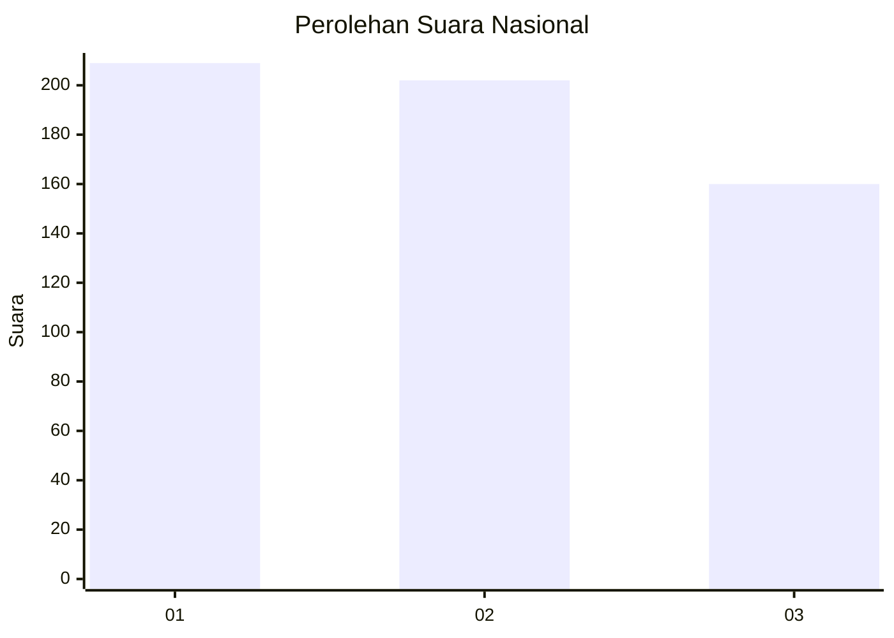
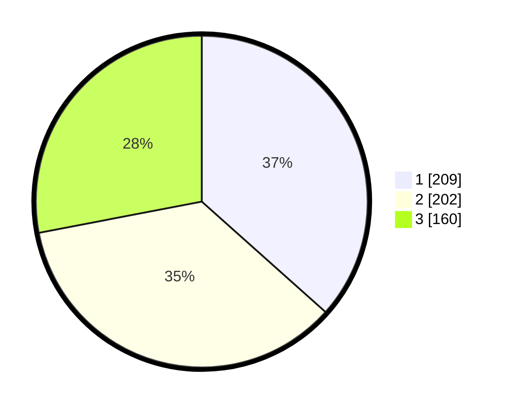

# Hasil

## Grafik

## Tabel

| No. | Nama Paslon    | Suara | Suara (raw) | Persentase |
|:--- |:-------------- | -----:| -----------:| ----------:|
| 1   | ANIES MUHAIMIN | 209   | [209][p-1]  | 36,60      |
| 2   | PRABOWO GIBRAN | 202   | [202][p-2]  | 35,38      |
| 3   | GANJAR MAHFUD  | 160   | [160][p-3]  | 28,02      |

[p-1]: https://github.com/gigit-pemilu/pemilu-2024/blob/main/pilpres/hitung-suara/sub/99-luar-negeri/sub/13-bangkok-thailand/sub/01-bangkok-thailand/sub/0001-bangkok-thailand/sub/003-tps-002/sub/paslon-1.txt
[p-2]: https://github.com/gigit-pemilu/pemilu-2024/blob/main/pilpres/hitung-suara/sub/99-luar-negeri/sub/13-bangkok-thailand/sub/01-bangkok-thailand/sub/0001-bangkok-thailand/sub/003-tps-002/sub/paslon-2.txt
[p-3]: https://github.com/gigit-pemilu/pemilu-2024/blob/main/pilpres/hitung-suara/sub/99-luar-negeri/sub/13-bangkok-thailand/sub/01-bangkok-thailand/sub/0001-bangkok-thailand/sub/003-tps-002/sub/paslon-3.txt

## Foto C Plano

https://sirekap-obj-formc.kpu.go.id/1fc5/pemilu/ppwp/99/13/01/00/01/9913010001003-20240214-153007--45b1bbe7-a4e5-434b-8385-105d72f87629.jpg

https://sirekap-obj-formc.kpu.go.id/1fc5/pemilu/ppwp/99/13/01/00/01/9913010001003-20240214-153126--f616f334-0570-41c7-8e7a-b264b8f181eb.jpg

https://sirekap-obj-formc.kpu.go.id/1fc5/pemilu/ppwp/99/13/01/00/01/9913010001003-20240214-153230--552e5aa1-a6c8-4930-b605-9f1702d44dff.jpg

## Metadata

| Key        | Value               |
| ---------- | ------------------- |
| Time Stamp | 2024-02-14 21:46:01 |

## DATA PEMILIH TETAP

Jumlah pemilih dalam DPT: **556**.
 * L: **240**.
 * P: **316**.

## DATA PENGGUNA HAK PILIH

Jumlah pengguna hak pilih dalam DPT: **306**.
 * L: **137**.
 * P: **169**.

Jumlah pengguna hak pilih dalam DPTb: **203**.
 * L: **82**.
 * P: **121**.

Jumlah pengguna hak pilih dalam DPK: **71**.
 * L: **43**.
 * P: **28**.

Jumlah pengguna hak pilih: **580**.
 * L: **262**.
 * P: **318**.

## JUMLAH SUARA SAH DAN TIDAK SAH

JUMLAH SELURUH SUARA SAH: **571**.

JUMLAH SUARA TIDAK SAH: **9**.

JUMLAH SELURUH SUARA SAH DAN SUARA TIDAK SAH: **580**.

