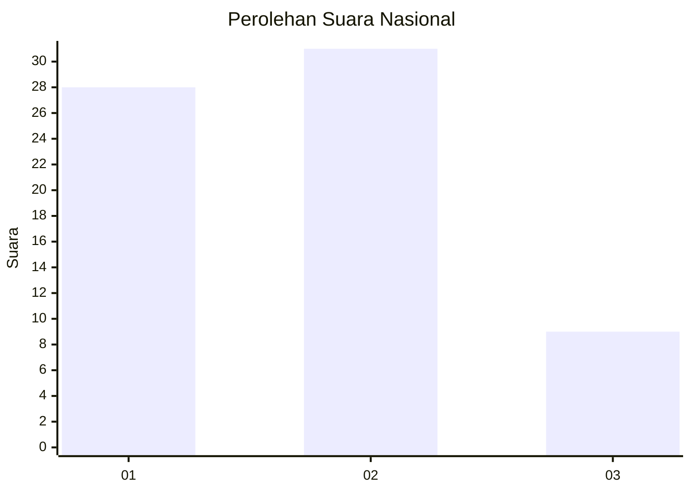
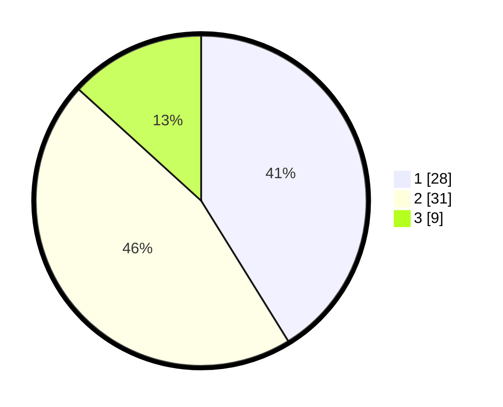

# Hasil

## Grafik

## Tabel

| No. | Nama Paslon    | Suara | Suara (raw) | Persentase |
|:--- |:-------------- | -----:| -----------:| ----------:|
| 1   | ANIES MUHAIMIN | 28    | [28][p-1]   | 41,18      |
| 2   | PRABOWO GIBRAN | 31    | [31][p-2]   | 45,59      |
| 3   | GANJAR MAHFUD  | 9     | [9][p-3]    | 13,24      |

[p-1]: https://github.com/gigit-pemilu/pemilu-2024/blob/main/pilpres/hitung-suara/sub/99-luar-negeri/sub/13-bangkok-thailand/sub/01-bangkok-thailand/sub/0001-bangkok-thailand/sub/004-ksk-001/sub/paslon-1.txt
[p-2]: https://github.com/gigit-pemilu/pemilu-2024/blob/main/pilpres/hitung-suara/sub/99-luar-negeri/sub/13-bangkok-thailand/sub/01-bangkok-thailand/sub/0001-bangkok-thailand/sub/004-ksk-001/sub/paslon-2.txt
[p-3]: https://github.com/gigit-pemilu/pemilu-2024/blob/main/pilpres/hitung-suara/sub/99-luar-negeri/sub/13-bangkok-thailand/sub/01-bangkok-thailand/sub/0001-bangkok-thailand/sub/004-ksk-001/sub/paslon-3.txt

## Foto C Plano

https://sirekap-obj-formc.kpu.go.id/fc0b/pemilu/ppwp/99/13/01/00/01/9913010001004-20240215-232804--cc3b6f50-3d19-495e-a3da-a08405d1d557.jpg

https://sirekap-obj-formc.kpu.go.id/fc0b/pemilu/ppwp/99/13/01/00/01/9913010001004-20240215-232809--0165352c-8e04-4727-8638-6aa14b79d0f0.jpg

https://sirekap-obj-formc.kpu.go.id/fc0b/pemilu/ppwp/99/13/01/00/01/9913010001004-20240215-232807--32712e8d-1b36-46a8-9640-564c26e27072.jpg

## Metadata

| Key        | Value               |
| ---------- | ------------------- |
| Time Stamp | 2024-02-16 12:51:22 |

## DATA PEMILIH TETAP

Jumlah pemilih dalam DPT: **45**.
 * L: **26**.
 * P: **19**.

## DATA PENGGUNA HAK PILIH

Jumlah pengguna hak pilih dalam DPT: **29**.
 * L: **15**.
 * P: **14**.

Jumlah pengguna hak pilih dalam DPTb: **38**.
 * L: **18**.
 * P: **20**.

Jumlah pengguna hak pilih dalam DPK: **3**.
 * L: **1**.
 * P: **2**.

Jumlah pengguna hak pilih: **70**.
 * L: **34**.
 * P: **36**.

## JUMLAH SUARA SAH DAN TIDAK SAH

JUMLAH SELURUH SUARA SAH: **68**.

JUMLAH SUARA TIDAK SAH: **2**.

JUMLAH SELURUH SUARA SAH DAN SUARA TIDAK SAH: **70**.

