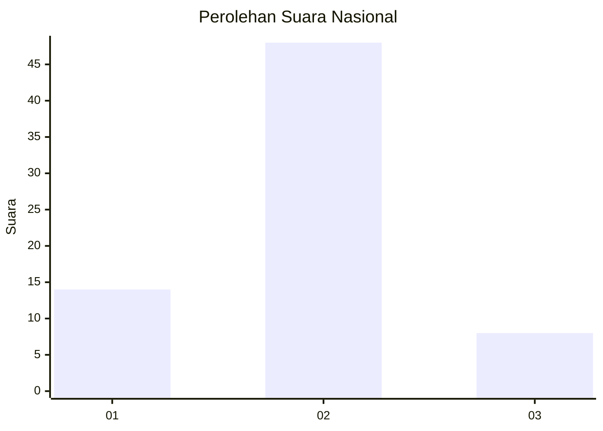
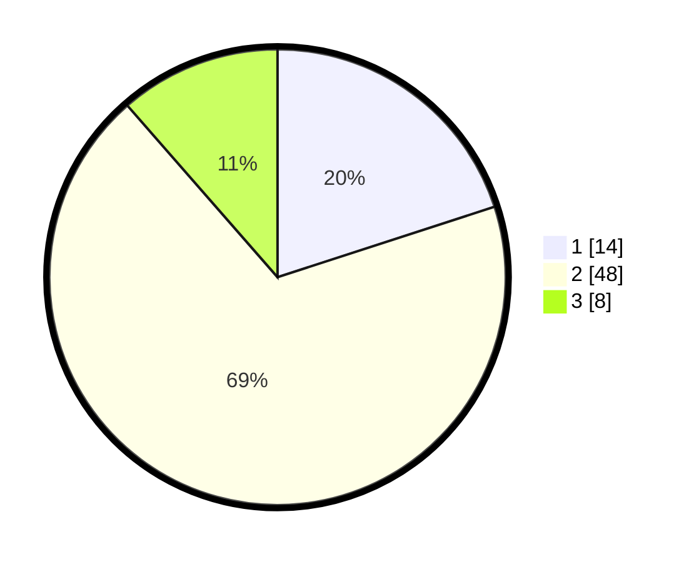

# Hasil

## Grafik

## Tabel

| No. | Nama Paslon    | Suara | Suara (raw) | Persentase |
|:--- |:-------------- | -----:| -----------:| ----------:|
| 1   | ANIES MUHAIMIN | 14    | [14][p-1]   | 20,00      |
| 2   | PRABOWO GIBRAN | 48    | [48][p-2]   | 68,57      |
| 3   | GANJAR MAHFUD  | 8     | [8][p-3]    | 11,43      |

[p-1]: https://github.com/gigit-pemilu/pemilu-2024/blob/main/pilpres/hitung-suara/sub/99-luar-negeri/sub/14-beijing-republik-rakyat-tiongkok/sub/01-beijing-republik-rakyat-tiongkok/sub/0001-beijing-republik-rakyat-tiongkok/sub/001-pos-001/sub/paslon-1.txt
[p-2]: https://github.com/gigit-pemilu/pemilu-2024/blob/main/pilpres/hitung-suara/sub/99-luar-negeri/sub/14-beijing-republik-rakyat-tiongkok/sub/01-beijing-republik-rakyat-tiongkok/sub/0001-beijing-republik-rakyat-tiongkok/sub/001-pos-001/sub/paslon-2.txt
[p-3]: https://github.com/gigit-pemilu/pemilu-2024/blob/main/pilpres/hitung-suara/sub/99-luar-negeri/sub/14-beijing-republik-rakyat-tiongkok/sub/01-beijing-republik-rakyat-tiongkok/sub/0001-beijing-republik-rakyat-tiongkok/sub/001-pos-001/sub/paslon-3.txt

## Foto C Plano

https://sirekap-obj-formc.kpu.go.id/0439/pemilu/ppwp/99/14/01/00/01/9914010001001-20240218-132020--ca6b8375-7f85-479c-9ee8-539a9fbb30b4.jpg

https://sirekap-obj-formc.kpu.go.id/0439/pemilu/ppwp/99/14/01/00/01/9914010001001-20240218-132021--e2ae6671-02c5-403f-9f69-d8673eacfc23.jpg

https://sirekap-obj-formc.kpu.go.id/0439/pemilu/ppwp/99/14/01/00/01/9914010001001-20240218-132020--858770fe-e924-4e2c-9f8c-71aa087b701d.jpg

## Metadata

| Key        | Value               |
| ---------- | ------------------- |
| Time Stamp | 2024-02-19 06:16:00 |

## DATA PEMILIH TETAP

Jumlah pemilih dalam DPT: **96**.
 * L: **28**.
 * P: **68**.

## DATA PENGGUNA HAK PILIH

Jumlah pengguna hak pilih dalam DPT: **71**.
 * L: **21**.
 * P: **50**.

Jumlah pengguna hak pilih dalam DPTb: **0**.
 * L: **0**.
 * P: **0**.

Jumlah pengguna hak pilih dalam DPK: **0**.
 * L: **0**.
 * P: **0**.

Jumlah pengguna hak pilih: **71**.
 * L: **21**.
 * P: **50**.

## JUMLAH SUARA SAH DAN TIDAK SAH

JUMLAH SELURUH SUARA SAH: **70**.

JUMLAH SUARA TIDAK SAH: **1**.

JUMLAH SELURUH SUARA SAH DAN SUARA TIDAK SAH: **71**.

