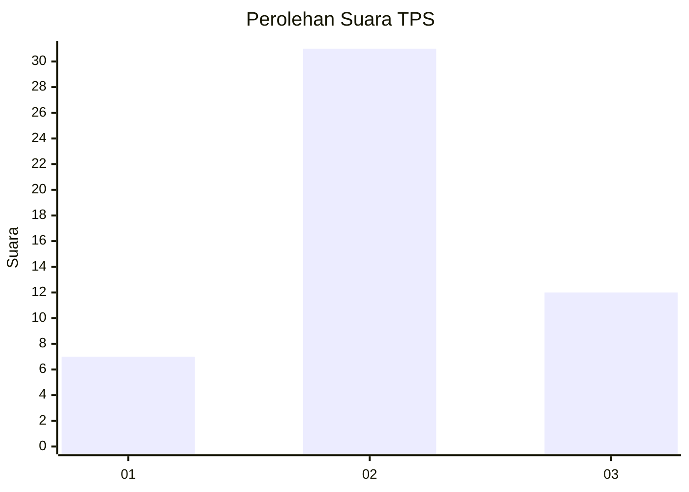
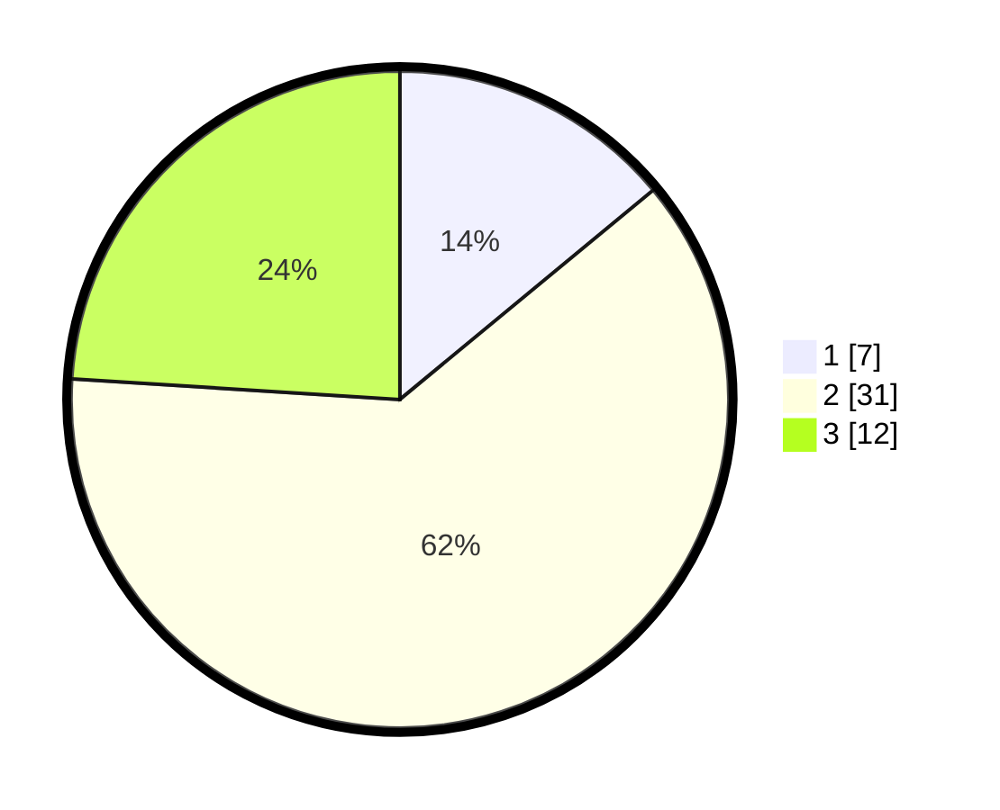

# Hasil

## Grafik

## Tabel

| No. | Nama Paslon    | Suara | Suara (raw) | Persentase |
|:--- |:-------------- | -----:| -----------:| ----------:|
| 1   | ANIES MUHAIMIN | 7     | [7][p-1]    | 14,00      |
| 2   | PRABOWO GIBRAN | 31    | [31][p-2]   | 62,00      |
| 3   | GANJAR MAHFUD  | 12    | [12][p-3]   | 24,00      |

[p-1]: https://github.com/gigit-pemilu/pemilu-2024-99-luar-negeri/blob/main/pilpres/hitung-suara/sub/99-luar-negeri/sub/14-beijing-republik-rakyat-tiongkok/sub/01-beijing-republik-rakyat-tiongkok/sub/0001-beijing-republik-rakyat-tiongkok/sub/002-pos-002/sub/paslon-1.txt
[p-2]: https://github.com/gigit-pemilu/pemilu-2024-99-luar-negeri/blob/main/pilpres/hitung-suara/sub/99-luar-negeri/sub/14-beijing-republik-rakyat-tiongkok/sub/01-beijing-republik-rakyat-tiongkok/sub/0001-beijing-republik-rakyat-tiongkok/sub/002-pos-002/sub/paslon-2.txt
[p-3]: https://github.com/gigit-pemilu/pemilu-2024-99-luar-negeri/blob/main/pilpres/hitung-suara/sub/99-luar-negeri/sub/14-beijing-republik-rakyat-tiongkok/sub/01-beijing-republik-rakyat-tiongkok/sub/0001-beijing-republik-rakyat-tiongkok/sub/002-pos-002/sub/paslon-3.txt

## Foto C Plano

https://sirekap-obj-formc.kpu.go.id/8d38/pemilu/ppwp/99/14/01/00/01/9914010001002-20240216-122008--72ffe844-6be2-485b-9071-3d30fc5646e0.jpg

https://sirekap-obj-formc.kpu.go.id/8d38/pemilu/ppwp/99/14/01/00/01/9914010001002-20240216-122015--5a5ddb20-482b-4304-87de-b314aad3c837.jpg

https://sirekap-obj-formc.kpu.go.id/8d38/pemilu/ppwp/99/14/01/00/01/9914010001002-20240216-122011--27bac516-ee86-4454-ab44-2f4e493d9116.jpg

## Metadata

| Key        | Value               |
| ---------- | ------------------- |
| Time Stamp | 2024-02-16 12:51:22 |

## DATA PEMILIH TETAP

Jumlah pemilih dalam DPT: **88**.
 * L: **29**.
 * P: **59**.

## DATA PENGGUNA HAK PILIH

Jumlah pengguna hak pilih dalam DPT: **50**.
 * L: **16**.
 * P: **34**.

Jumlah pengguna hak pilih dalam DPTb: **0**.
 * L: **0**.
 * P: **0**.

Jumlah pengguna hak pilih dalam DPK: **0**.
 * L: **0**.
 * P: **0**.

Jumlah pengguna hak pilih: **50**.
 * L: **16**.
 * P: **34**.

## JUMLAH SUARA SAH DAN TIDAK SAH

JUMLAH SELURUH SUARA SAH: **50**.

JUMLAH SUARA TIDAK SAH: **0**.

JUMLAH SELURUH SUARA SAH DAN SUARA TIDAK SAH: **50**.

