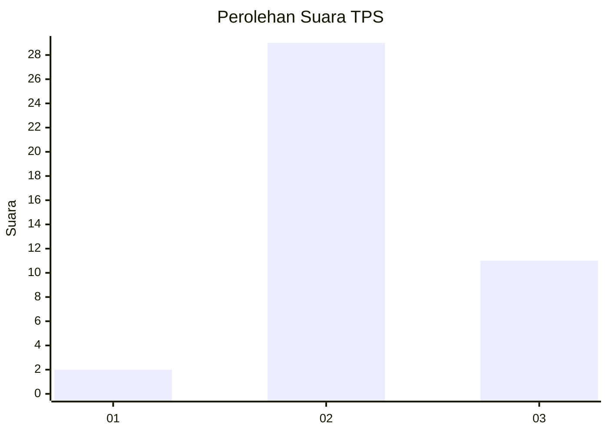
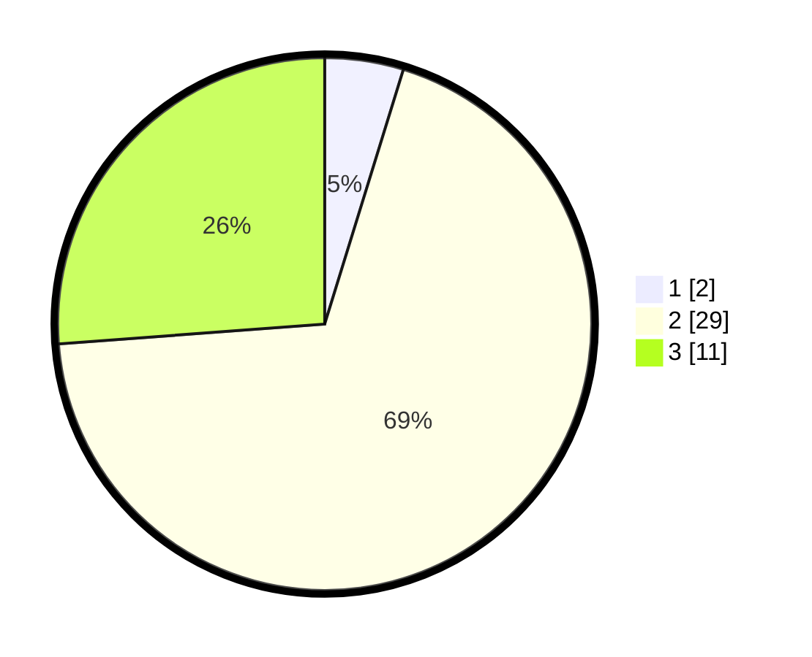

# Hasil

## Grafik

## Tabel

| No. | Nama Paslon    | Suara | Suara (raw) | Persentase |
|:--- |:-------------- | -----:| -----------:| ----------:|
| 1   | ANIES MUHAIMIN | 2     | [2][p-1]    | 4,76       |
| 2   | PRABOWO GIBRAN | 29    | [29][p-2]   | 69,05      |
| 3   | GANJAR MAHFUD  | 11    | [11][p-3]   | 26,19      |

[p-1]: https://github.com/gigit-pemilu/pemilu-2024-99-luar-negeri/blob/main/pilpres/hitung-suara/sub/99-luar-negeri/sub/14-beijing-republik-rakyat-tiongkok/sub/01-beijing-republik-rakyat-tiongkok/sub/0001-beijing-republik-rakyat-tiongkok/sub/003-pos-003/sub/paslon-1.txt
[p-2]: https://github.com/gigit-pemilu/pemilu-2024-99-luar-negeri/blob/main/pilpres/hitung-suara/sub/99-luar-negeri/sub/14-beijing-republik-rakyat-tiongkok/sub/01-beijing-republik-rakyat-tiongkok/sub/0001-beijing-republik-rakyat-tiongkok/sub/003-pos-003/sub/paslon-2.txt
[p-3]: https://github.com/gigit-pemilu/pemilu-2024-99-luar-negeri/blob/main/pilpres/hitung-suara/sub/99-luar-negeri/sub/14-beijing-republik-rakyat-tiongkok/sub/01-beijing-republik-rakyat-tiongkok/sub/0001-beijing-republik-rakyat-tiongkok/sub/003-pos-003/sub/paslon-3.txt

## Foto C Plano

https://sirekap-obj-formc.kpu.go.id/d8b8/pemilu/ppwp/99/14/01/00/01/9914010001003-20240216-132054--f0eab3ad-a5b0-47d0-9b5f-2fe40ae68824.jpg

https://sirekap-obj-formc.kpu.go.id/d8b8/pemilu/ppwp/99/14/01/00/01/9914010001003-20240216-132055--864102e3-8392-4e14-b0e2-cbc390ef9b21.jpg

https://sirekap-obj-formc.kpu.go.id/d8b8/pemilu/ppwp/99/14/01/00/01/9914010001003-20240216-132054--6b3e2818-a9e1-47d7-a4e6-7516d7efd362.jpg

## Metadata

| Key        | Value               |
| ---------- | ------------------- |
| Time Stamp | 2024-02-19 06:16:00 |

## DATA PEMILIH TETAP

Jumlah pemilih dalam DPT: **88**.
 * L: **30**.
 * P: **58**.

## DATA PENGGUNA HAK PILIH

Jumlah pengguna hak pilih dalam DPT: **45**.
 * L: **16**.
 * P: **29**.

Jumlah pengguna hak pilih dalam DPTb: **0**.
 * L: **0**.
 * P: **0**.

Jumlah pengguna hak pilih dalam DPK: **0**.
 * L: **0**.
 * P: **0**.

Jumlah pengguna hak pilih: **45**.
 * L: **16**.
 * P: **29**.

## JUMLAH SUARA SAH DAN TIDAK SAH

JUMLAH SELURUH SUARA SAH: **42**.

JUMLAH SUARA TIDAK SAH: **3**.

JUMLAH SELURUH SUARA SAH DAN SUARA TIDAK SAH: **45**.

