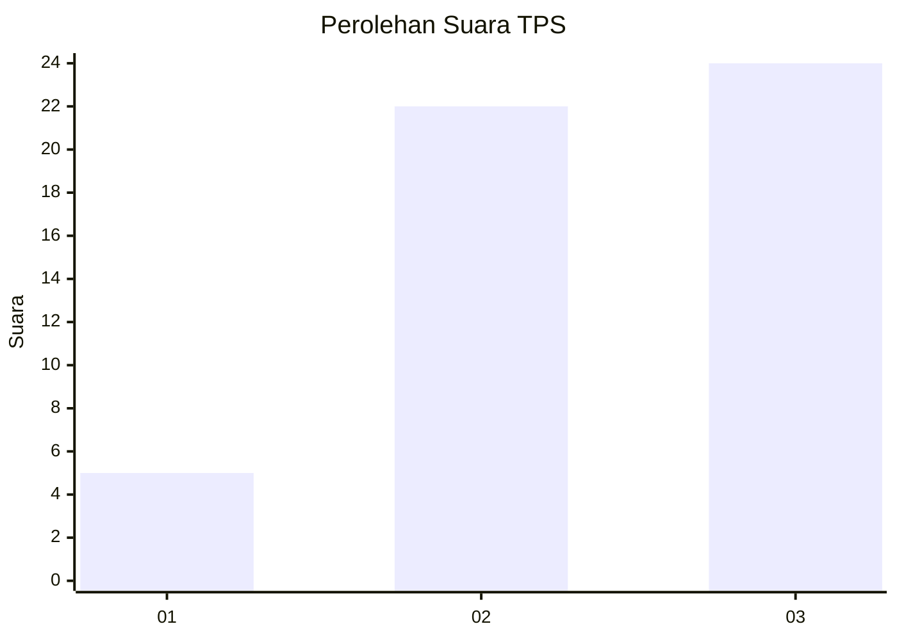
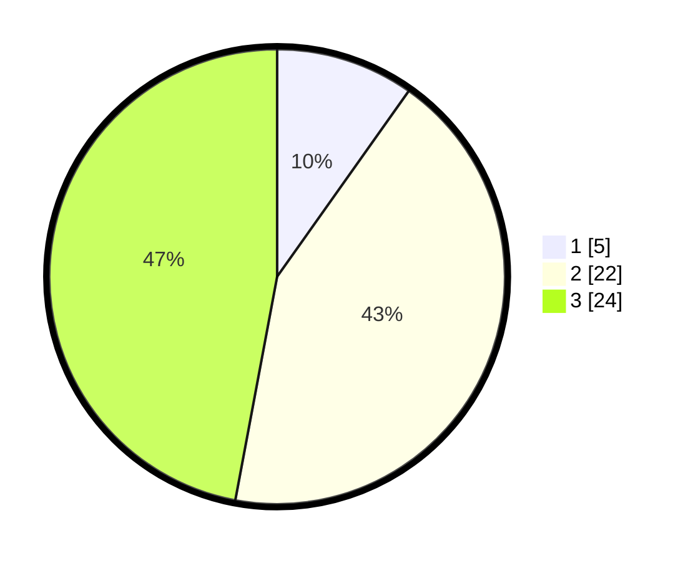

# Hasil

## Grafik

## Tabel

| No. | Nama Paslon    | Suara | Suara (raw) | Persentase |
|:--- |:-------------- | -----:| -----------:| ----------:|
| 1   | ANIES MUHAIMIN | 5     | [5][p-1]    | 9,80       |
| 2   | PRABOWO GIBRAN | 22    | [22][p-2]   | 43,14      |
| 3   | GANJAR MAHFUD  | 24    | [24][p-3]   | 47,06      |

[p-1]: https://github.com/gigit-pemilu/pemilu-2024-99-luar-negeri/blob/main/pilpres/hitung-suara/sub/99-luar-negeri/sub/14-beijing-republik-rakyat-tiongkok/sub/01-beijing-republik-rakyat-tiongkok/sub/0001-beijing-republik-rakyat-tiongkok/sub/004-pos-004/sub/paslon-1.txt
[p-2]: https://github.com/gigit-pemilu/pemilu-2024-99-luar-negeri/blob/main/pilpres/hitung-suara/sub/99-luar-negeri/sub/14-beijing-republik-rakyat-tiongkok/sub/01-beijing-republik-rakyat-tiongkok/sub/0001-beijing-republik-rakyat-tiongkok/sub/004-pos-004/sub/paslon-2.txt
[p-3]: https://github.com/gigit-pemilu/pemilu-2024-99-luar-negeri/blob/main/pilpres/hitung-suara/sub/99-luar-negeri/sub/14-beijing-republik-rakyat-tiongkok/sub/01-beijing-republik-rakyat-tiongkok/sub/0001-beijing-republik-rakyat-tiongkok/sub/004-pos-004/sub/paslon-3.txt

## Foto C Plano

https://sirekap-obj-formc.kpu.go.id/6ba6/pemilu/ppwp/99/14/01/00/01/9914010001004-20240217-181104--aa10f0ec-b92f-436a-84d7-6e4c3524ccdf.jpg

https://sirekap-obj-formc.kpu.go.id/6ba6/pemilu/ppwp/99/14/01/00/01/9914010001004-20240217-181105--d3244a97-17c5-4926-82cf-1d0a6a65817d.jpg

https://sirekap-obj-formc.kpu.go.id/6ba6/pemilu/ppwp/99/14/01/00/01/9914010001004-20240217-181105--d832de5e-1a8b-4352-82f1-daccc727a0bb.jpg

## Metadata

| Key        | Value               |
| ---------- | ------------------- |
| Time Stamp | 2024-02-19 06:16:00 |

## DATA PEMILIH TETAP

Jumlah pemilih dalam DPT: **88**.
 * L: **28**.
 * P: **60**.

## DATA PENGGUNA HAK PILIH

Jumlah pengguna hak pilih dalam DPT: **52**.
 * L: **12**.
 * P: **40**.

Jumlah pengguna hak pilih dalam DPTb: **0**.
 * L: **0**.
 * P: **0**.

Jumlah pengguna hak pilih dalam DPK: **0**.
 * L: **0**.
 * P: **0**.

Jumlah pengguna hak pilih: **52**.
 * L: **12**.
 * P: **40**.

## JUMLAH SUARA SAH DAN TIDAK SAH

JUMLAH SELURUH SUARA SAH: **51**.

JUMLAH SUARA TIDAK SAH: **1**.

JUMLAH SELURUH SUARA SAH DAN SUARA TIDAK SAH: **52**.

