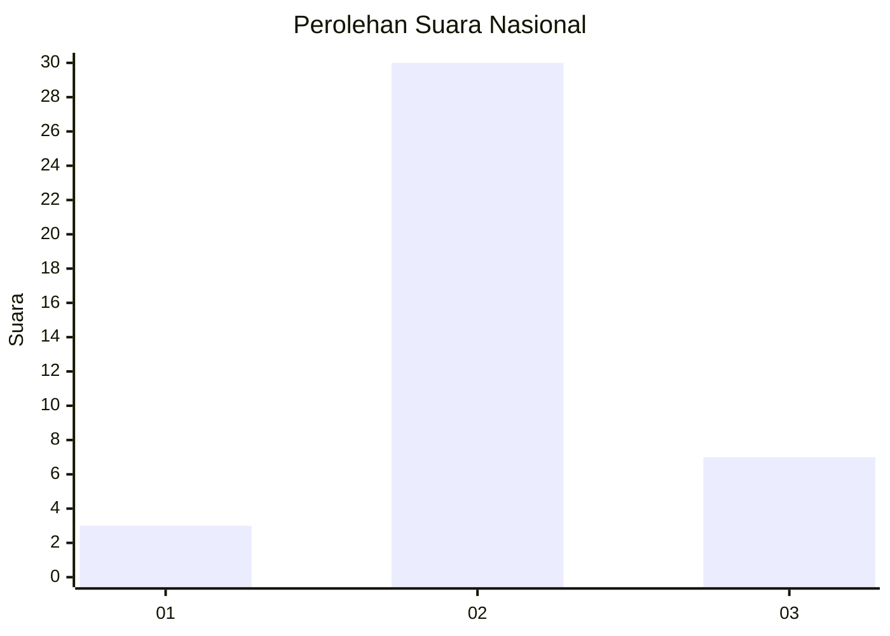
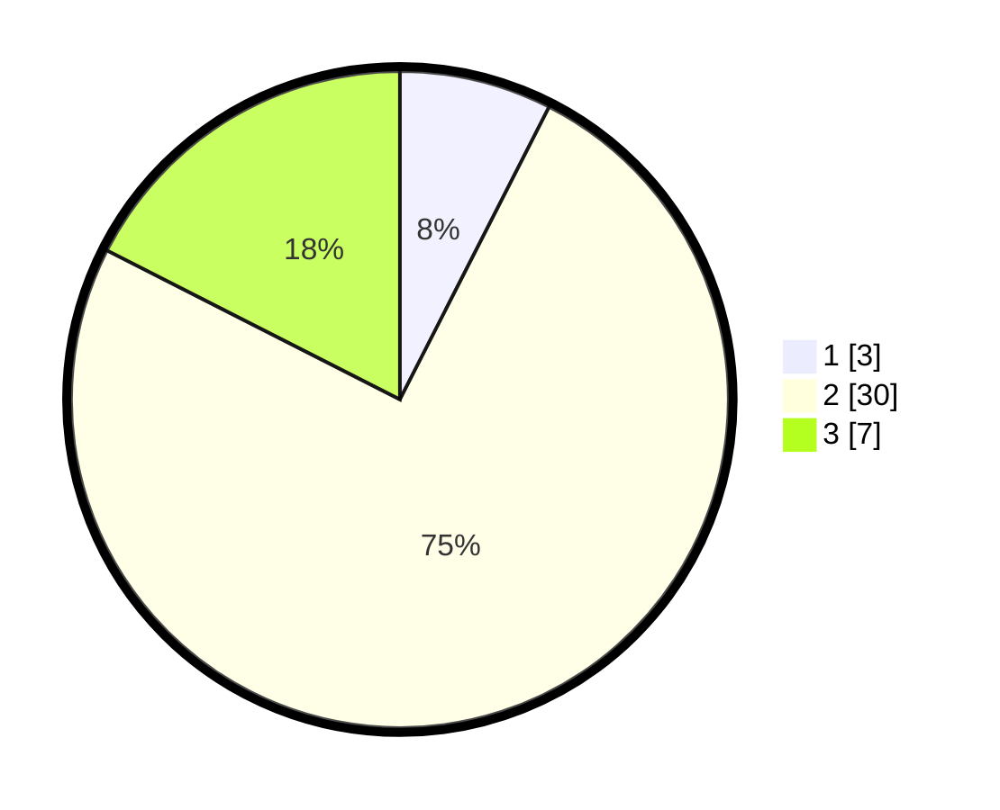

# Hasil

## Grafik

## Tabel

| No. | Nama Paslon    | Suara | Suara (raw) | Persentase |
|:--- |:-------------- | -----:| -----------:| ----------:|
| 1   | ANIES MUHAIMIN | 3     | [3][p-1]    | 7,50       |
| 2   | PRABOWO GIBRAN | 30    | [30][p-2]   | 75,00      |
| 3   | GANJAR MAHFUD  | 7     | [7][p-3]    | 17,50      |

[p-1]: https://github.com/gigit-pemilu/pemilu-2024/blob/main/pilpres/hitung-suara/sub/99-luar-negeri/sub/14-beijing-republik-rakyat-tiongkok/sub/01-beijing-republik-rakyat-tiongkok/sub/0001-beijing-republik-rakyat-tiongkok/sub/005-pos-005/sub/paslon-1.txt
[p-2]: https://github.com/gigit-pemilu/pemilu-2024/blob/main/pilpres/hitung-suara/sub/99-luar-negeri/sub/14-beijing-republik-rakyat-tiongkok/sub/01-beijing-republik-rakyat-tiongkok/sub/0001-beijing-republik-rakyat-tiongkok/sub/005-pos-005/sub/paslon-2.txt
[p-3]: https://github.com/gigit-pemilu/pemilu-2024/blob/main/pilpres/hitung-suara/sub/99-luar-negeri/sub/14-beijing-republik-rakyat-tiongkok/sub/01-beijing-republik-rakyat-tiongkok/sub/0001-beijing-republik-rakyat-tiongkok/sub/005-pos-005/sub/paslon-3.txt

## Foto C Plano

https://sirekap-obj-formc.kpu.go.id/3140/pemilu/ppwp/99/14/01/00/01/9914010001005-20240216-115658--ce875781-f58b-46e6-a0df-8aa74818cb71.jpg

https://sirekap-obj-formc.kpu.go.id/3140/pemilu/ppwp/99/14/01/00/01/9914010001005-20240216-115711--af8e324e-9f09-4d56-ae93-b4aa2f384976.jpg

https://sirekap-obj-formc.kpu.go.id/3140/pemilu/ppwp/99/14/01/00/01/9914010001005-20240216-115706--5d4f549d-ed1d-44ab-8b40-06b368a24584.jpg

## Metadata

| Key        | Value               |
| ---------- | ------------------- |
| Time Stamp | 2024-02-16 12:51:22 |

## DATA PEMILIH TETAP

Jumlah pemilih dalam DPT: **88**.
 * L: **24**.
 * P: **64**.

## DATA PENGGUNA HAK PILIH

Jumlah pengguna hak pilih dalam DPT: **40**.
 * L: **12**.
 * P: **28**.

Jumlah pengguna hak pilih dalam DPTb: **0**.
 * L: **0**.
 * P: **0**.

Jumlah pengguna hak pilih dalam DPK: **0**.
 * L: **0**.
 * P: **0**.

Jumlah pengguna hak pilih: **40**.
 * L: **12**.
 * P: **28**.

## JUMLAH SUARA SAH DAN TIDAK SAH

JUMLAH SELURUH SUARA SAH: **40**.

JUMLAH SUARA TIDAK SAH: **0**.

JUMLAH SELURUH SUARA SAH DAN SUARA TIDAK SAH: **40**.

