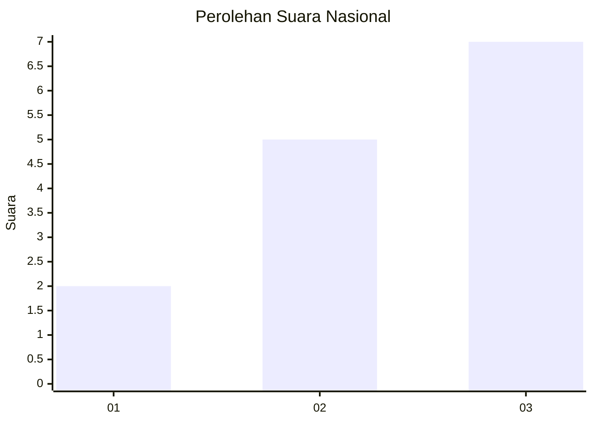
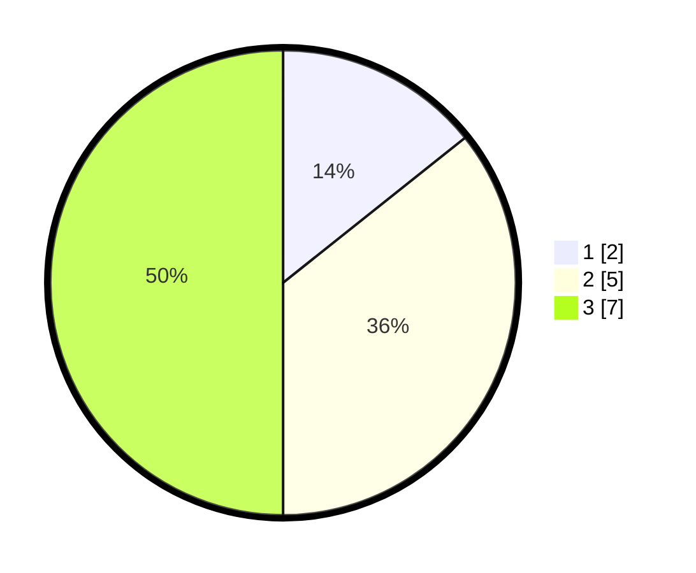

# Hasil

## Grafik

## Tabel

| No. | Nama Paslon    | Suara | Suara (raw) | Persentase |
|:--- |:-------------- | -----:| -----------:| ----------:|
| 1   | ANIES MUHAIMIN | 2     | [2][p-1]    | 14,29      |
| 2   | PRABOWO GIBRAN | 5     | [5][p-2]    | 35,71      |
| 3   | GANJAR MAHFUD  | 7     | [7][p-3]    | 50,00      |

[p-1]: https://github.com/gigit-pemilu/pemilu-2024/blob/main/pilpres/hitung-suara/sub/99-luar-negeri/sub/16-beograd-serbia/sub/01-beograd-serbia/sub/0001-beograd-serbia/sub/001-pos-001/sub/paslon-1.txt
[p-2]: https://github.com/gigit-pemilu/pemilu-2024/blob/main/pilpres/hitung-suara/sub/99-luar-negeri/sub/16-beograd-serbia/sub/01-beograd-serbia/sub/0001-beograd-serbia/sub/001-pos-001/sub/paslon-2.txt
[p-3]: https://github.com/gigit-pemilu/pemilu-2024/blob/main/pilpres/hitung-suara/sub/99-luar-negeri/sub/16-beograd-serbia/sub/01-beograd-serbia/sub/0001-beograd-serbia/sub/001-pos-001/sub/paslon-3.txt

## Foto C Plano

https://sirekap-obj-formc.kpu.go.id/bdb3/pemilu/ppwp/99/16/01/00/01/9916010001001-20240216-144839--d6945449-b64c-4fd8-9184-504b1b9590d0.jpg

https://sirekap-obj-formc.kpu.go.id/bdb3/pemilu/ppwp/99/16/01/00/01/9916010001001-20240216-144840--d329f0cc-10ca-4fee-b675-cc6e329c7ab3.jpg

https://sirekap-obj-formc.kpu.go.id/bdb3/pemilu/ppwp/99/16/01/00/01/9916010001001-20240216-144839--861360c7-39b8-4e1b-8d9f-1ca1d192c6d2.jpg

## Metadata

| Key        | Value               |
| ---------- | ------------------- |
| Time Stamp | 2024-02-16 22:30:00 |

## DATA PEMILIH TETAP

Jumlah pemilih dalam DPT: **19**.
 * L: **1**.
 * P: **18**.

## DATA PENGGUNA HAK PILIH

Jumlah pengguna hak pilih dalam DPT: **15**.
 * L: **0**.
 * P: **15**.

Jumlah pengguna hak pilih dalam DPTb: **0**.
 * L: **0**.
 * P: **0**.

Jumlah pengguna hak pilih dalam DPK: **0**.
 * L: **0**.
 * P: **0**.

Jumlah pengguna hak pilih: **15**.
 * L: **0**.
 * P: **15**.

## JUMLAH SUARA SAH DAN TIDAK SAH

JUMLAH SELURUH SUARA SAH: **14**.

JUMLAH SUARA TIDAK SAH: **1**.

JUMLAH SELURUH SUARA SAH DAN SUARA TIDAK SAH: **15**.

