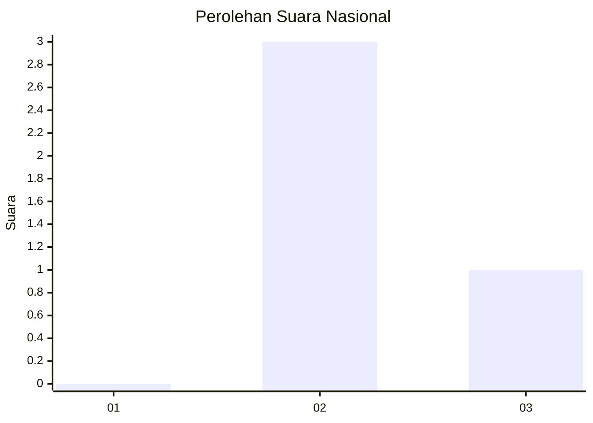
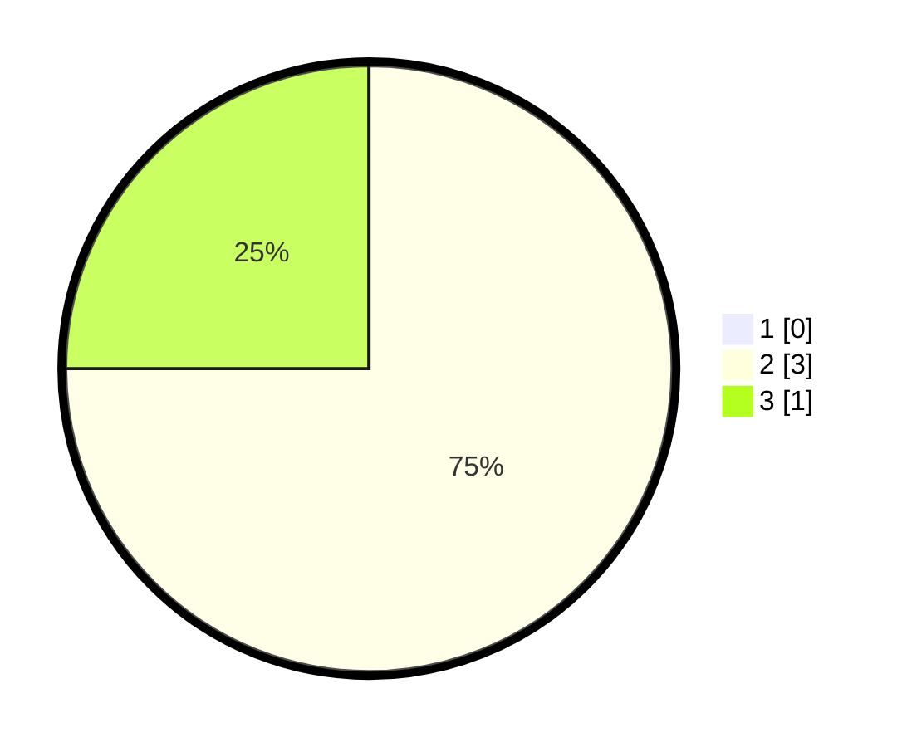

# Hasil

## Grafik

## Tabel

| No. | Nama Paslon    | Suara | Suara (raw) | Persentase |
|:--- |:-------------- | -----:| -----------:| ----------:|
| 1   | ANIES MUHAIMIN | 0     | [0][p-1]    | 0,00       |
| 2   | PRABOWO GIBRAN | 3     | [3][p-2]    | 75,00      |
| 3   | GANJAR MAHFUD  | 1     | [1][p-3]    | 25,00      |

[p-1]: https://github.com/gigit-pemilu/pemilu-2024/blob/main/pilpres/hitung-suara/sub/99-luar-negeri/sub/16-beograd-serbia/sub/01-beograd-serbia/sub/0001-beograd-serbia/sub/003-ksk-001/sub/paslon-1.txt
[p-2]: https://github.com/gigit-pemilu/pemilu-2024/blob/main/pilpres/hitung-suara/sub/99-luar-negeri/sub/16-beograd-serbia/sub/01-beograd-serbia/sub/0001-beograd-serbia/sub/003-ksk-001/sub/paslon-2.txt
[p-3]: https://github.com/gigit-pemilu/pemilu-2024/blob/main/pilpres/hitung-suara/sub/99-luar-negeri/sub/16-beograd-serbia/sub/01-beograd-serbia/sub/0001-beograd-serbia/sub/003-ksk-001/sub/paslon-3.txt

## Foto C Plano

https://sirekap-obj-formc.kpu.go.id/5620/pemilu/ppwp/99/16/01/00/01/9916010001003-20240215-182643--b889112b-22a4-4559-bc62-1a6f4eb053fd.jpg

https://sirekap-obj-formc.kpu.go.id/5620/pemilu/ppwp/99/16/01/00/01/9916010001003-20240216-140637--d161fa67-6c64-4283-ab0d-1fd461a68a49.jpg

https://sirekap-obj-formc.kpu.go.id/5620/pemilu/ppwp/99/16/01/00/01/9916010001003-20240216-140637--800c6fcf-8edb-41fd-87af-60c3384b7c30.jpg

## Metadata

| Key        | Value               |
| ---------- | ------------------- |
| Time Stamp | 2024-02-16 23:00:00 |

## DATA PEMILIH TETAP

Jumlah pemilih dalam DPT: **9**.
 * L: **1**.
 * P: **8**.

## DATA PENGGUNA HAK PILIH

Jumlah pengguna hak pilih dalam DPT: **5**.
 * L: **0**.
 * P: **5**.

Jumlah pengguna hak pilih dalam DPTb: **0**.
 * L: **0**.
 * P: **0**.

Jumlah pengguna hak pilih dalam DPK: **0**.
 * L: **0**.
 * P: **0**.

Jumlah pengguna hak pilih: **5**.
 * L: **0**.
 * P: **5**.

## JUMLAH SUARA SAH DAN TIDAK SAH

JUMLAH SELURUH SUARA SAH: **4**.

JUMLAH SUARA TIDAK SAH: **1**.

JUMLAH SELURUH SUARA SAH DAN SUARA TIDAK SAH: **5**.

