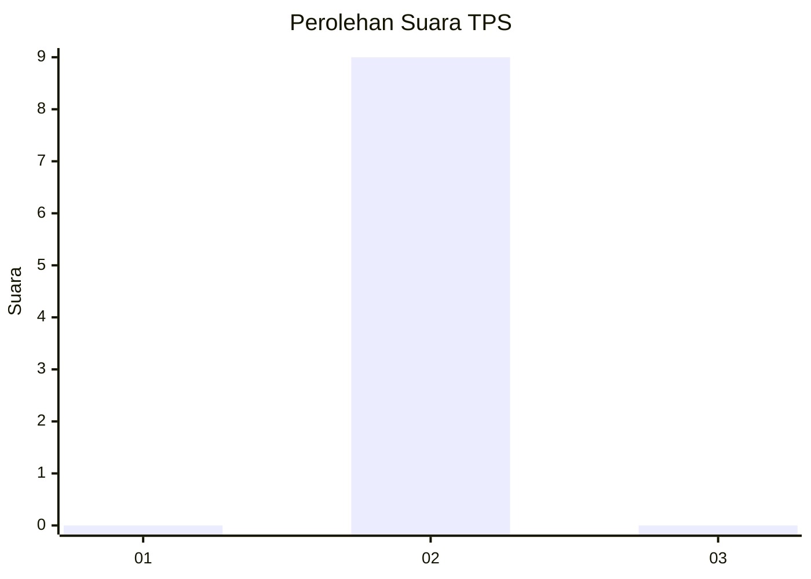
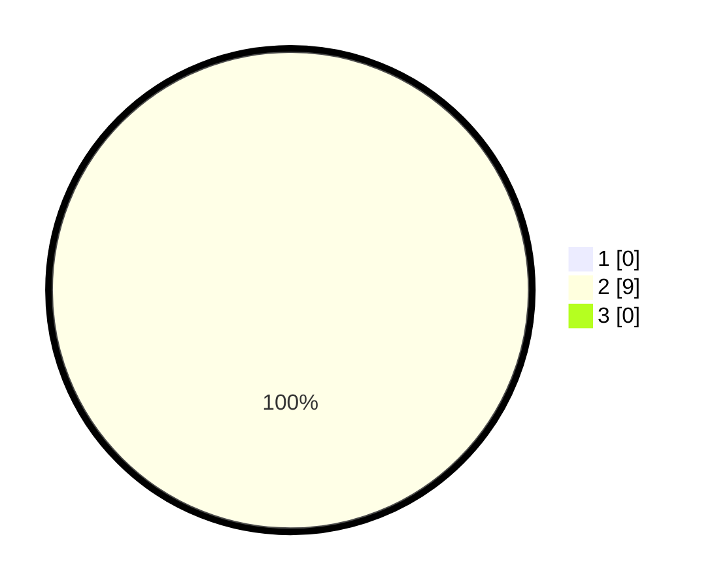

# Hasil

## Grafik

## Tabel

| No. | Nama Paslon    | Suara | Suara (raw) | Persentase |
|:--- |:-------------- | -----:| -----------:| ----------:|
| 1   | ANIES MUHAIMIN | 0     | [0][p-1]    | 0,00       |
| 2   | PRABOWO GIBRAN | 9     | [9][p-2]    | 100,00     |
| 3   | GANJAR MAHFUD  | 0     | [0][p-3]    | 0,00       |

[p-1]: https://github.com/gigit-pemilu/pemilu-2024-99-luar-negeri/blob/main/pilpres/hitung-suara/sub/99-luar-negeri/sub/16-beograd-serbia/sub/01-beograd-serbia/sub/0001-beograd-serbia/sub/004-ksk-002/sub/paslon-1.txt
[p-2]: https://github.com/gigit-pemilu/pemilu-2024-99-luar-negeri/blob/main/pilpres/hitung-suara/sub/99-luar-negeri/sub/16-beograd-serbia/sub/01-beograd-serbia/sub/0001-beograd-serbia/sub/004-ksk-002/sub/paslon-2.txt
[p-3]: https://github.com/gigit-pemilu/pemilu-2024-99-luar-negeri/blob/main/pilpres/hitung-suara/sub/99-luar-negeri/sub/16-beograd-serbia/sub/01-beograd-serbia/sub/0001-beograd-serbia/sub/004-ksk-002/sub/paslon-3.txt

## Foto C Plano

https://sirekap-obj-formc.kpu.go.id/de54/pemilu/ppwp/99/16/01/00/01/9916010001004-20240216-141527--d0ebec95-892b-406a-8b4a-9b25351077dc.jpg

https://sirekap-obj-formc.kpu.go.id/de54/pemilu/ppwp/99/16/01/00/01/9916010001004-20240216-141528--773f7d40-64f7-4a44-a0a1-44b0c99cdf21.jpg

https://sirekap-obj-formc.kpu.go.id/de54/pemilu/ppwp/99/16/01/00/01/9916010001004-20240216-141527--2c4dee0f-d7e7-4946-a3b1-3ee746c8b360.jpg

## Metadata

| Key        | Value               |
| ---------- | ------------------- |
| Time Stamp | 2024-02-16 22:30:00 |

## DATA PEMILIH TETAP

Jumlah pemilih dalam DPT: **29**.
 * L: **28**.
 * P: **1**.

## DATA PENGGUNA HAK PILIH

Jumlah pengguna hak pilih dalam DPT: **9**.
 * L: **9**.
 * P: **0**.

Jumlah pengguna hak pilih dalam DPTb: **0**.
 * L: **0**.
 * P: **0**.

Jumlah pengguna hak pilih dalam DPK: **0**.
 * L: **0**.
 * P: **0**.

Jumlah pengguna hak pilih: **9**.
 * L: **9**.
 * P: **0**.

## JUMLAH SUARA SAH DAN TIDAK SAH

JUMLAH SELURUH SUARA SAH: **9**.

JUMLAH SUARA TIDAK SAH: **0**.

JUMLAH SELURUH SUARA SAH DAN SUARA TIDAK SAH: **9**.

