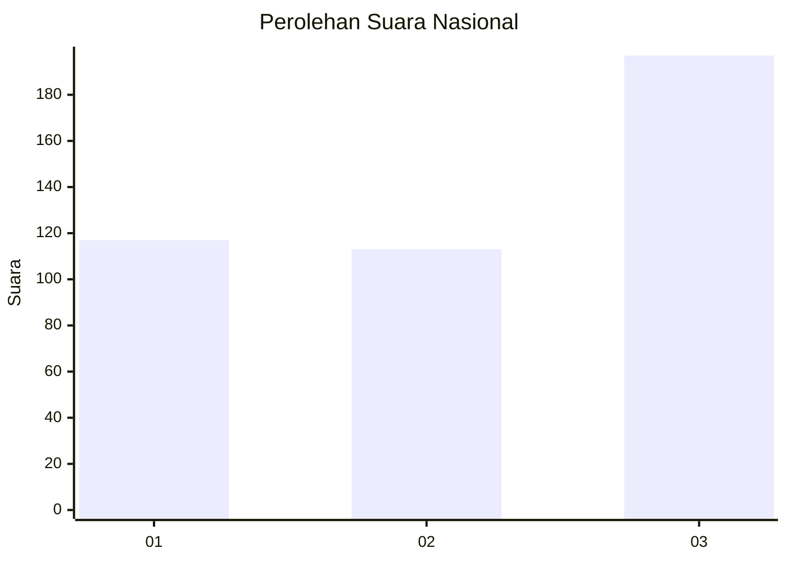
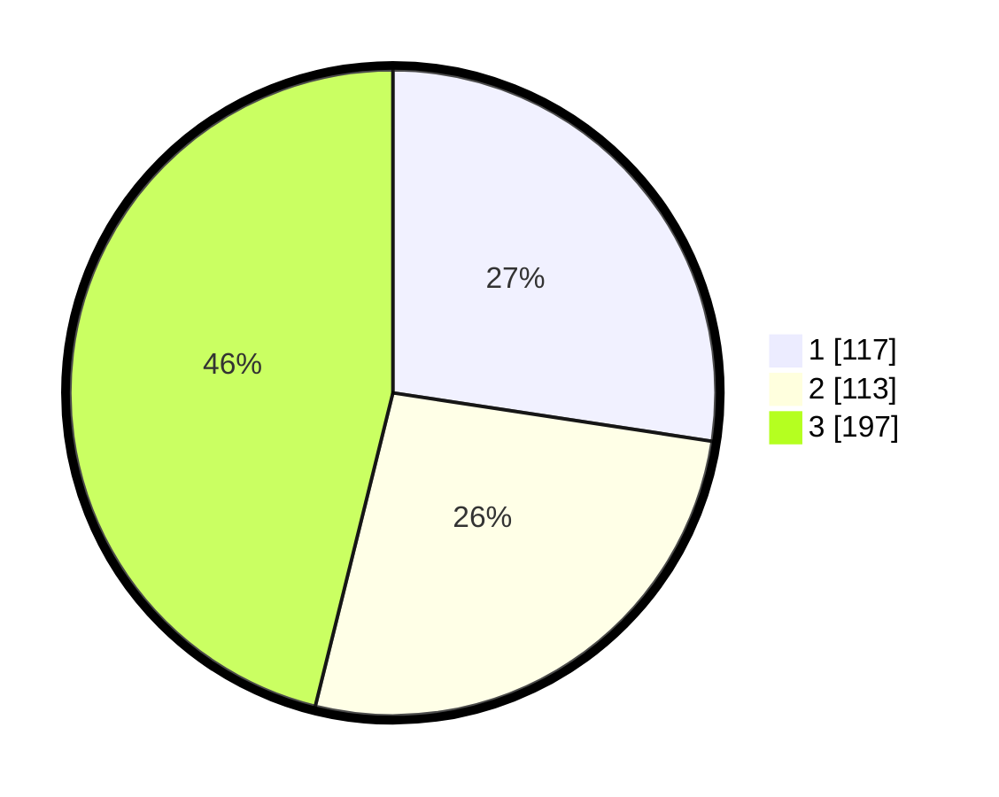

# Hasil

## Grafik

## Tabel

| No. | Nama Paslon    | Suara | Suara (raw) | Persentase |
|:--- |:-------------- | -----:| -----------:| ----------:|
| 1   | ANIES MUHAIMIN | 117   | [117][p-1]  | 27,40      |
| 2   | PRABOWO GIBRAN | 113   | [113][p-2]  | 26,46      |
| 3   | GANJAR MAHFUD  | 197   | [197][p-3]  | 46,14      |

[p-1]: https://github.com/gigit-pemilu/pemilu-2024/blob/main/pilpres/hitung-suara/sub/99-luar-negeri/sub/17-berlin-jerman/sub/01-berlin-jerman/sub/0001-berlin-jerman/sub/001-pos-001/sub/paslon-1.txt
[p-2]: https://github.com/gigit-pemilu/pemilu-2024/blob/main/pilpres/hitung-suara/sub/99-luar-negeri/sub/17-berlin-jerman/sub/01-berlin-jerman/sub/0001-berlin-jerman/sub/001-pos-001/sub/paslon-2.txt
[p-3]: https://github.com/gigit-pemilu/pemilu-2024/blob/main/pilpres/hitung-suara/sub/99-luar-negeri/sub/17-berlin-jerman/sub/01-berlin-jerman/sub/0001-berlin-jerman/sub/001-pos-001/sub/paslon-3.txt

## Foto C Plano

https://sirekap-obj-formc.kpu.go.id/2e44/pemilu/ppwp/99/17/01/00/01/9917010001001-20240217-023525--4142fd31-7f81-49e6-87a0-086461c6f1a1.jpg

https://sirekap-obj-formc.kpu.go.id/2e44/pemilu/ppwp/99/17/01/00/01/9917010001001-20240217-023546--f7e8efa3-645b-40eb-bb1a-6b9aa36277cd.jpg

https://sirekap-obj-formc.kpu.go.id/2e44/pemilu/ppwp/99/17/01/00/01/9917010001001-20240217-023613--2de9c820-1f67-494a-8f64-16d716a4dcd8.jpg

## Metadata

| Key        | Value               |
| ---------- | ------------------- |
| Time Stamp | 2024-02-17 16:36:25 |

## DATA PEMILIH TETAP

Jumlah pemilih dalam DPT: **496**.
 * L: **237**.
 * P: **259**.

## DATA PENGGUNA HAK PILIH

Jumlah pengguna hak pilih dalam DPT: **432**.
 * L: **196**.
 * P: **249**.

Jumlah pengguna hak pilih dalam DPTb: **0**.
 * L: **0**.
 * P: **0**.

Jumlah pengguna hak pilih dalam DPK: **0**.
 * L: **0**.
 * P: **0**.

Jumlah pengguna hak pilih: **432**.
 * L: **196**.
 * P: **249**.

## JUMLAH SUARA SAH DAN TIDAK SAH

JUMLAH SELURUH SUARA SAH: **427**.

JUMLAH SUARA TIDAK SAH: **5**.

JUMLAH SELURUH SUARA SAH DAN SUARA TIDAK SAH: **432**.

