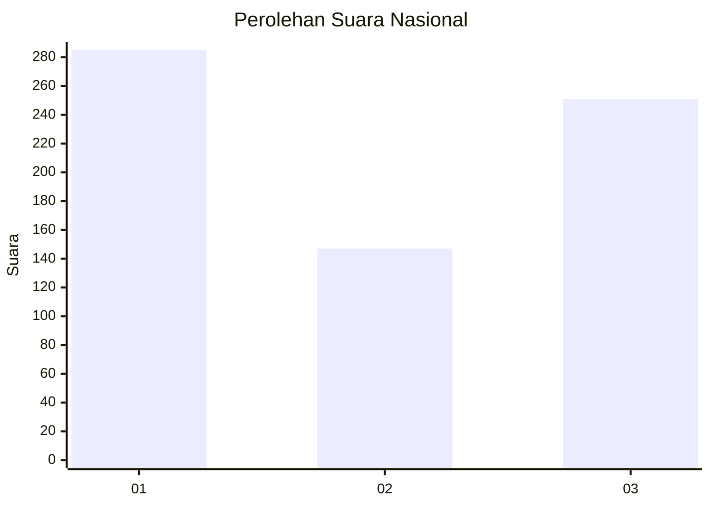
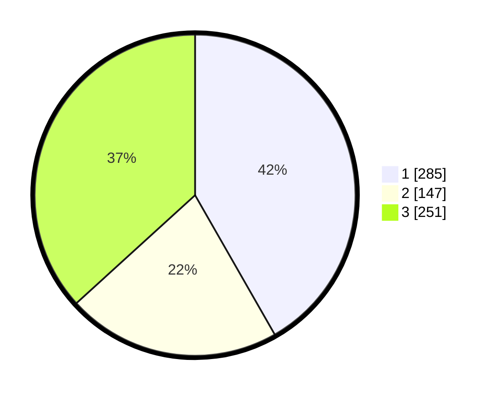

# Hasil

## Grafik

## Tabel

| No. | Nama Paslon    | Suara | Suara (raw) | Persentase |
|:--- |:-------------- | -----:| -----------:| ----------:|
| 1   | ANIES MUHAIMIN | 285   | [285][p-1]  | 41,73      |
| 2   | PRABOWO GIBRAN | 147   | [147][p-2]  | 21,52      |
| 3   | GANJAR MAHFUD  | 251   | [251][p-3]  | 36,75      |

[p-1]: https://github.com/gigit-pemilu/pemilu-2024/blob/main/pilpres/hitung-suara/sub/99-luar-negeri/sub/17-berlin-jerman/sub/01-berlin-jerman/sub/0001-berlin-jerman/sub/002-tps-001/sub/paslon-1.txt
[p-2]: https://github.com/gigit-pemilu/pemilu-2024/blob/main/pilpres/hitung-suara/sub/99-luar-negeri/sub/17-berlin-jerman/sub/01-berlin-jerman/sub/0001-berlin-jerman/sub/002-tps-001/sub/paslon-2.txt
[p-3]: https://github.com/gigit-pemilu/pemilu-2024/blob/main/pilpres/hitung-suara/sub/99-luar-negeri/sub/17-berlin-jerman/sub/01-berlin-jerman/sub/0001-berlin-jerman/sub/002-tps-001/sub/paslon-3.txt

## Foto C Plano

https://sirekap-obj-formc.kpu.go.id/d05a/pemilu/ppwp/99/17/01/00/01/9917010001002-20240216-101036--b804130d-2eb0-455f-8ff3-c05c0c5d64e7.jpg

https://sirekap-obj-formc.kpu.go.id/d05a/pemilu/ppwp/99/17/01/00/01/9917010001002-20240216-101045--1352e210-0c89-42c0-a72a-b36da109c4ab.jpg

https://sirekap-obj-formc.kpu.go.id/d05a/pemilu/ppwp/99/17/01/00/01/9917010001002-20240216-093223--c707f174-6d3e-4cac-9c40-4cde4a2cc174.jpg

## Metadata

| Key        | Value               |
| ---------- | ------------------- |
| Time Stamp | 2024-02-16 12:51:22 |

## DATA PEMILIH TETAP

Jumlah pemilih dalam DPT: **1000**.
 * L: **543**.
 * P: **457**.

## DATA PENGGUNA HAK PILIH

Jumlah pengguna hak pilih dalam DPT: **659**.
 * L: **333**.
 * P: **326**.

Jumlah pengguna hak pilih dalam DPTb: **36**.
 * L: **19**.
 * P: **17**.

Jumlah pengguna hak pilih dalam DPK: **0**.
 * L: **0**.
 * P: **0**.

Jumlah pengguna hak pilih: **695**.
 * L: **352**.
 * P: **343**.

## JUMLAH SUARA SAH DAN TIDAK SAH

JUMLAH SELURUH SUARA SAH: **683**.

JUMLAH SUARA TIDAK SAH: **12**.

JUMLAH SELURUH SUARA SAH DAN SUARA TIDAK SAH: **695**.

