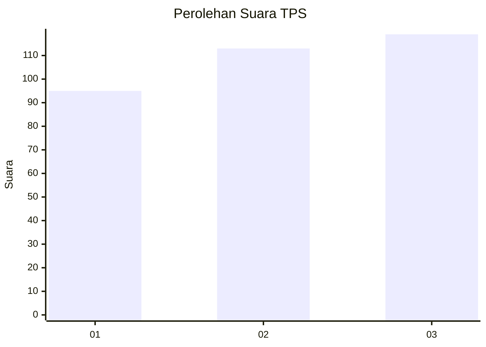
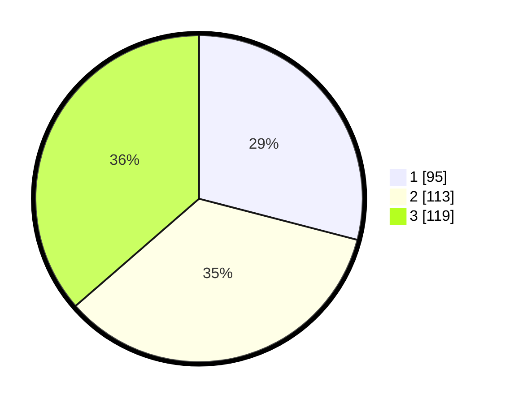

# Hasil

## Grafik

## Tabel

| No. | Nama Paslon    | Suara | Suara (raw) | Persentase |
|:--- |:-------------- | -----:| -----------:| ----------:|
| 1   | ANIES MUHAIMIN | 95    | [95][p-1]   | 29,05      |
| 2   | PRABOWO GIBRAN | 113   | [113][p-2]  | 34,56      |
| 3   | GANJAR MAHFUD  | 119   | [119][p-3]  | 36,39      |

[p-1]: https://github.com/gigit-pemilu/pemilu-2024-99-luar-negeri/blob/main/pilpres/hitung-suara/sub/99-luar-negeri/sub/17-berlin-jerman/sub/01-berlin-jerman/sub/0001-berlin-jerman/sub/003-tps-002/sub/paslon-1.txt
[p-2]: https://github.com/gigit-pemilu/pemilu-2024-99-luar-negeri/blob/main/pilpres/hitung-suara/sub/99-luar-negeri/sub/17-berlin-jerman/sub/01-berlin-jerman/sub/0001-berlin-jerman/sub/003-tps-002/sub/paslon-2.txt
[p-3]: https://github.com/gigit-pemilu/pemilu-2024-99-luar-negeri/blob/main/pilpres/hitung-suara/sub/99-luar-negeri/sub/17-berlin-jerman/sub/01-berlin-jerman/sub/0001-berlin-jerman/sub/003-tps-002/sub/paslon-3.txt

## Foto C Plano

https://sirekap-obj-formc.kpu.go.id/35b8/pemilu/ppwp/99/17/01/00/01/9917010001003-20240214-230729--39b47eaf-c7fc-435d-8965-b0d03b3a2c45.jpg

https://sirekap-obj-formc.kpu.go.id/35b8/pemilu/ppwp/99/17/01/00/01/9917010001003-20240214-230953--b9dc9c67-f0a5-4524-8138-c99cf17bdf5f.jpg

https://sirekap-obj-formc.kpu.go.id/35b8/pemilu/ppwp/99/17/01/00/01/9917010001003-20240214-231101--c025bf2f-e011-4e92-860e-801721ccccd9.jpg

## Metadata

| Key        | Value               |
| ---------- | ------------------- |
| Time Stamp | 2024-02-19 23:00:00 |

## DATA PEMILIH TETAP

Jumlah pemilih dalam DPT: **1000**.
 * L: **497**.
 * P: **503**.

## DATA PENGGUNA HAK PILIH

Jumlah pengguna hak pilih dalam DPT: **217**.
 * L: **108**.
 * P: **109**.

Jumlah pengguna hak pilih dalam DPTb: **95**.
 * L: **39**.
 * P: **56**.

Jumlah pengguna hak pilih dalam DPK: **18**.
 * L: **9**.
 * P: **9**.

Jumlah pengguna hak pilih: **330**.
 * L: **156**.
 * P: **174**.

## JUMLAH SUARA SAH DAN TIDAK SAH

JUMLAH SELURUH SUARA SAH: **327**.

JUMLAH SUARA TIDAK SAH: **3**.

JUMLAH SELURUH SUARA SAH DAN SUARA TIDAK SAH: **330**.

