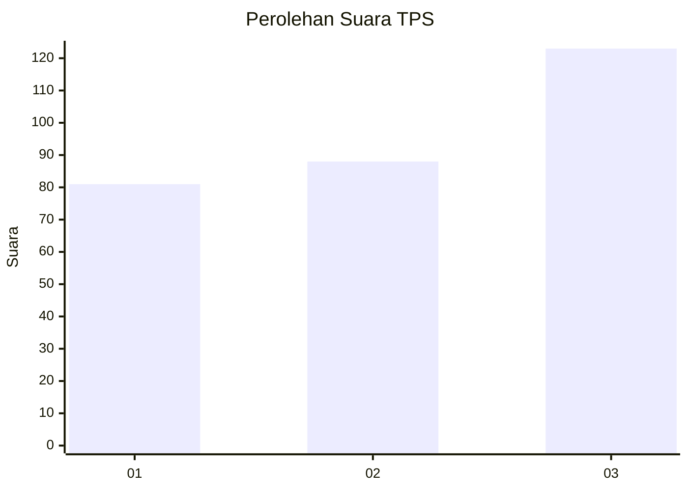
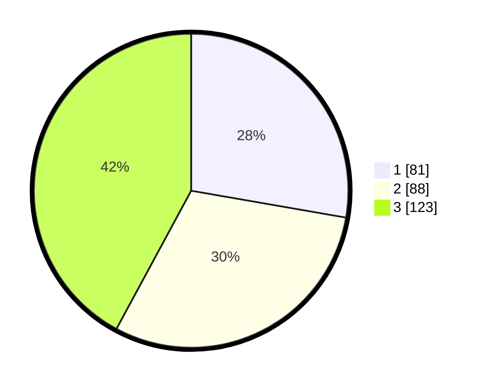

# Hasil

## Grafik

## Tabel

| No. | Nama Paslon    | Suara | Suara (raw) | Persentase |
|:--- |:-------------- | -----:| -----------:| ----------:|
| 1   | ANIES MUHAIMIN | 81    | [81][p-1]   | 27,74      |
| 2   | PRABOWO GIBRAN | 88    | [88][p-2]   | 30,14      |
| 3   | GANJAR MAHFUD  | 123   | [123][p-3]  | 42,12      |

[p-1]: https://github.com/gigit-pemilu/pemilu-2024-99-luar-negeri/blob/main/pilpres/hitung-suara/sub/99-luar-negeri/sub/17-berlin-jerman/sub/01-berlin-jerman/sub/0001-berlin-jerman/sub/004-tps-003/sub/paslon-1.txt
[p-2]: https://github.com/gigit-pemilu/pemilu-2024-99-luar-negeri/blob/main/pilpres/hitung-suara/sub/99-luar-negeri/sub/17-berlin-jerman/sub/01-berlin-jerman/sub/0001-berlin-jerman/sub/004-tps-003/sub/paslon-2.txt
[p-3]: https://github.com/gigit-pemilu/pemilu-2024-99-luar-negeri/blob/main/pilpres/hitung-suara/sub/99-luar-negeri/sub/17-berlin-jerman/sub/01-berlin-jerman/sub/0001-berlin-jerman/sub/004-tps-003/sub/paslon-3.txt

## Foto C Plano

https://sirekap-obj-formc.kpu.go.id/230b/pemilu/ppwp/99/17/01/00/01/9917010001004-20240214-233316--88534b2f-03d1-40a5-a0d2-a008650858c8.jpg

https://sirekap-obj-formc.kpu.go.id/230b/pemilu/ppwp/99/17/01/00/01/9917010001004-20240214-233631--9474acc8-e85d-44c0-a987-6527b6562fe3.jpg

https://sirekap-obj-formc.kpu.go.id/230b/pemilu/ppwp/99/17/01/00/01/9917010001004-20240214-233740--479fbb5a-668f-4ace-a08b-e3e7b1ad34cc.jpg

## Metadata

| Key        | Value               |
| ---------- | ------------------- |
| Time Stamp | 2024-02-16 00:00:26 |

## DATA PEMILIH TETAP

Jumlah pemilih dalam DPT: **1000**.
 * L: **496**.
 * P: **504**.

## DATA PENGGUNA HAK PILIH

Jumlah pengguna hak pilih dalam DPT: **173**.
 * L: **82**.
 * P: **91**.

Jumlah pengguna hak pilih dalam DPTb: **107**.
 * L: **41**.
 * P: **66**.

Jumlah pengguna hak pilih dalam DPK: **18**.
 * L: **9**.
 * P: **9**.

Jumlah pengguna hak pilih: **298**.
 * L: **132**.
 * P: **166**.

## JUMLAH SUARA SAH DAN TIDAK SAH

JUMLAH SELURUH SUARA SAH: **292**.

JUMLAH SUARA TIDAK SAH: **6**.

JUMLAH SELURUH SUARA SAH DAN SUARA TIDAK SAH: **298**.

