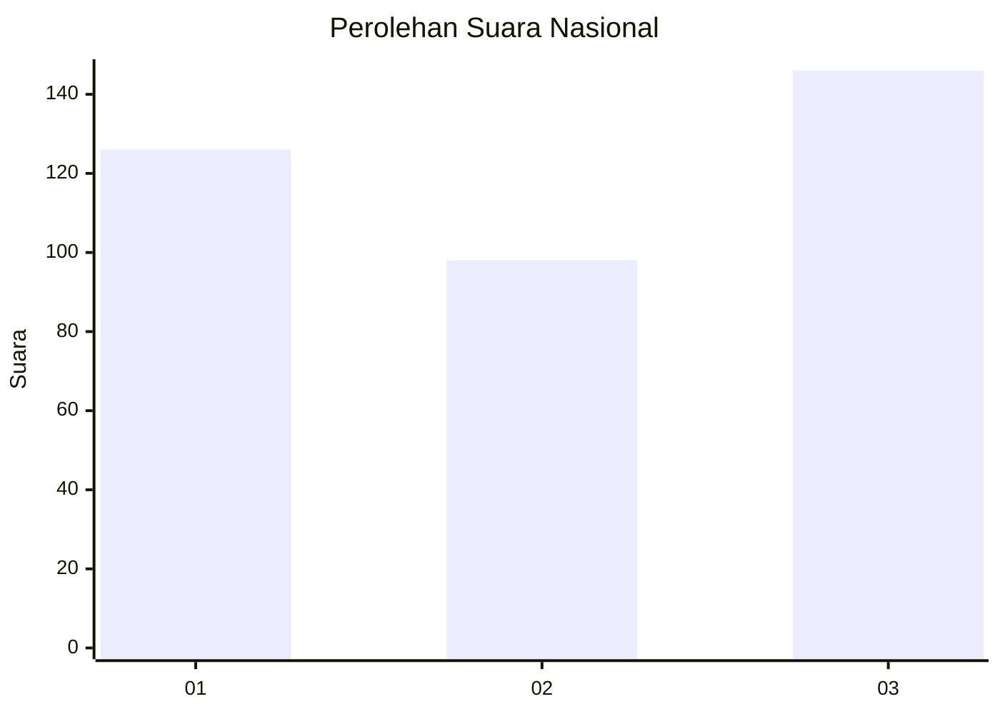
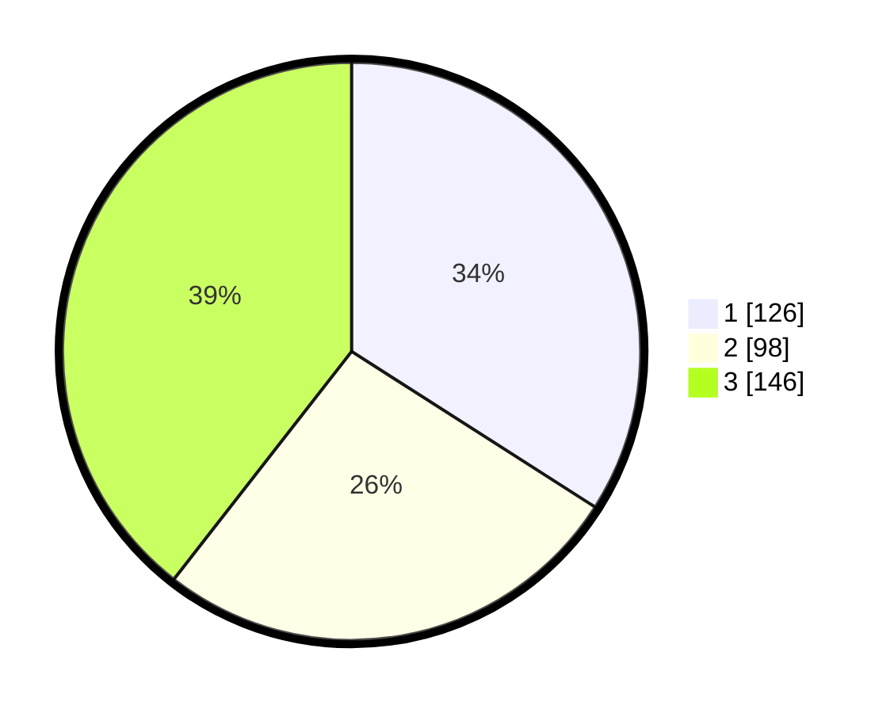

# Hasil

## Grafik

## Tabel

| No. | Nama Paslon    | Suara | Suara (raw) | Persentase |
|:--- |:-------------- | -----:| -----------:| ----------:|
| 1   | ANIES MUHAIMIN | 126   | [126][p-1]  | 34,05      |
| 2   | PRABOWO GIBRAN | 98    | [98][p-2]   | 26,49      |
| 3   | GANJAR MAHFUD  | 146   | [146][p-3]  | 39,46      |

[p-1]: https://github.com/gigit-pemilu/pemilu-2024/blob/main/pilpres/hitung-suara/sub/99-luar-negeri/sub/17-berlin-jerman/sub/01-berlin-jerman/sub/0001-berlin-jerman/sub/005-tps-004/sub/paslon-1.txt
[p-2]: https://github.com/gigit-pemilu/pemilu-2024/blob/main/pilpres/hitung-suara/sub/99-luar-negeri/sub/17-berlin-jerman/sub/01-berlin-jerman/sub/0001-berlin-jerman/sub/005-tps-004/sub/paslon-2.txt
[p-3]: https://github.com/gigit-pemilu/pemilu-2024/blob/main/pilpres/hitung-suara/sub/99-luar-negeri/sub/17-berlin-jerman/sub/01-berlin-jerman/sub/0001-berlin-jerman/sub/005-tps-004/sub/paslon-3.txt

## Foto C Plano

https://sirekap-obj-formc.kpu.go.id/baa4/pemilu/ppwp/99/17/01/00/01/9917010001005-20240214-231345--4dfd599c-f0ca-4c8a-b518-4f9498a2c60d.jpg

https://sirekap-obj-formc.kpu.go.id/baa4/pemilu/ppwp/99/17/01/00/01/9917010001005-20240214-231702--7735e3dc-5277-420d-9a77-dcf3f8becc9a.jpg

https://sirekap-obj-formc.kpu.go.id/baa4/pemilu/ppwp/99/17/01/00/01/9917010001005-20240214-231803--a3767094-8074-43f2-8645-72110341f6e1.jpg

## Metadata

| Key        | Value               |
| ---------- | ------------------- |
| Time Stamp | 2024-02-19 06:16:00 |

## DATA PEMILIH TETAP

Jumlah pemilih dalam DPT: **1049**.
 * L: **630**.
 * P: **419**.

## DATA PENGGUNA HAK PILIH

Jumlah pengguna hak pilih dalam DPT: **208**.
 * L: **74**.
 * P: **134**.

Jumlah pengguna hak pilih dalam DPTb: **140**.
 * L: **71**.
 * P: **69**.

Jumlah pengguna hak pilih dalam DPK: **28**.
 * L: **11**.
 * P: **17**.

Jumlah pengguna hak pilih: **376**.
 * L: **156**.
 * P: **220**.

## JUMLAH SUARA SAH DAN TIDAK SAH

JUMLAH SELURUH SUARA SAH: **370**.

JUMLAH SUARA TIDAK SAH: **6**.

JUMLAH SELURUH SUARA SAH DAN SUARA TIDAK SAH: **376**.

