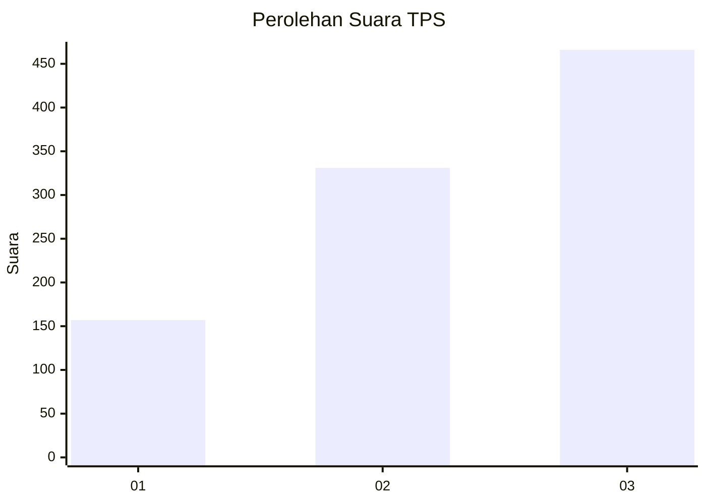
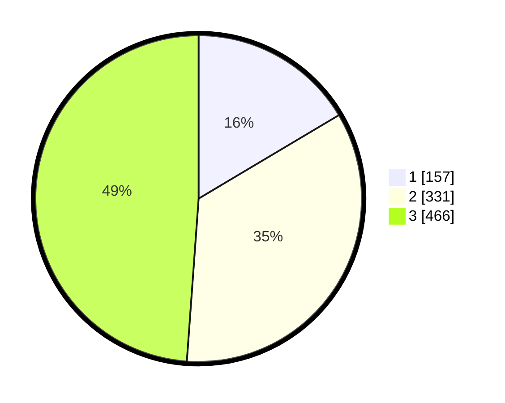

# Hasil

## Grafik

## Tabel

| No. | Nama Paslon    | Suara | Suara (raw) | Persentase |
|:--- |:-------------- | -----:| -----------:| ----------:|
| 1   | ANIES MUHAIMIN | 157   | [157][p-1]  | 16,46      |
| 2   | PRABOWO GIBRAN | 331   | [331][p-2]  | 34,70      |
| 3   | GANJAR MAHFUD  | 466   | [466][p-3]  | 48,85      |

[p-1]: https://github.com/gigit-pemilu/pemilu-2024-99-luar-negeri/blob/main/pilpres/hitung-suara/sub/99-luar-negeri/sub/18-bern-swiss/sub/01-bern-swiss/sub/0001-bern-swiss/sub/001-pos-001/sub/paslon-1.txt
[p-2]: https://github.com/gigit-pemilu/pemilu-2024-99-luar-negeri/blob/main/pilpres/hitung-suara/sub/99-luar-negeri/sub/18-bern-swiss/sub/01-bern-swiss/sub/0001-bern-swiss/sub/001-pos-001/sub/paslon-2.txt
[p-3]: https://github.com/gigit-pemilu/pemilu-2024-99-luar-negeri/blob/main/pilpres/hitung-suara/sub/99-luar-negeri/sub/18-bern-swiss/sub/01-bern-swiss/sub/0001-bern-swiss/sub/001-pos-001/sub/paslon-3.txt

## Foto C Plano

https://sirekap-obj-formc.kpu.go.id/33c7/pemilu/ppwp/99/18/01/00/01/9918010001001-20240217-000333--5c71abf8-c2dd-495e-aef0-d7fcb6638c8b.jpg

https://sirekap-obj-formc.kpu.go.id/33c7/pemilu/ppwp/99/18/01/00/01/9918010001001-20240217-001012--04625ca6-6434-4f60-857a-25f5b7ddc31a.jpg

https://sirekap-obj-formc.kpu.go.id/33c7/pemilu/ppwp/99/18/01/00/01/9918010001001-20240217-001148--bbc213e1-1f8c-4713-9331-6ef5bf3c9e1c.jpg

## Metadata

| Key        | Value               |
| ---------- | ------------------- |
| Time Stamp | 2024-02-17 13:37:34 |

## DATA PEMILIH TETAP

Jumlah pemilih dalam DPT: **1283**.
 * L: **398**.
 * P: **885**.

## DATA PENGGUNA HAK PILIH

Jumlah pengguna hak pilih dalam DPT: **936**.
 * L: **286**.
 * P: **650**.

Jumlah pengguna hak pilih dalam DPTb: **0**.
 * L: **0**.
 * P: **0**.

Jumlah pengguna hak pilih dalam DPK: **32**.
 * L: **7**.
 * P: **25**.

Jumlah pengguna hak pilih: **968**.
 * L: **293**.
 * P: **675**.

## JUMLAH SUARA SAH DAN TIDAK SAH

JUMLAH SELURUH SUARA SAH: **954**.

JUMLAH SUARA TIDAK SAH: **14**.

JUMLAH SELURUH SUARA SAH DAN SUARA TIDAK SAH: **968**.

