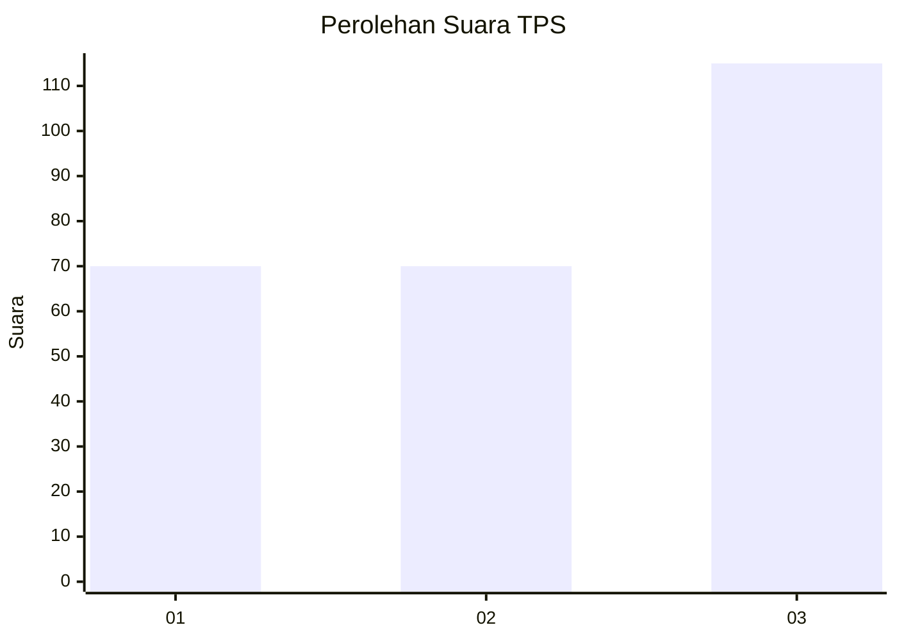
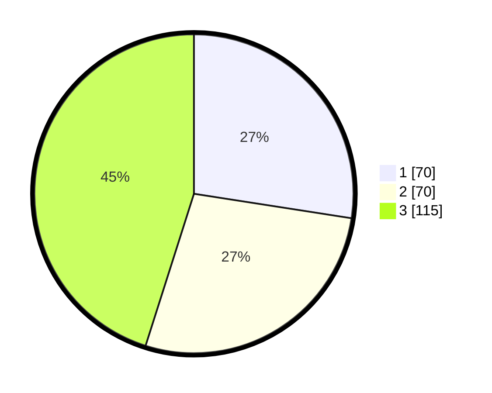

# Hasil

## Grafik

## Tabel

| No. | Nama Paslon    | Suara | Suara (raw) | Persentase |
|:--- |:-------------- | -----:| -----------:| ----------:|
| 1   | ANIES MUHAIMIN | 70    | [70][p-1]   | 27,45      |
| 2   | PRABOWO GIBRAN | 70    | [70][p-2]   | 27,45      |
| 3   | GANJAR MAHFUD  | 115   | [115][p-3]  | 45,10      |

[p-1]: https://github.com/gigit-pemilu/pemilu-2024-99-luar-negeri/blob/main/pilpres/hitung-suara/sub/99-luar-negeri/sub/18-bern-swiss/sub/01-bern-swiss/sub/0001-bern-swiss/sub/002-tps-001/sub/paslon-1.txt
[p-2]: https://github.com/gigit-pemilu/pemilu-2024-99-luar-negeri/blob/main/pilpres/hitung-suara/sub/99-luar-negeri/sub/18-bern-swiss/sub/01-bern-swiss/sub/0001-bern-swiss/sub/002-tps-001/sub/paslon-2.txt
[p-3]: https://github.com/gigit-pemilu/pemilu-2024-99-luar-negeri/blob/main/pilpres/hitung-suara/sub/99-luar-negeri/sub/18-bern-swiss/sub/01-bern-swiss/sub/0001-bern-swiss/sub/002-tps-001/sub/paslon-3.txt

## Foto C Plano

https://sirekap-obj-formc.kpu.go.id/bc94/pemilu/ppwp/99/18/01/00/01/9918010001002-20240214-211221--6b6b63a9-7658-4378-b505-41f4de5bffab.jpg

https://sirekap-obj-formc.kpu.go.id/bc94/pemilu/ppwp/99/18/01/00/01/9918010001002-20240214-223605--ae5f2076-46c7-462b-90b1-4235313476be.jpg

https://sirekap-obj-formc.kpu.go.id/bc94/pemilu/ppwp/99/18/01/00/01/9918010001002-20240214-224604--939ed2ef-7139-41a4-9485-948182901ee2.jpg

## Metadata

| Key        | Value               |
| ---------- | ------------------- |
| Time Stamp | 2024-02-15 17:30:25 |

## DATA PEMILIH TETAP

Jumlah pemilih dalam DPT: **485**.
 * L: **188**.
 * P: **297**.

## DATA PENGGUNA HAK PILIH

Jumlah pengguna hak pilih dalam DPT: **169**.
 * L: **72**.
 * P: **97**.

Jumlah pengguna hak pilih dalam DPTb: **75**.
 * L: **27**.
 * P: **48**.

Jumlah pengguna hak pilih dalam DPK: **16**.
 * L: **7**.
 * P: **9**.

Jumlah pengguna hak pilih: **260**.
 * L: **106**.
 * P: **154**.

## JUMLAH SUARA SAH DAN TIDAK SAH

JUMLAH SELURUH SUARA SAH: **255**.

JUMLAH SUARA TIDAK SAH: **5**.

JUMLAH SELURUH SUARA SAH DAN SUARA TIDAK SAH: **260**.

