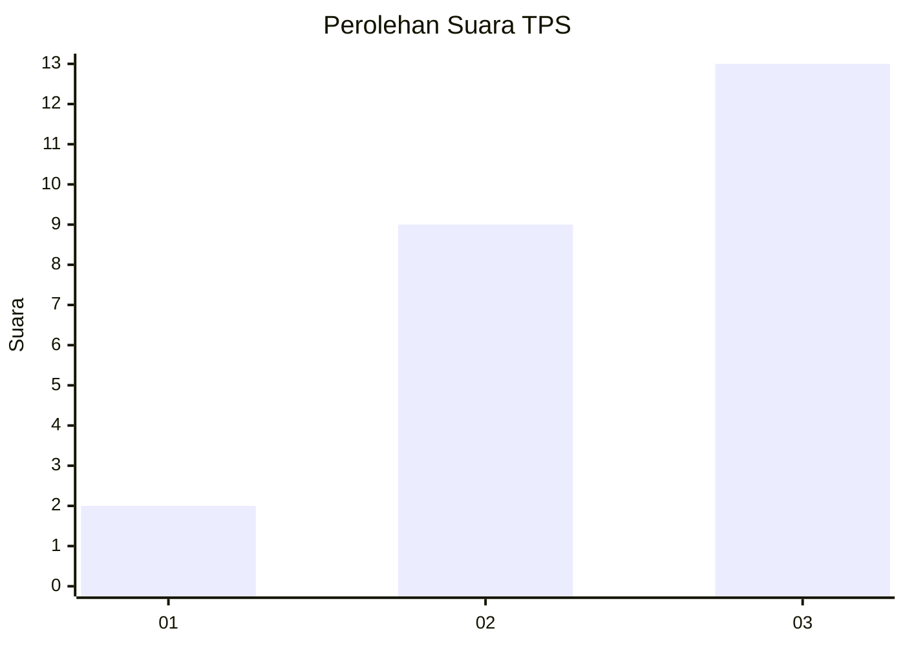
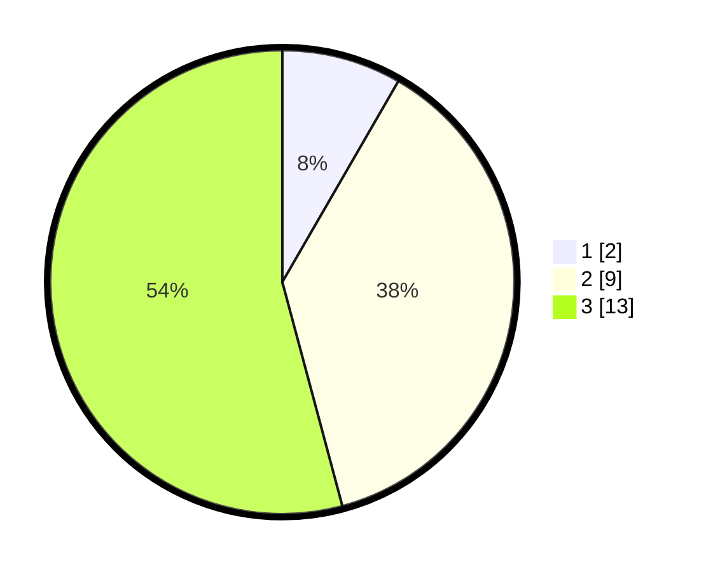

# Hasil

## Grafik

## Tabel

| No. | Nama Paslon    | Suara | Suara (raw) | Persentase |
|:--- |:-------------- | -----:| -----------:| ----------:|
| 1   | ANIES MUHAIMIN | 2     | [2][p-1]    | 8,33       |
| 2   | PRABOWO GIBRAN | 9     | [9][p-2]    | 37,50      |
| 3   | GANJAR MAHFUD  | 13    | [13][p-3]   | 54,17      |

[p-1]: https://github.com/gigit-pemilu/pemilu-2024-99-luar-negeri/blob/main/pilpres/hitung-suara/sub/99-luar-negeri/sub/19-bogota-kolombia/sub/01-bogota-kolombia/sub/0001-bogota-kolombia/sub/001-pos-001/sub/paslon-1.txt
[p-2]: https://github.com/gigit-pemilu/pemilu-2024-99-luar-negeri/blob/main/pilpres/hitung-suara/sub/99-luar-negeri/sub/19-bogota-kolombia/sub/01-bogota-kolombia/sub/0001-bogota-kolombia/sub/001-pos-001/sub/paslon-2.txt
[p-3]: https://github.com/gigit-pemilu/pemilu-2024-99-luar-negeri/blob/main/pilpres/hitung-suara/sub/99-luar-negeri/sub/19-bogota-kolombia/sub/01-bogota-kolombia/sub/0001-bogota-kolombia/sub/001-pos-001/sub/paslon-3.txt

## Foto C Plano

https://sirekap-obj-formc.kpu.go.id/8222/pemilu/ppwp/99/19/01/00/01/9919010001001-20240220-224523--92a327ac-8f2a-463b-b12d-82656606bac1.jpg

https://sirekap-obj-formc.kpu.go.id/8222/pemilu/ppwp/99/19/01/00/01/9919010001001-20240220-232421--9e4b83d7-f35a-44ce-ac68-7c8a4c236a1a.jpg

https://sirekap-obj-formc.kpu.go.id/8222/pemilu/ppwp/99/19/01/00/01/9919010001001-20240220-231343--967492ac-791e-418e-a824-473cd53256a6.jpg

## Metadata

| Key        | Value               |
| ---------- | ------------------- |
| Time Stamp | 2024-02-21 00:00:00 |

## DATA PEMILIH TETAP

Jumlah pemilih dalam DPT: **28**.
 * L: **18**.
 * P: **10**.

## DATA PENGGUNA HAK PILIH

Jumlah pengguna hak pilih dalam DPT: **25**.
 * L: **16**.
 * P: **9**.

Jumlah pengguna hak pilih dalam DPTb: **0**.
 * L: **0**.
 * P: **0**.

Jumlah pengguna hak pilih dalam DPK: **0**.
 * L: **0**.
 * P: **0**.

Jumlah pengguna hak pilih: **25**.
 * L: **16**.
 * P: **9**.

## JUMLAH SUARA SAH DAN TIDAK SAH

JUMLAH SELURUH SUARA SAH: **24**.

JUMLAH SUARA TIDAK SAH: **1**.

JUMLAH SELURUH SUARA SAH DAN SUARA TIDAK SAH: **25**.

