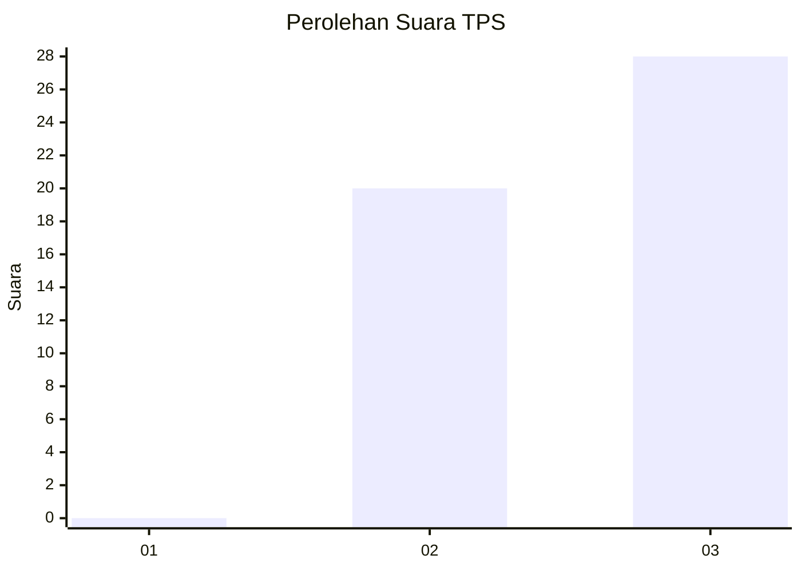
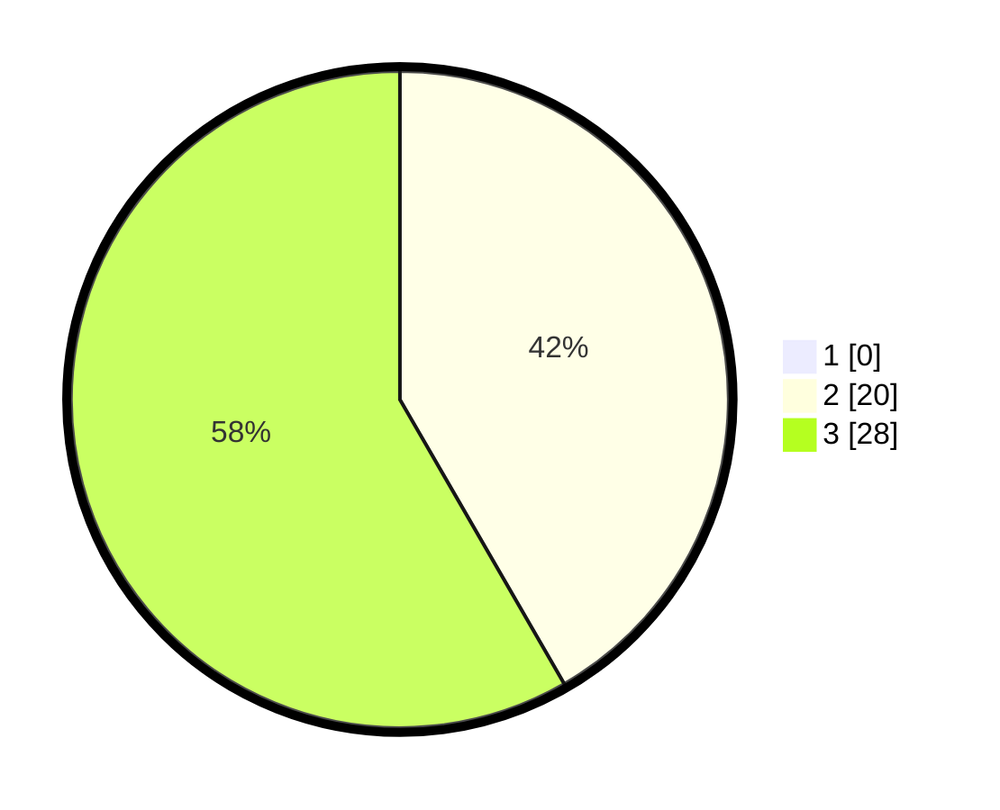

# Hasil

## Grafik

## Tabel

| No. | Nama Paslon    | Suara | Suara (raw) | Persentase |
|:--- |:-------------- | -----:| -----------:| ----------:|
| 1   | ANIES MUHAIMIN | 0     | [0][p-1]    | 0,00       |
| 2   | PRABOWO GIBRAN | 20    | [20][p-2]   | 41,67      |
| 3   | GANJAR MAHFUD  | 28    | [28][p-3]   | 58,33      |

[p-1]: https://github.com/gigit-pemilu/pemilu-2024-99-luar-negeri/blob/main/pilpres/hitung-suara/sub/99-luar-negeri/sub/19-bogota-kolombia/sub/01-bogota-kolombia/sub/0001-bogota-kolombia/sub/002-tps-001/sub/paslon-1.txt
[p-2]: https://github.com/gigit-pemilu/pemilu-2024-99-luar-negeri/blob/main/pilpres/hitung-suara/sub/99-luar-negeri/sub/19-bogota-kolombia/sub/01-bogota-kolombia/sub/0001-bogota-kolombia/sub/002-tps-001/sub/paslon-2.txt
[p-3]: https://github.com/gigit-pemilu/pemilu-2024-99-luar-negeri/blob/main/pilpres/hitung-suara/sub/99-luar-negeri/sub/19-bogota-kolombia/sub/01-bogota-kolombia/sub/0001-bogota-kolombia/sub/002-tps-001/sub/paslon-3.txt

## Foto C Plano

https://sirekap-obj-formc.kpu.go.id/bbcd/pemilu/ppwp/99/19/01/00/01/9919010001002-20240216-043028--096195e4-38d3-4bd8-8c66-d3a18ee38ded.jpg

https://sirekap-obj-formc.kpu.go.id/bbcd/pemilu/ppwp/99/19/01/00/01/9919010001002-20240216-043657--57b2386f-05f8-43d0-bc91-7acf90de2a30.jpg

https://sirekap-obj-formc.kpu.go.id/bbcd/pemilu/ppwp/99/19/01/00/01/9919010001002-20240216-043926--ad56e101-39d5-4883-90a5-3a49848d6622.jpg

## Metadata

| Key        | Value               |
| ---------- | ------------------- |
| Time Stamp | 2024-02-16 05:00:26 |

## DATA PEMILIH TETAP

Jumlah pemilih dalam DPT: **50**.
 * L: **32**.
 * P: **18**.

## DATA PENGGUNA HAK PILIH

Jumlah pengguna hak pilih dalam DPT: **35**.
 * L: **19**.
 * P: **16**.

Jumlah pengguna hak pilih dalam DPTb: **9**.
 * L: **6**.
 * P: **3**.

Jumlah pengguna hak pilih dalam DPK: **4**.
 * L: **2**.
 * P: **2**.

Jumlah pengguna hak pilih: **48**.
 * L: **27**.
 * P: **21**.

## JUMLAH SUARA SAH DAN TIDAK SAH

JUMLAH SELURUH SUARA SAH: **48**.

JUMLAH SUARA TIDAK SAH: **0**.

JUMLAH SELURUH SUARA SAH DAN SUARA TIDAK SAH: **48**.

