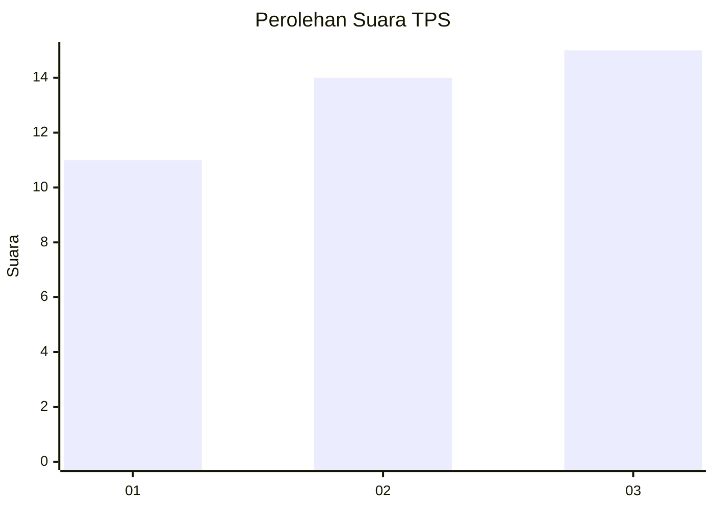
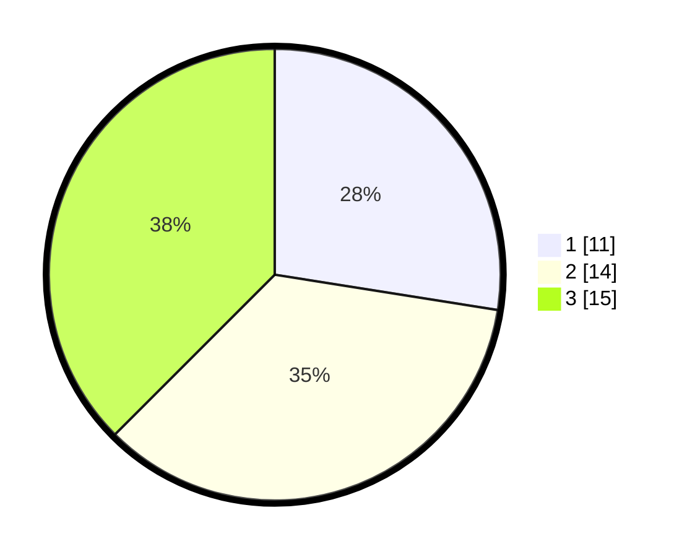

# Hasil

## Grafik

## Tabel

| No. | Nama Paslon    | Suara | Suara (raw) | Persentase |
|:--- |:-------------- | -----:| -----------:| ----------:|
| 1   | ANIES MUHAIMIN | 11    | [11][p-1]   | 27,50      |
| 2   | PRABOWO GIBRAN | 14    | [14][p-2]   | 35,00      |
| 3   | GANJAR MAHFUD  | 15    | [15][p-3]   | 37,50      |

[p-1]: https://github.com/gigit-pemilu/pemilu-2024-99-luar-negeri/blob/main/pilpres/hitung-suara/sub/99-luar-negeri/sub/20-brasilia-brasil/sub/01-brasilia-brasil/sub/0001-brasilia-brasil/sub/002-tps-001/sub/paslon-1.txt
[p-2]: https://github.com/gigit-pemilu/pemilu-2024-99-luar-negeri/blob/main/pilpres/hitung-suara/sub/99-luar-negeri/sub/20-brasilia-brasil/sub/01-brasilia-brasil/sub/0001-brasilia-brasil/sub/002-tps-001/sub/paslon-2.txt
[p-3]: https://github.com/gigit-pemilu/pemilu-2024-99-luar-negeri/blob/main/pilpres/hitung-suara/sub/99-luar-negeri/sub/20-brasilia-brasil/sub/01-brasilia-brasil/sub/0001-brasilia-brasil/sub/002-tps-001/sub/paslon-3.txt

## Foto C Plano

https://sirekap-obj-formc.kpu.go.id/fb48/pemilu/ppwp/99/20/01/00/01/9920010001002-20240216-155555--b8cadc62-ab0e-47c3-81a6-f5ae0637ff30.jpg

https://sirekap-obj-formc.kpu.go.id/fb48/pemilu/ppwp/99/20/01/00/01/9920010001002-20240216-155606--a4ce6e93-b88c-4d9c-b6ed-5d22ed04fcd9.jpg

https://sirekap-obj-formc.kpu.go.id/fb48/pemilu/ppwp/99/20/01/00/01/9920010001002-20240216-155555--9975ce03-d0f9-473f-bb5d-c802d31495d2.jpg

## Metadata

| Key        | Value               |
| ---------- | ------------------- |
| Time Stamp | 2024-02-17 02:00:02 |

## DATA PEMILIH TETAP

Jumlah pemilih dalam DPT: **43**.
 * L: **22**.
 * P: **21**.

## DATA PENGGUNA HAK PILIH

Jumlah pengguna hak pilih dalam DPT: **34**.
 * L: **19**.
 * P: **15**.

Jumlah pengguna hak pilih dalam DPTb: **6**.
 * L: **2**.
 * P: **4**.

Jumlah pengguna hak pilih dalam DPK: **0**.
 * L: **0**.
 * P: **0**.

Jumlah pengguna hak pilih: **40**.
 * L: **21**.
 * P: **19**.

## JUMLAH SUARA SAH DAN TIDAK SAH

JUMLAH SELURUH SUARA SAH: **40**.

JUMLAH SUARA TIDAK SAH: **0**.

JUMLAH SELURUH SUARA SAH DAN SUARA TIDAK SAH: **40**.

