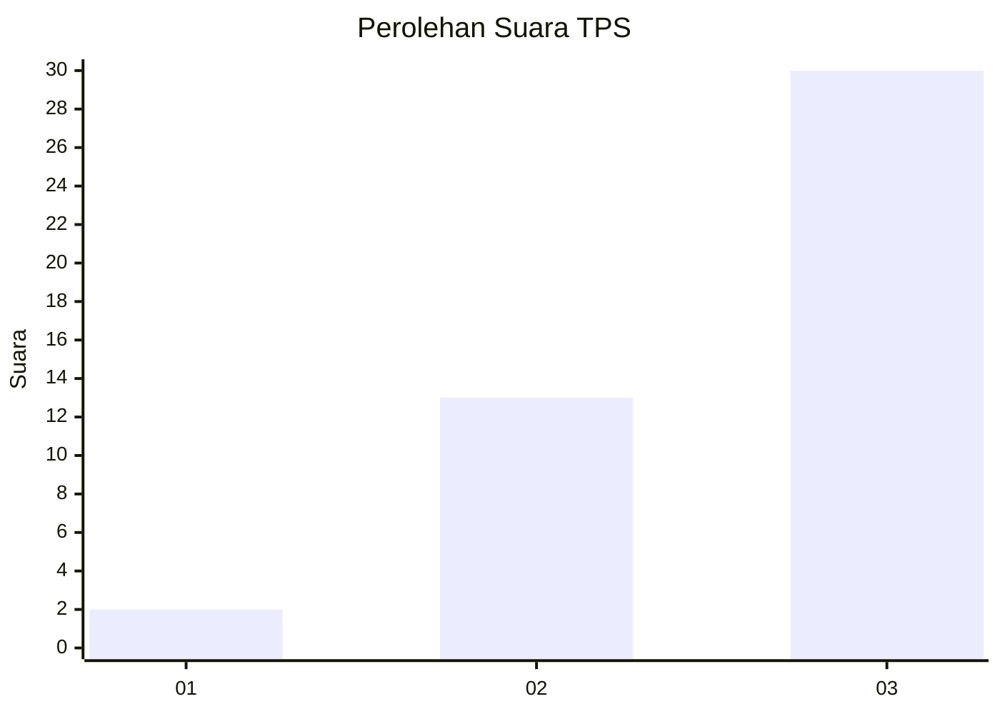
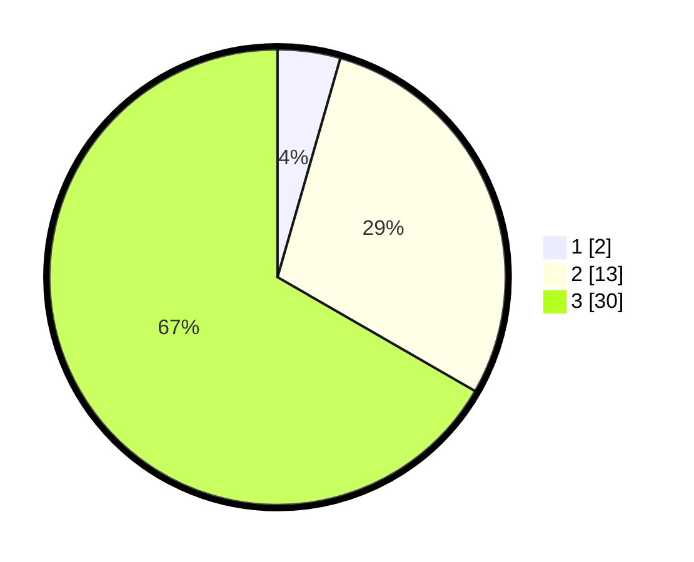

# Hasil

## Grafik

## Tabel

| No. | Nama Paslon    | Suara | Suara (raw) | Persentase |
|:--- |:-------------- | -----:| -----------:| ----------:|
| 1   | ANIES MUHAIMIN | 2     | [2][p-1]    | 4,44       |
| 2   | PRABOWO GIBRAN | 13    | [13][p-2]   | 28,89      |
| 3   | GANJAR MAHFUD  | 30    | [30][p-3]   | 66,67      |

[p-1]: https://github.com/gigit-pemilu/pemilu-2024-99-luar-negeri/blob/main/pilpres/hitung-suara/sub/99-luar-negeri/sub/20-brasilia-brasil/sub/01-brasilia-brasil/sub/0001-brasilia-brasil/sub/003-ksk-001/sub/paslon-1.txt
[p-2]: https://github.com/gigit-pemilu/pemilu-2024-99-luar-negeri/blob/main/pilpres/hitung-suara/sub/99-luar-negeri/sub/20-brasilia-brasil/sub/01-brasilia-brasil/sub/0001-brasilia-brasil/sub/003-ksk-001/sub/paslon-2.txt
[p-3]: https://github.com/gigit-pemilu/pemilu-2024-99-luar-negeri/blob/main/pilpres/hitung-suara/sub/99-luar-negeri/sub/20-brasilia-brasil/sub/01-brasilia-brasil/sub/0001-brasilia-brasil/sub/003-ksk-001/sub/paslon-3.txt

## Foto C Plano

https://sirekap-obj-formc.kpu.go.id/7490/pemilu/ppwp/99/20/01/00/01/9920010001003-20240216-145912--b8f975c1-d70c-4c3d-a5fc-3c4e4be2a3c9.jpg

https://sirekap-obj-formc.kpu.go.id/7490/pemilu/ppwp/99/20/01/00/01/9920010001003-20240216-145913--d497348f-0bd5-4e8f-9a27-510a10841601.jpg

https://sirekap-obj-formc.kpu.go.id/7490/pemilu/ppwp/99/20/01/00/01/9920010001003-20240216-145912--cae308c4-064d-4291-bb5c-64f2f3ddae43.jpg

## Metadata

| Key        | Value               |
| ---------- | ------------------- |
| Time Stamp | 2024-02-17 02:00:02 |

## DATA PEMILIH TETAP

Jumlah pemilih dalam DPT: **48**.
 * L: **24**.
 * P: **24**.

## DATA PENGGUNA HAK PILIH

Jumlah pengguna hak pilih dalam DPT: **41**.
 * L: **20**.
 * P: **21**.

Jumlah pengguna hak pilih dalam DPTb: **4**.
 * L: **1**.
 * P: **3**.

Jumlah pengguna hak pilih dalam DPK: **1**.
 * L: **0**.
 * P: **1**.

Jumlah pengguna hak pilih: **46**.
 * L: **21**.
 * P: **25**.

## JUMLAH SUARA SAH DAN TIDAK SAH

JUMLAH SELURUH SUARA SAH: **45**.

JUMLAH SUARA TIDAK SAH: **1**.

JUMLAH SELURUH SUARA SAH DAN SUARA TIDAK SAH: **46**.

