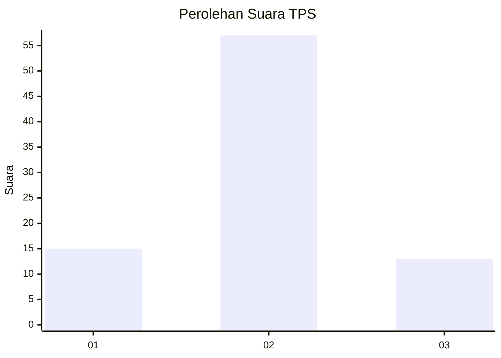
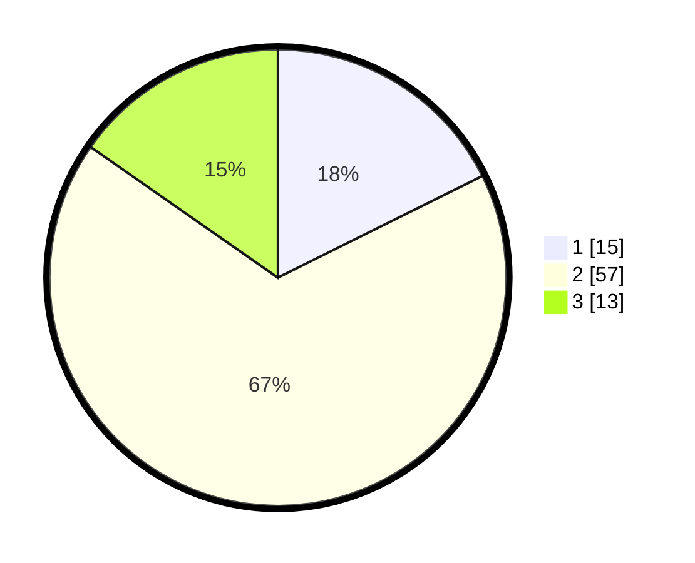

# Hasil

## Grafik

## Tabel

| No. | Nama Paslon    | Suara | Suara (raw) | Persentase |
|:--- |:-------------- | -----:| -----------:| ----------:|
| 1   | ANIES MUHAIMIN | 15    | [15][p-1]   | 17,65      |
| 2   | PRABOWO GIBRAN | 57    | [57][p-2]   | 67,06      |
| 3   | GANJAR MAHFUD  | 13    | [13][p-3]   | 15,29      |

[p-1]: https://github.com/gigit-pemilu/pemilu-2024-99-luar-negeri/blob/main/pilpres/hitung-suara/sub/99-luar-negeri/sub/21-bratislava-slowakia/sub/01-bratislava-slowakia/sub/0001-bratislava-slowakia/sub/001-pos-001/sub/paslon-1.txt
[p-2]: https://github.com/gigit-pemilu/pemilu-2024-99-luar-negeri/blob/main/pilpres/hitung-suara/sub/99-luar-negeri/sub/21-bratislava-slowakia/sub/01-bratislava-slowakia/sub/0001-bratislava-slowakia/sub/001-pos-001/sub/paslon-2.txt
[p-3]: https://github.com/gigit-pemilu/pemilu-2024-99-luar-negeri/blob/main/pilpres/hitung-suara/sub/99-luar-negeri/sub/21-bratislava-slowakia/sub/01-bratislava-slowakia/sub/0001-bratislava-slowakia/sub/001-pos-001/sub/paslon-3.txt

## Foto C Plano

https://sirekap-obj-formc.kpu.go.id/a2ba/pemilu/ppwp/99/21/01/00/01/9921010001001-20240216-154318--2c1c23c5-26fb-4691-a734-3aa8f4a0a4f1.jpg

https://sirekap-obj-formc.kpu.go.id/a2ba/pemilu/ppwp/99/21/01/00/01/9921010001001-20240216-154320--1d110278-ee52-4ab1-ac80-010bc5ce28ff.jpg

https://sirekap-obj-formc.kpu.go.id/a2ba/pemilu/ppwp/99/21/01/00/01/9921010001001-20240216-154319--57379be0-4292-49d7-a7a6-1b8a835df6e4.jpg

## Metadata

| Key        | Value               |
| ---------- | ------------------- |
| Time Stamp | 2024-02-17 02:00:02 |

## DATA PEMILIH TETAP

Jumlah pemilih dalam DPT: **132**.
 * L: **102**.
 * P: **30**.

## DATA PENGGUNA HAK PILIH

Jumlah pengguna hak pilih dalam DPT: **74**.
 * L: **54**.
 * P: **20**.

Jumlah pengguna hak pilih dalam DPTb: **12**.
 * L: **11**.
 * P: **1**.

Jumlah pengguna hak pilih dalam DPK: **0**.
 * L: **0**.
 * P: **0**.

Jumlah pengguna hak pilih: **86**.
 * L: **65**.
 * P: **21**.

## JUMLAH SUARA SAH DAN TIDAK SAH

JUMLAH SELURUH SUARA SAH: **85**.

JUMLAH SUARA TIDAK SAH: **1**.

JUMLAH SELURUH SUARA SAH DAN SUARA TIDAK SAH: **86**.

