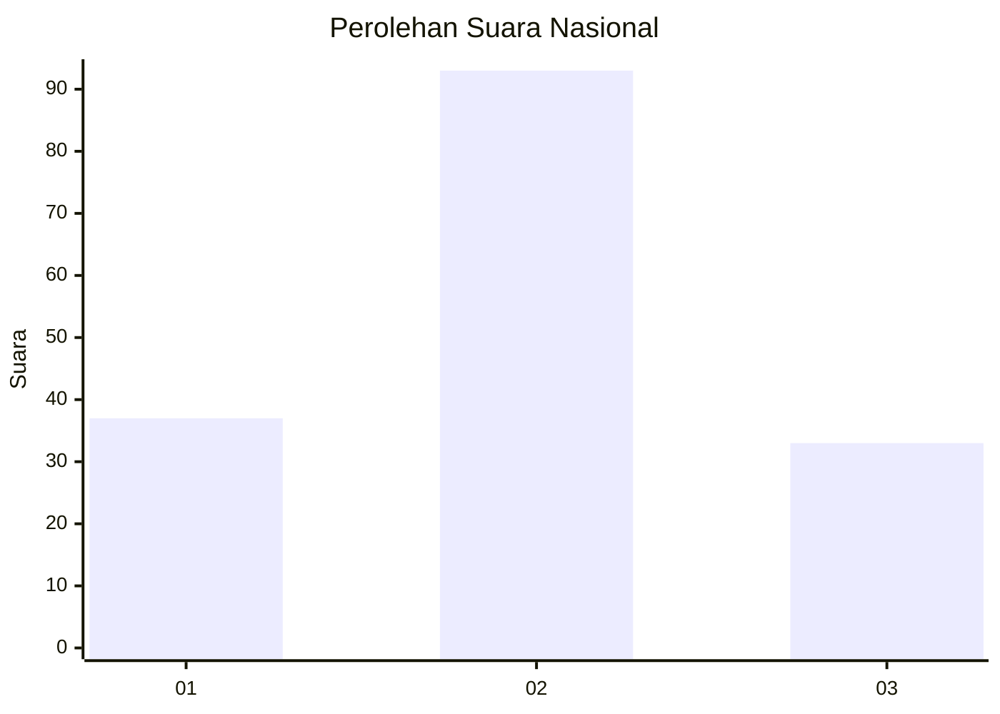
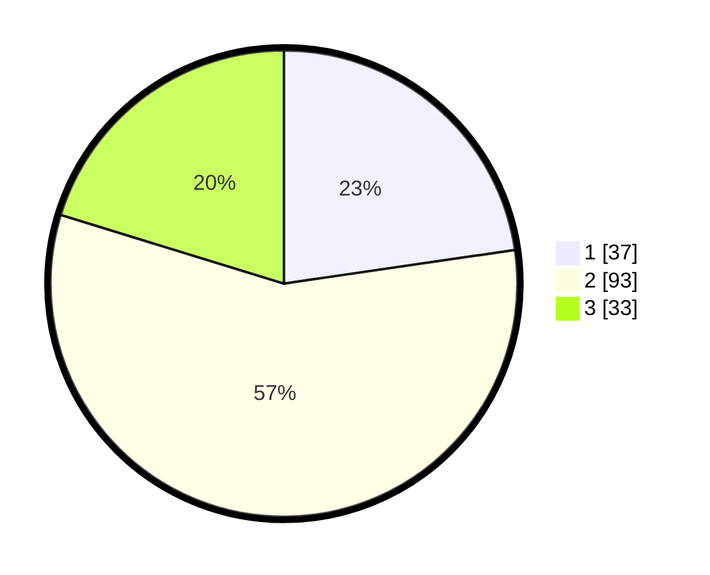

# Hasil

## Grafik

## Tabel

| No. | Nama Paslon    | Suara | Suara (raw) | Persentase |
|:--- |:-------------- | -----:| -----------:| ----------:|
| 1   | ANIES MUHAIMIN | 37    | [37][p-1]   | 22,70      |
| 2   | PRABOWO GIBRAN | 93    | [93][p-2]   | 57,06      |
| 3   | GANJAR MAHFUD  | 33    | [33][p-3]   | 20,25      |

[p-1]: https://github.com/gigit-pemilu/pemilu-2024/blob/main/pilpres/hitung-suara/sub/99-luar-negeri/sub/21-bratislava-slowakia/sub/01-bratislava-slowakia/sub/0001-bratislava-slowakia/sub/002-tps-001/sub/paslon-1.txt
[p-2]: https://github.com/gigit-pemilu/pemilu-2024/blob/main/pilpres/hitung-suara/sub/99-luar-negeri/sub/21-bratislava-slowakia/sub/01-bratislava-slowakia/sub/0001-bratislava-slowakia/sub/002-tps-001/sub/paslon-2.txt
[p-3]: https://github.com/gigit-pemilu/pemilu-2024/blob/main/pilpres/hitung-suara/sub/99-luar-negeri/sub/21-bratislava-slowakia/sub/01-bratislava-slowakia/sub/0001-bratislava-slowakia/sub/002-tps-001/sub/paslon-3.txt

## Foto C Plano

https://sirekap-obj-formc.kpu.go.id/203b/pemilu/ppwp/99/21/01/00/01/9921010001002-20240215-211345--62317217-2191-45f0-badb-0c92eb6026c3.jpg

https://sirekap-obj-formc.kpu.go.id/203b/pemilu/ppwp/99/21/01/00/01/9921010001002-20240215-211347--6c6c68fb-08c6-4906-a7e4-58ea73bd1490.jpg

https://sirekap-obj-formc.kpu.go.id/203b/pemilu/ppwp/99/21/01/00/01/9921010001002-20240215-211346--f8b6b56f-df50-4c14-86d4-62fd83c0fa39.jpg

## Metadata

| Key        | Value               |
| ---------- | ------------------- |
| Time Stamp | 2024-02-16 12:51:22 |

## DATA PEMILIH TETAP

Jumlah pemilih dalam DPT: **198**.
 * L: **143**.
 * P: **55**.

## DATA PENGGUNA HAK PILIH

Jumlah pengguna hak pilih dalam DPT: **95**.
 * L: **55**.
 * P: **40**.

Jumlah pengguna hak pilih dalam DPTb: **68**.
 * L: **49**.
 * P: **19**.

Jumlah pengguna hak pilih dalam DPK: **3**.
 * L: **3**.
 * P: **0**.

Jumlah pengguna hak pilih: **166**.
 * L: **107**.
 * P: **59**.

## JUMLAH SUARA SAH DAN TIDAK SAH

JUMLAH SELURUH SUARA SAH: **163**.

JUMLAH SUARA TIDAK SAH: **3**.

JUMLAH SELURUH SUARA SAH DAN SUARA TIDAK SAH: **166**.

