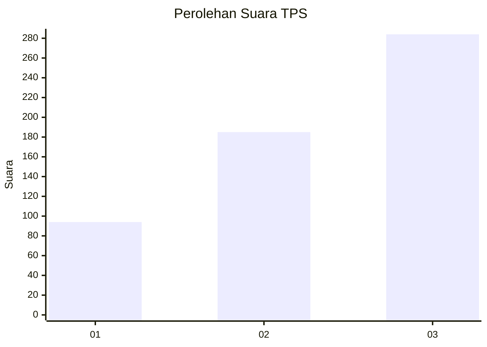
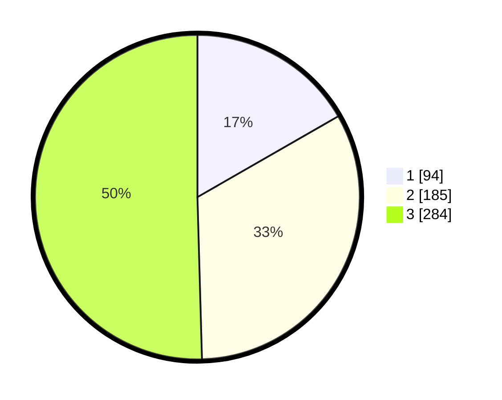

# Hasil

## Grafik

## Tabel

| No. | Nama Paslon    | Suara | Suara (raw) | Persentase |
|:--- |:-------------- | -----:| -----------:| ----------:|
| 1   | ANIES MUHAIMIN | 94    | [94][p-1]   | 16,70      |
| 2   | PRABOWO GIBRAN | 185   | [185][p-2]  | 32,86      |
| 3   | GANJAR MAHFUD  | 284   | [284][p-3]  | 50,44      |

[p-1]: https://github.com/gigit-pemilu/pemilu-2024-99-luar-negeri/blob/main/pilpres/hitung-suara/sub/99-luar-negeri/sub/22-brussels-belgia/sub/01-brussels-belgia/sub/0001-brussels-belgia/sub/001-pos-001/sub/paslon-1.txt
[p-2]: https://github.com/gigit-pemilu/pemilu-2024-99-luar-negeri/blob/main/pilpres/hitung-suara/sub/99-luar-negeri/sub/22-brussels-belgia/sub/01-brussels-belgia/sub/0001-brussels-belgia/sub/001-pos-001/sub/paslon-2.txt
[p-3]: https://github.com/gigit-pemilu/pemilu-2024-99-luar-negeri/blob/main/pilpres/hitung-suara/sub/99-luar-negeri/sub/22-brussels-belgia/sub/01-brussels-belgia/sub/0001-brussels-belgia/sub/001-pos-001/sub/paslon-3.txt

## Foto C Plano

https://sirekap-obj-formc.kpu.go.id/a8cf/pemilu/ppwp/99/22/01/00/01/9922010001001-20240216-044516--d7c375fe-f373-44f8-adae-f8f7db3acf4c.jpg

https://sirekap-obj-formc.kpu.go.id/a8cf/pemilu/ppwp/99/22/01/00/01/9922010001001-20240216-045134--851a53fe-c25d-45cf-be0b-505eccbdc074.jpg

https://sirekap-obj-formc.kpu.go.id/a8cf/pemilu/ppwp/99/22/01/00/01/9922010001001-20240216-044527--dc577379-d421-46c6-9c2d-a1a5515c9966.jpg

## Metadata

| Key        | Value               |
| ---------- | ------------------- |
| Time Stamp | 2024-02-16 12:51:22 |

## DATA PEMILIH TETAP

Jumlah pemilih dalam DPT: **932**.
 * L: **190**.
 * P: **742**.

## DATA PENGGUNA HAK PILIH

Jumlah pengguna hak pilih dalam DPT: **559**.
 * L: **106**.
 * P: **453**.

Jumlah pengguna hak pilih dalam DPTb: **2**.
 * L: **1**.
 * P: **1**.

Jumlah pengguna hak pilih dalam DPK: **16**.
 * L: **3**.
 * P: **13**.

Jumlah pengguna hak pilih: **577**.
 * L: **110**.
 * P: **467**.

## JUMLAH SUARA SAH DAN TIDAK SAH

JUMLAH SELURUH SUARA SAH: **563**.

JUMLAH SUARA TIDAK SAH: **14**.

JUMLAH SELURUH SUARA SAH DAN SUARA TIDAK SAH: **577**.

