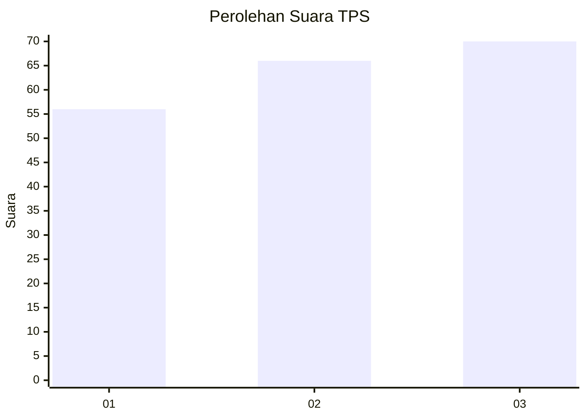
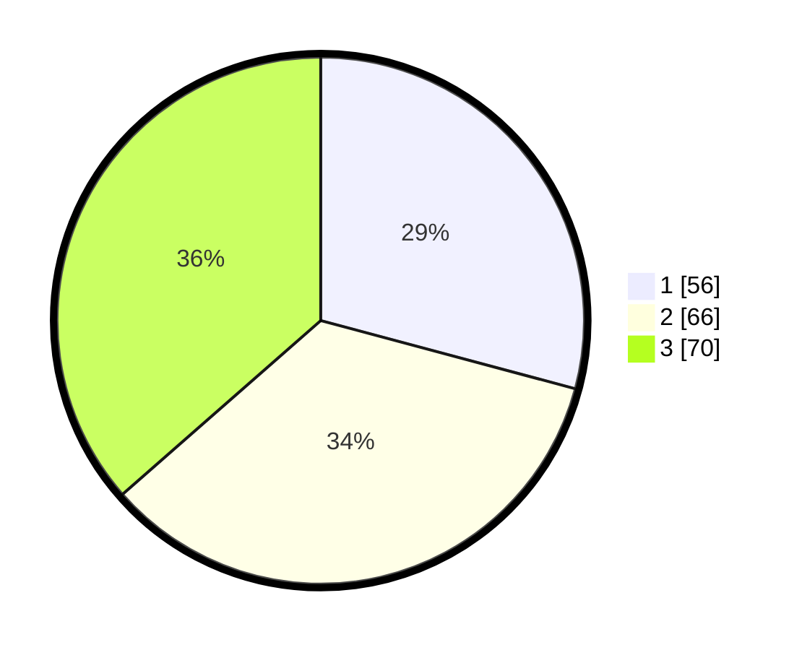

# Hasil

## Grafik

## Tabel

| No. | Nama Paslon    | Suara | Suara (raw) | Persentase |
|:--- |:-------------- | -----:| -----------:| ----------:|
| 1   | ANIES MUHAIMIN | 56    | [56][p-1]   | 29,17      |
| 2   | PRABOWO GIBRAN | 66    | [66][p-2]   | 34,38      |
| 3   | GANJAR MAHFUD  | 70    | [70][p-3]   | 36,46      |

[p-1]: https://github.com/gigit-pemilu/pemilu-2024-99-luar-negeri/blob/main/pilpres/hitung-suara/sub/99-luar-negeri/sub/22-brussels-belgia/sub/01-brussels-belgia/sub/0001-brussels-belgia/sub/002-tps-001/sub/paslon-1.txt
[p-2]: https://github.com/gigit-pemilu/pemilu-2024-99-luar-negeri/blob/main/pilpres/hitung-suara/sub/99-luar-negeri/sub/22-brussels-belgia/sub/01-brussels-belgia/sub/0001-brussels-belgia/sub/002-tps-001/sub/paslon-2.txt
[p-3]: https://github.com/gigit-pemilu/pemilu-2024-99-luar-negeri/blob/main/pilpres/hitung-suara/sub/99-luar-negeri/sub/22-brussels-belgia/sub/01-brussels-belgia/sub/0001-brussels-belgia/sub/002-tps-001/sub/paslon-3.txt

## Foto C Plano

https://sirekap-obj-formc.kpu.go.id/9942/pemilu/ppwp/99/22/01/00/01/9922010001002-20240216-143053--691cd9f3-e188-4960-b080-1328c27c14f4.jpg

https://sirekap-obj-formc.kpu.go.id/9942/pemilu/ppwp/99/22/01/00/01/9922010001002-20240214-215847--b8325207-1a5e-406c-94c9-6573201a03d0.jpg

https://sirekap-obj-formc.kpu.go.id/9942/pemilu/ppwp/99/22/01/00/01/9922010001002-20240214-220012--38ecf04a-b246-4d7d-963a-615c87fd96fd.jpg

## Metadata

| Key        | Value               |
| ---------- | ------------------- |
| Time Stamp | 2024-02-16 16:25:10 |

## DATA PEMILIH TETAP

Jumlah pemilih dalam DPT: **407**.
 * L: **128**.
 * P: **279**.

## DATA PENGGUNA HAK PILIH

Jumlah pengguna hak pilih dalam DPT: **118**.
 * L: **38**.
 * P: **80**.

Jumlah pengguna hak pilih dalam DPTb: **65**.
 * L: **21**.
 * P: **44**.

Jumlah pengguna hak pilih dalam DPK: **10**.
 * L: **7**.
 * P: **3**.

Jumlah pengguna hak pilih: **193**.
 * L: **66**.
 * P: **127**.

## JUMLAH SUARA SAH DAN TIDAK SAH

JUMLAH SELURUH SUARA SAH: **192**.

JUMLAH SUARA TIDAK SAH: **1**.

JUMLAH SELURUH SUARA SAH DAN SUARA TIDAK SAH: **193**.

