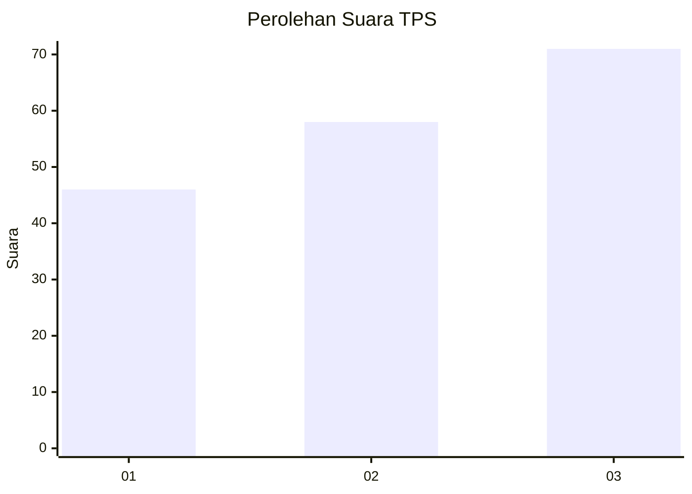
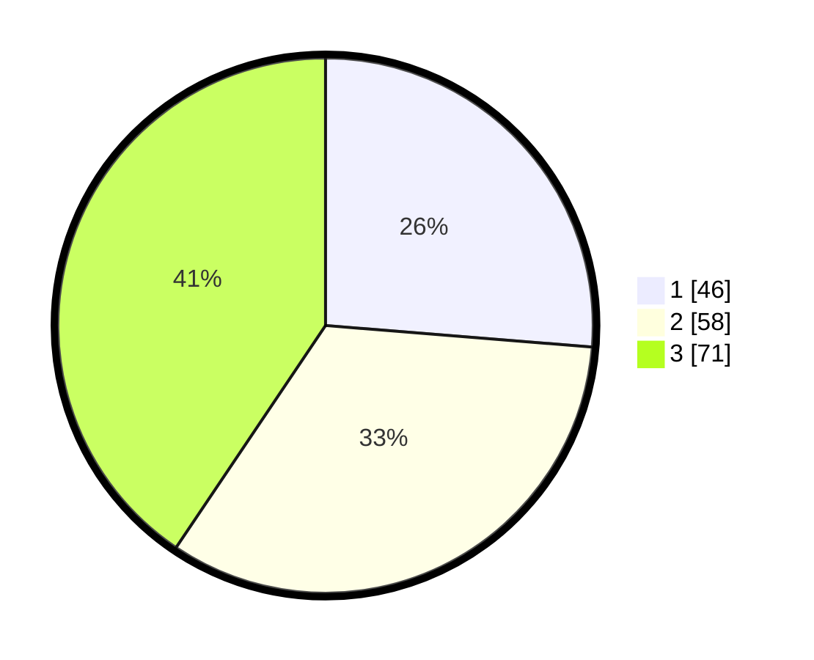

# Hasil

## Grafik

## Tabel

| No. | Nama Paslon    | Suara | Suara (raw) | Persentase |
|:--- |:-------------- | -----:| -----------:| ----------:|
| 1   | ANIES MUHAIMIN | 46    | [46][p-1]   | 26,29      |
| 2   | PRABOWO GIBRAN | 58    | [58][p-2]   | 33,14      |
| 3   | GANJAR MAHFUD  | 71    | [71][p-3]   | 40,57      |

[p-1]: https://github.com/gigit-pemilu/pemilu-2024-99-luar-negeri/blob/main/pilpres/hitung-suara/sub/99-luar-negeri/sub/22-brussels-belgia/sub/01-brussels-belgia/sub/0001-brussels-belgia/sub/003-tps-002/sub/paslon-1.txt
[p-2]: https://github.com/gigit-pemilu/pemilu-2024-99-luar-negeri/blob/main/pilpres/hitung-suara/sub/99-luar-negeri/sub/22-brussels-belgia/sub/01-brussels-belgia/sub/0001-brussels-belgia/sub/003-tps-002/sub/paslon-2.txt
[p-3]: https://github.com/gigit-pemilu/pemilu-2024-99-luar-negeri/blob/main/pilpres/hitung-suara/sub/99-luar-negeri/sub/22-brussels-belgia/sub/01-brussels-belgia/sub/0001-brussels-belgia/sub/003-tps-002/sub/paslon-3.txt

## Foto C Plano

https://sirekap-obj-formc.kpu.go.id/a48b/pemilu/ppwp/99/22/01/00/01/9922010001003-20240216-141143--b16ac02b-61d2-4c84-b79a-e6c717797c7d.jpg

https://sirekap-obj-formc.kpu.go.id/a48b/pemilu/ppwp/99/22/01/00/01/9922010001003-20240216-141144--ec7dea46-5662-4d7b-ba2c-b1733049baa1.jpg

https://sirekap-obj-formc.kpu.go.id/a48b/pemilu/ppwp/99/22/01/00/01/9922010001003-20240216-141144--36aa32c0-4d78-40dd-b168-0d0004586ae8.jpg

## Metadata

| Key        | Value               |
| ---------- | ------------------- |
| Time Stamp | 2024-02-17 02:00:02 |

## DATA PEMILIH TETAP

Jumlah pemilih dalam DPT: **407**.
 * L: **119**.
 * P: **288**.

## DATA PENGGUNA HAK PILIH

Jumlah pengguna hak pilih dalam DPT: **100**.
 * L: **40**.
 * P: **60**.

Jumlah pengguna hak pilih dalam DPTb: **72**.
 * L: **23**.
 * P: **49**.

Jumlah pengguna hak pilih dalam DPK: **8**.
 * L: **6**.
 * P: **2**.

Jumlah pengguna hak pilih: **180**.
 * L: **69**.
 * P: **111**.

## JUMLAH SUARA SAH DAN TIDAK SAH

JUMLAH SELURUH SUARA SAH: **175**.

JUMLAH SUARA TIDAK SAH: **5**.

JUMLAH SELURUH SUARA SAH DAN SUARA TIDAK SAH: **180**.

