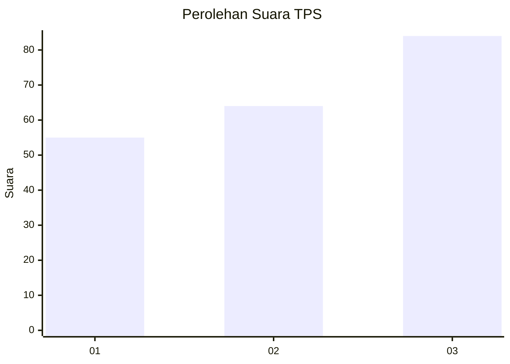
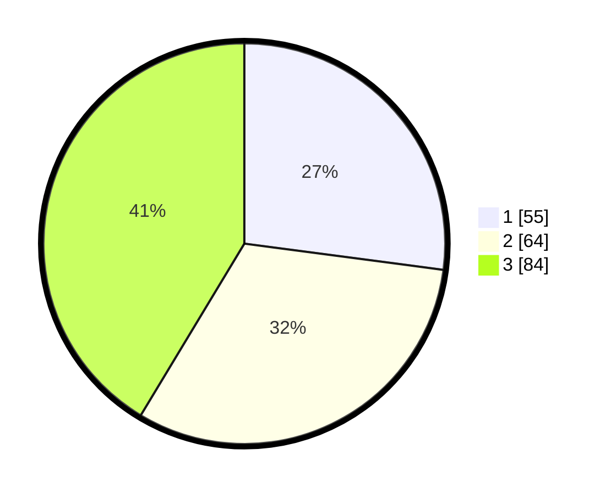

# Hasil

## Grafik

## Tabel

| No. | Nama Paslon    | Suara | Suara (raw) | Persentase |
|:--- |:-------------- | -----:| -----------:| ----------:|
| 1   | ANIES MUHAIMIN | 55    | [55][p-1]   | 27,09      |
| 2   | PRABOWO GIBRAN | 64    | [64][p-2]   | 31,53      |
| 3   | GANJAR MAHFUD  | 84    | [84][p-3]   | 41,38      |

[p-1]: https://github.com/gigit-pemilu/pemilu-2024-99-luar-negeri/blob/main/pilpres/hitung-suara/sub/99-luar-negeri/sub/22-brussels-belgia/sub/01-brussels-belgia/sub/0001-brussels-belgia/sub/004-tps-003/sub/paslon-1.txt
[p-2]: https://github.com/gigit-pemilu/pemilu-2024-99-luar-negeri/blob/main/pilpres/hitung-suara/sub/99-luar-negeri/sub/22-brussels-belgia/sub/01-brussels-belgia/sub/0001-brussels-belgia/sub/004-tps-003/sub/paslon-2.txt
[p-3]: https://github.com/gigit-pemilu/pemilu-2024-99-luar-negeri/blob/main/pilpres/hitung-suara/sub/99-luar-negeri/sub/22-brussels-belgia/sub/01-brussels-belgia/sub/0001-brussels-belgia/sub/004-tps-003/sub/paslon-3.txt

## Foto C Plano

https://sirekap-obj-formc.kpu.go.id/89e8/pemilu/ppwp/99/22/01/00/01/9922010001004-20240216-043701--c130beac-f881-48ed-9a85-f6bb94c52abe.jpg

https://sirekap-obj-formc.kpu.go.id/89e8/pemilu/ppwp/99/22/01/00/01/9922010001004-20240216-043702--3d6e4c1f-1f1b-42ff-82c4-13c0147bcde3.jpg

https://sirekap-obj-formc.kpu.go.id/89e8/pemilu/ppwp/99/22/01/00/01/9922010001004-20240216-021639--f86e8b3f-80cf-4795-a0f3-2378a4a401c2.jpg

## Metadata

| Key        | Value               |
| ---------- | ------------------- |
| Time Stamp | 2024-02-16 12:51:22 |

## DATA PEMILIH TETAP

Jumlah pemilih dalam DPT: **406**.
 * L: **142**.
 * P: **264**.

## DATA PENGGUNA HAK PILIH

Jumlah pengguna hak pilih dalam DPT: **120**.
 * L: **48**.
 * P: **72**.

Jumlah pengguna hak pilih dalam DPTb: **80**.
 * L: **29**.
 * P: **51**.

Jumlah pengguna hak pilih dalam DPK: **7**.
 * L: **4**.
 * P: **3**.

Jumlah pengguna hak pilih: **207**.
 * L: **81**.
 * P: **126**.

## JUMLAH SUARA SAH DAN TIDAK SAH

JUMLAH SELURUH SUARA SAH: **203**.

JUMLAH SUARA TIDAK SAH: **4**.

JUMLAH SELURUH SUARA SAH DAN SUARA TIDAK SAH: **207**.

