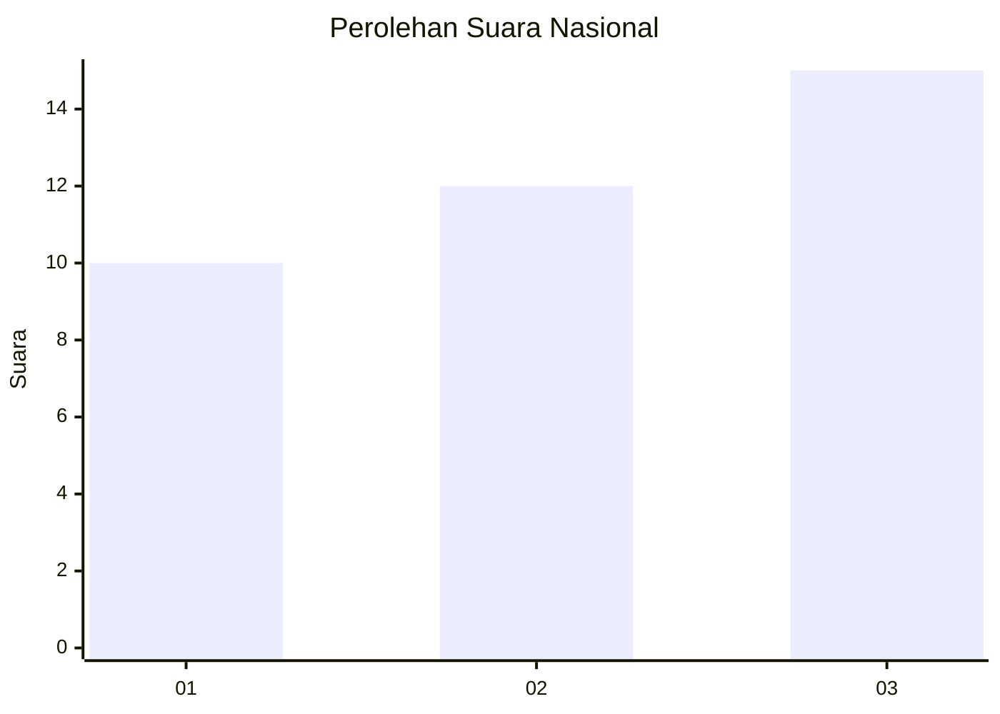
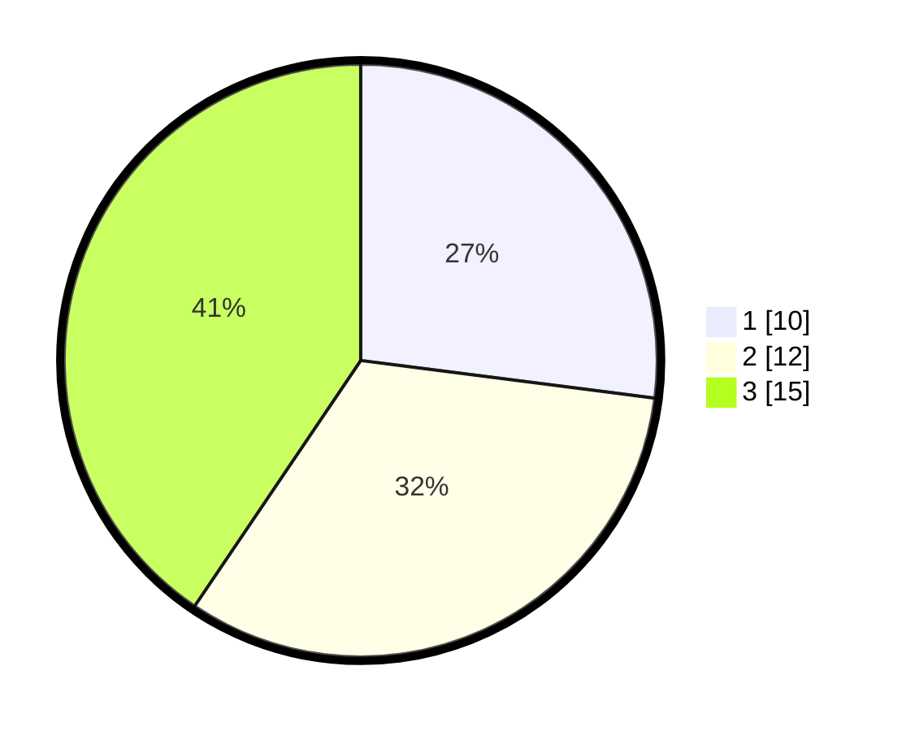

# Hasil

## Grafik

## Tabel

| No. | Nama Paslon    | Suara | Suara (raw) | Persentase |
|:--- |:-------------- | -----:| -----------:| ----------:|
| 1   | ANIES MUHAIMIN | 10    | [10][p-1]   | 27,03      |
| 2   | PRABOWO GIBRAN | 12    | [12][p-2]   | 32,43      |
| 3   | GANJAR MAHFUD  | 15    | [15][p-3]   | 40,54      |

[p-1]: https://github.com/gigit-pemilu/pemilu-2024/blob/main/pilpres/hitung-suara/sub/99-luar-negeri/sub/22-brussels-belgia/sub/01-brussels-belgia/sub/0001-brussels-belgia/sub/005-ksk-001/sub/paslon-1.txt
[p-2]: https://github.com/gigit-pemilu/pemilu-2024/blob/main/pilpres/hitung-suara/sub/99-luar-negeri/sub/22-brussels-belgia/sub/01-brussels-belgia/sub/0001-brussels-belgia/sub/005-ksk-001/sub/paslon-2.txt
[p-3]: https://github.com/gigit-pemilu/pemilu-2024/blob/main/pilpres/hitung-suara/sub/99-luar-negeri/sub/22-brussels-belgia/sub/01-brussels-belgia/sub/0001-brussels-belgia/sub/005-ksk-001/sub/paslon-3.txt

## Foto C Plano

https://sirekap-obj-formc.kpu.go.id/d905/pemilu/ppwp/99/22/01/00/01/9922010001005-20240214-200144--6b9d4b5a-4eaf-4c8c-bf7c-0750e6a5efcc.jpg

https://sirekap-obj-formc.kpu.go.id/d905/pemilu/ppwp/99/22/01/00/01/9922010001005-20240214-200401--20d87adc-7a42-43a1-ab5d-34b74dfaf57f.jpg

https://sirekap-obj-formc.kpu.go.id/d905/pemilu/ppwp/99/22/01/00/01/9922010001005-20240216-144626--173cc78e-8f0a-482c-af3b-765a2501bd14.jpg

## Metadata

| Key        | Value               |
| ---------- | ------------------- |
| Time Stamp | 2024-02-16 16:25:10 |

## DATA PEMILIH TETAP

Jumlah pemilih dalam DPT: **39**.
 * L: **11**.
 * P: **28**.

## DATA PENGGUNA HAK PILIH

Jumlah pengguna hak pilih dalam DPT: **12**.
 * L: **4**.
 * P: **8**.

Jumlah pengguna hak pilih dalam DPTb: **21**.
 * L: **9**.
 * P: **12**.

Jumlah pengguna hak pilih dalam DPK: **4**.
 * L: **2**.
 * P: **2**.

Jumlah pengguna hak pilih: **37**.
 * L: **15**.
 * P: **22**.

## JUMLAH SUARA SAH DAN TIDAK SAH

JUMLAH SELURUH SUARA SAH: **37**.

JUMLAH SUARA TIDAK SAH: **0**.

JUMLAH SELURUH SUARA SAH DAN SUARA TIDAK SAH: **37**.

