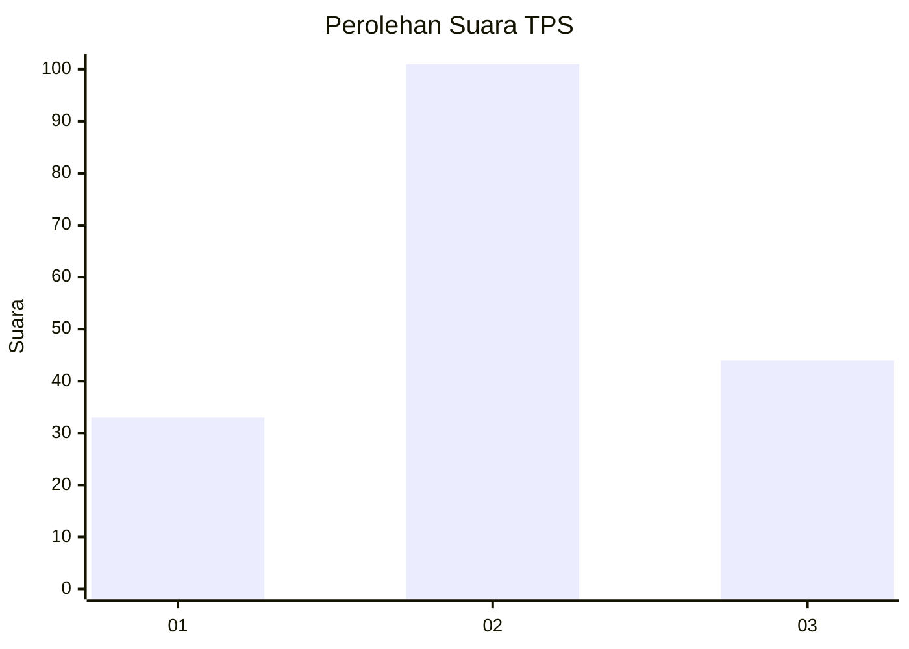
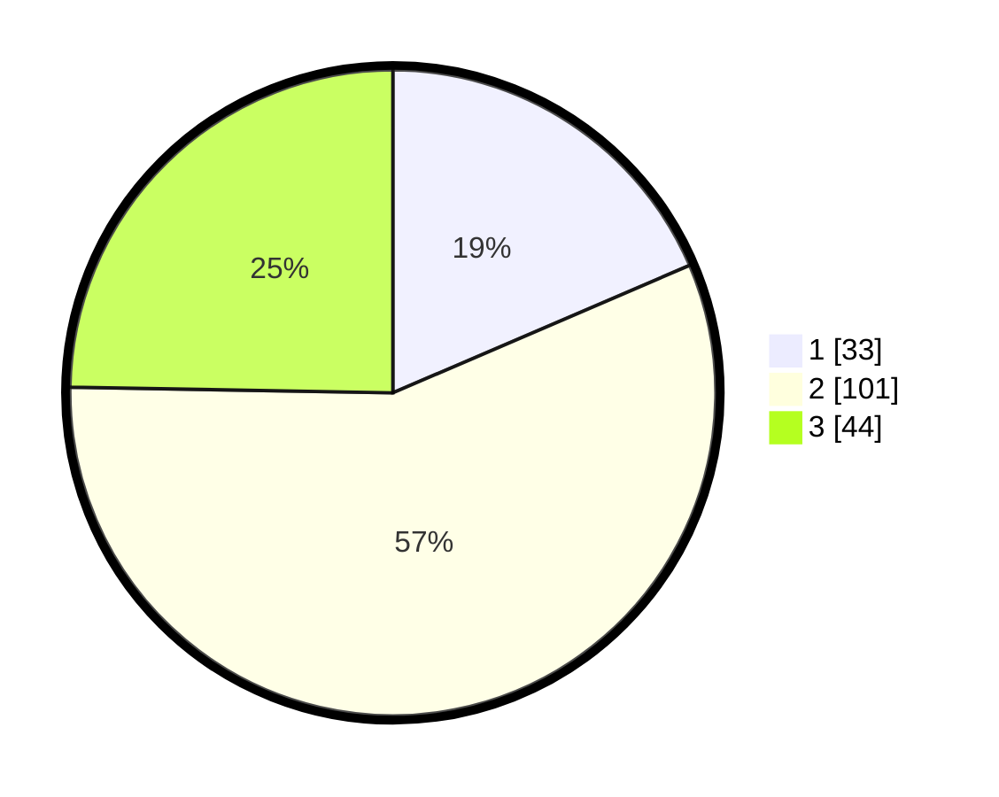

# Hasil

## Grafik

## Tabel

| No. | Nama Paslon    | Suara | Suara (raw) | Persentase |
|:--- |:-------------- | -----:| -----------:| ----------:|
| 1   | ANIES MUHAIMIN | 33    | [33][p-1]   | 18,54      |
| 2   | PRABOWO GIBRAN | 101   | [101][p-2]  | 56,74      |
| 3   | GANJAR MAHFUD  | 44    | [44][p-3]   | 24,72      |

[p-1]: https://github.com/gigit-pemilu/pemilu-2024-99-luar-negeri/blob/main/pilpres/hitung-suara/sub/99-luar-negeri/sub/23-bucharest-rumania/sub/01-bucharest-rumania/sub/0001-bucharest-rumania/sub/002-tps-001/sub/paslon-1.txt
[p-2]: https://github.com/gigit-pemilu/pemilu-2024-99-luar-negeri/blob/main/pilpres/hitung-suara/sub/99-luar-negeri/sub/23-bucharest-rumania/sub/01-bucharest-rumania/sub/0001-bucharest-rumania/sub/002-tps-001/sub/paslon-2.txt
[p-3]: https://github.com/gigit-pemilu/pemilu-2024-99-luar-negeri/blob/main/pilpres/hitung-suara/sub/99-luar-negeri/sub/23-bucharest-rumania/sub/01-bucharest-rumania/sub/0001-bucharest-rumania/sub/002-tps-001/sub/paslon-3.txt

## Foto C Plano

https://sirekap-obj-formc.kpu.go.id/9915/pemilu/ppwp/99/23/01/00/01/9923010001002-20240214-220902--3ae9e202-948f-4de5-ad67-e8e18a076ce0.jpg

https://sirekap-obj-formc.kpu.go.id/9915/pemilu/ppwp/99/23/01/00/01/9923010001002-20240215-210306--40797e3b-67ad-4151-8669-ca592889478e.jpg

https://sirekap-obj-formc.kpu.go.id/9915/pemilu/ppwp/99/23/01/00/01/9923010001002-20240214-221128--804b2472-6804-4d84-8c12-c275fa3f7bc0.jpg

## Metadata

| Key        | Value               |
| ---------- | ------------------- |
| Time Stamp | 2024-02-15 22:30:27 |

