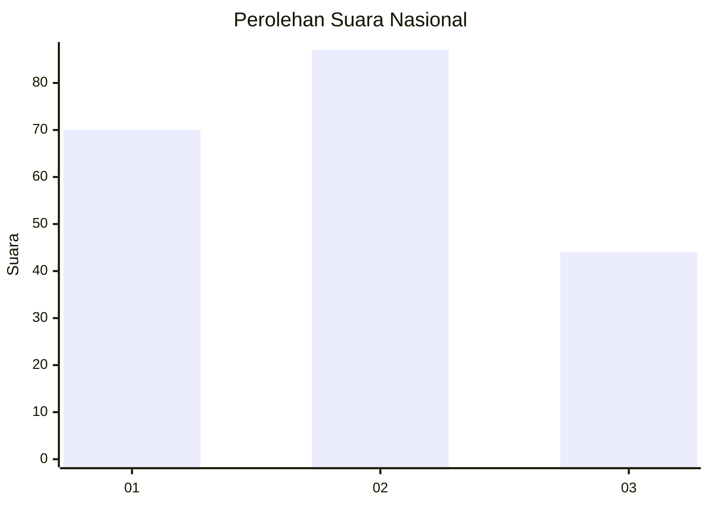
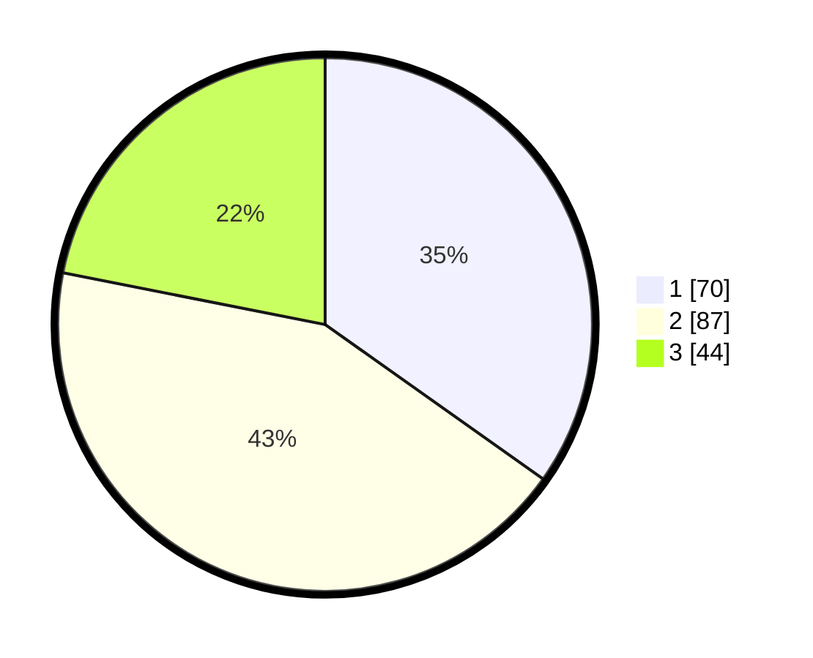

# Hasil

## Grafik

## Tabel

| No. | Nama Paslon    | Suara | Suara (raw) | Persentase |
|:--- |:-------------- | -----:| -----------:| ----------:|
| 1   | ANIES MUHAIMIN | 70    | [70][p-1]   | 34,83      |
| 2   | PRABOWO GIBRAN | 87    | [87][p-2]   | 43,28      |
| 3   | GANJAR MAHFUD  | 44    | [44][p-3]   | 21,89      |

[p-1]: https://github.com/gigit-pemilu/pemilu-2024/blob/main/pilpres/hitung-suara/sub/99-luar-negeri/sub/24-budapest-hongaria/sub/01-budapest-hongaria/sub/0001-budapest-hongaria/sub/002-tps-001/sub/paslon-1.txt
[p-2]: https://github.com/gigit-pemilu/pemilu-2024/blob/main/pilpres/hitung-suara/sub/99-luar-negeri/sub/24-budapest-hongaria/sub/01-budapest-hongaria/sub/0001-budapest-hongaria/sub/002-tps-001/sub/paslon-2.txt
[p-3]: https://github.com/gigit-pemilu/pemilu-2024/blob/main/pilpres/hitung-suara/sub/99-luar-negeri/sub/24-budapest-hongaria/sub/01-budapest-hongaria/sub/0001-budapest-hongaria/sub/002-tps-001/sub/paslon-3.txt

## Foto C Plano

https://sirekap-obj-formc.kpu.go.id/2921/pemilu/ppwp/99/24/01/00/01/9924010001002-20240214-201419--4d02f7fb-5129-4693-9a56-437a8708f2a9.jpg

https://sirekap-obj-formc.kpu.go.id/2921/pemilu/ppwp/99/24/01/00/01/9924010001002-20240214-201517--5ed94f6e-964a-48d4-9472-b75c94ba4fc6.jpg

https://sirekap-obj-formc.kpu.go.id/2921/pemilu/ppwp/99/24/01/00/01/9924010001002-20240214-201608--3872f2d9-096a-4f73-a163-5f72c6304e74.jpg

## Metadata

| Key        | Value               |
| ---------- | ------------------- |
| Time Stamp | 2024-02-15 00:41:44 |

## DATA PEMILIH TETAP

Jumlah pemilih dalam DPT: **251**.
 * L: **160**.
 * P: **91**.

## DATA PENGGUNA HAK PILIH

Jumlah pengguna hak pilih dalam DPT: **122**.
 * L: **72**.
 * P: **50**.

Jumlah pengguna hak pilih dalam DPTb: **45**.
 * L: **28**.
 * P: **17**.

Jumlah pengguna hak pilih dalam DPK: **38**.
 * L: **28**.
 * P: **10**.

Jumlah pengguna hak pilih: **205**.
 * L: **128**.
 * P: **77**.

## JUMLAH SUARA SAH DAN TIDAK SAH

JUMLAH SELURUH SUARA SAH: **201**.

JUMLAH SUARA TIDAK SAH: **4**.

JUMLAH SELURUH SUARA SAH DAN SUARA TIDAK SAH: **205**.

