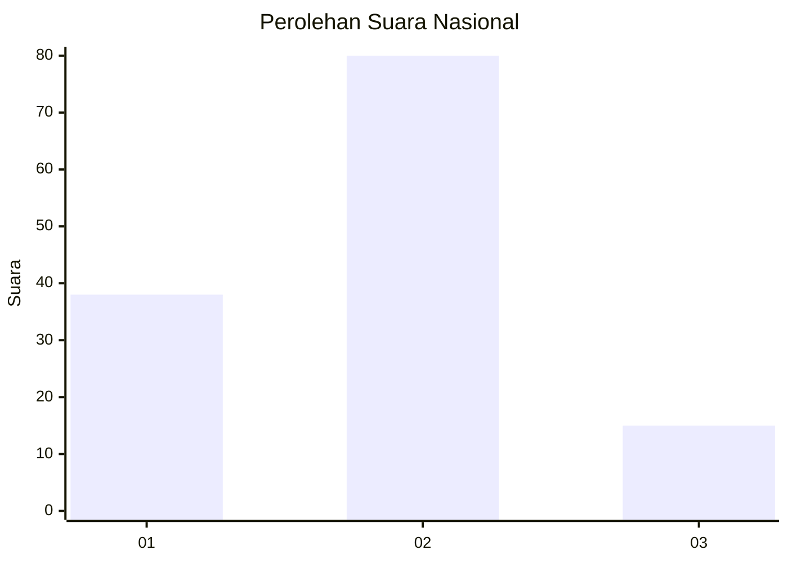
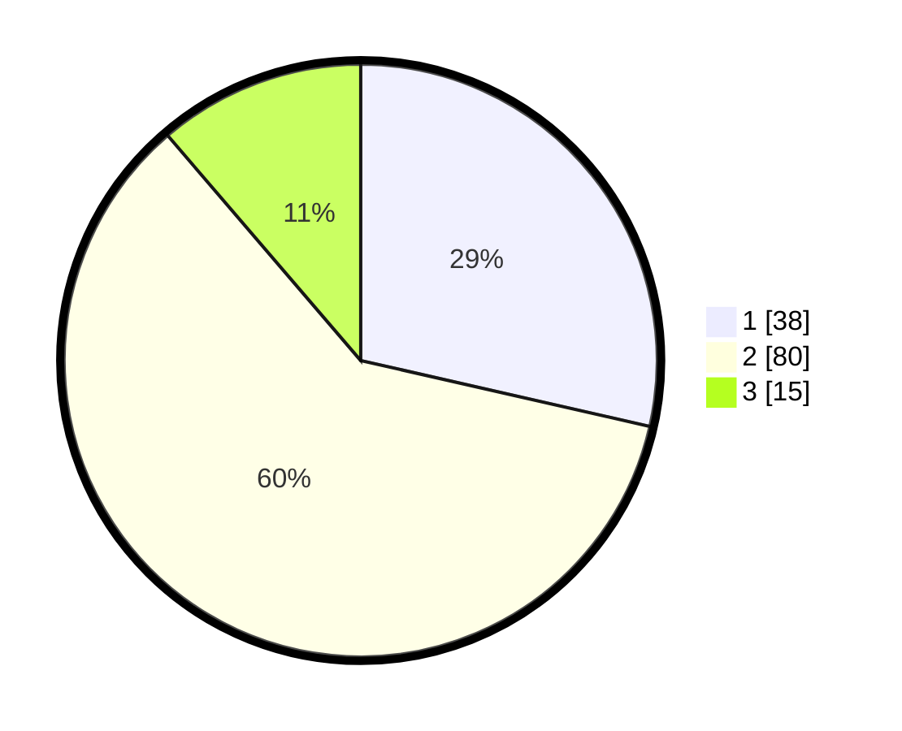

# Hasil

## Grafik

## Tabel

| No. | Nama Paslon    | Suara | Suara (raw) | Persentase |
|:--- |:-------------- | -----:| -----------:| ----------:|
| 1   | ANIES MUHAIMIN | 38    | [38][p-1]   | 28,57      |
| 2   | PRABOWO GIBRAN | 80    | [80][p-2]   | 60,15      |
| 3   | GANJAR MAHFUD  | 15    | [15][p-3]   | 11,28      |

[p-1]: https://github.com/gigit-pemilu/pemilu-2024/blob/main/pilpres/hitung-suara/sub/99-luar-negeri/sub/24-budapest-hongaria/sub/01-budapest-hongaria/sub/0001-budapest-hongaria/sub/003-tps-002/sub/paslon-1.txt
[p-2]: https://github.com/gigit-pemilu/pemilu-2024/blob/main/pilpres/hitung-suara/sub/99-luar-negeri/sub/24-budapest-hongaria/sub/01-budapest-hongaria/sub/0001-budapest-hongaria/sub/003-tps-002/sub/paslon-2.txt
[p-3]: https://github.com/gigit-pemilu/pemilu-2024/blob/main/pilpres/hitung-suara/sub/99-luar-negeri/sub/24-budapest-hongaria/sub/01-budapest-hongaria/sub/0001-budapest-hongaria/sub/003-tps-002/sub/paslon-3.txt

## Foto C Plano

https://sirekap-obj-formc.kpu.go.id/3fc4/pemilu/ppwp/99/24/01/00/01/9924010001003-20240214-224416--0a2acb8c-ffee-4b36-893d-adb6351fb442.jpg

https://sirekap-obj-formc.kpu.go.id/3fc4/pemilu/ppwp/99/24/01/00/01/9924010001003-20240214-224501--34f95243-2362-4128-8fec-7892a9adf529.jpg

https://sirekap-obj-formc.kpu.go.id/3fc4/pemilu/ppwp/99/24/01/00/01/9924010001003-20240214-224553--a46a5950-dde5-4224-84de-59d13e8ec377.jpg

## Metadata

| Key        | Value               |
| ---------- | ------------------- |
| Time Stamp | 2024-02-15 15:00:29 |

## DATA PEMILIH TETAP

Jumlah pemilih dalam DPT: **178**.
 * L: **142**.
 * P: **36**.

## DATA PENGGUNA HAK PILIH

Jumlah pengguna hak pilih dalam DPT: **99**.
 * L: **83**.
 * P: **16**.

Jumlah pengguna hak pilih dalam DPTb: **39**.
 * L: **32**.
 * P: **7**.

Jumlah pengguna hak pilih dalam DPK: **0**.
 * L: **0**.
 * P: **0**.

Jumlah pengguna hak pilih: **138**.
 * L: **115**.
 * P: **23**.

## JUMLAH SUARA SAH DAN TIDAK SAH

JUMLAH SELURUH SUARA SAH: **133**.

JUMLAH SUARA TIDAK SAH: **5**.

JUMLAH SELURUH SUARA SAH DAN SUARA TIDAK SAH: **138**.

