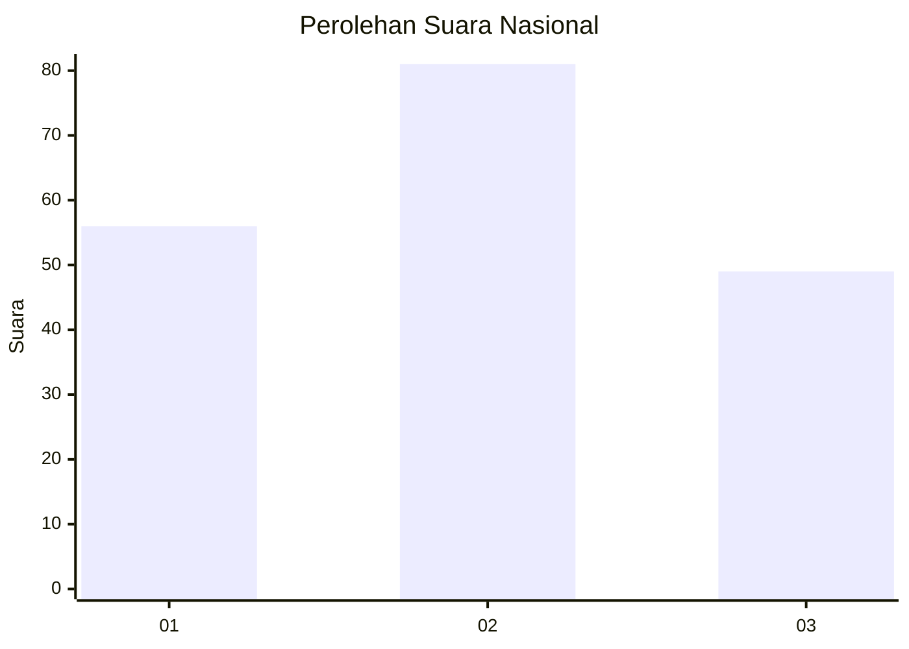
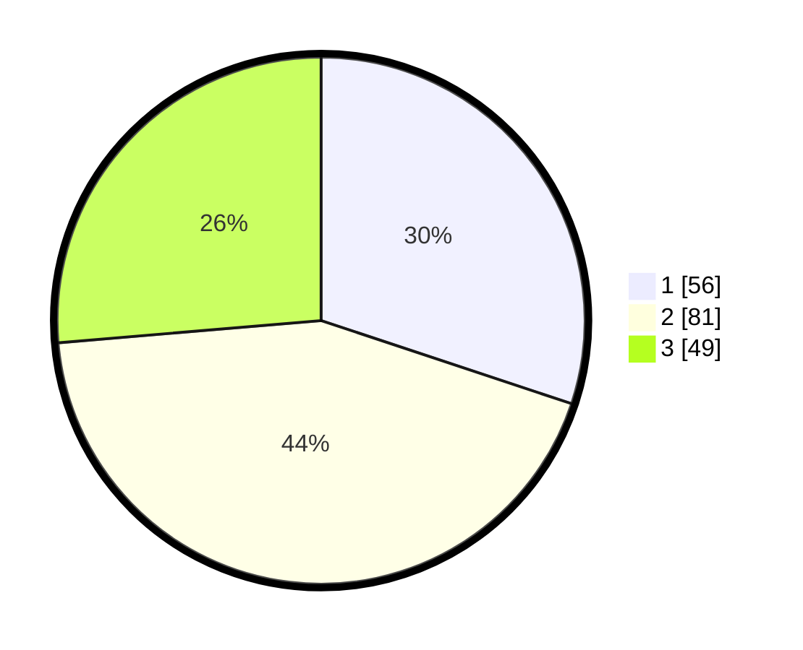

# Hasil

## Grafik

## Tabel

| No. | Nama Paslon    | Suara | Suara (raw) | Persentase |
|:--- |:-------------- | -----:| -----------:| ----------:|
| 1   | ANIES MUHAIMIN | 56    | [56][p-1]   | 30,11      |
| 2   | PRABOWO GIBRAN | 81    | [81][p-2]   | 43,55      |
| 3   | GANJAR MAHFUD  | 49    | [49][p-3]   | 26,34      |

[p-1]: https://github.com/gigit-pemilu/pemilu-2024/blob/main/pilpres/hitung-suara/sub/99-luar-negeri/sub/24-budapest-hongaria/sub/01-budapest-hongaria/sub/0001-budapest-hongaria/sub/004-tps-003/sub/paslon-1.txt
[p-2]: https://github.com/gigit-pemilu/pemilu-2024/blob/main/pilpres/hitung-suara/sub/99-luar-negeri/sub/24-budapest-hongaria/sub/01-budapest-hongaria/sub/0001-budapest-hongaria/sub/004-tps-003/sub/paslon-2.txt
[p-3]: https://github.com/gigit-pemilu/pemilu-2024/blob/main/pilpres/hitung-suara/sub/99-luar-negeri/sub/24-budapest-hongaria/sub/01-budapest-hongaria/sub/0001-budapest-hongaria/sub/004-tps-003/sub/paslon-3.txt

## Foto C Plano

https://sirekap-obj-formc.kpu.go.id/a5ba/pemilu/ppwp/99/24/01/00/01/9924010001004-20240214-193048--88753a4b-08a3-4d2b-bb39-7cc33c80455d.jpg

https://sirekap-obj-formc.kpu.go.id/a5ba/pemilu/ppwp/99/24/01/00/01/9924010001004-20240214-193237--59d744ef-a503-44e3-bf6d-7a79eb22478e.jpg

https://sirekap-obj-formc.kpu.go.id/a5ba/pemilu/ppwp/99/24/01/00/01/9924010001004-20240214-215213--44858ea7-4c59-40e3-8f80-dc5b296b7576.jpg

## Metadata

| Key        | Value               |
| ---------- | ------------------- |
| Time Stamp | 2024-02-15 03:06:03 |

## DATA PEMILIH TETAP

Jumlah pemilih dalam DPT: **216**.
 * L: **122**.
 * P: **94**.

## DATA PENGGUNA HAK PILIH

Jumlah pengguna hak pilih dalam DPT: **104**.
 * L: **65**.
 * P: **39**.

Jumlah pengguna hak pilih dalam DPTb: **75**.
 * L: **53**.
 * P: **22**.

Jumlah pengguna hak pilih dalam DPK: **4**.
 * L: **1**.
 * P: **3**.

Jumlah pengguna hak pilih: **183**.
 * L: **119**.
 * P: **64**.

## JUMLAH SUARA SAH DAN TIDAK SAH

JUMLAH SELURUH SUARA SAH: **186**.

JUMLAH SUARA TIDAK SAH: **1**.

JUMLAH SELURUH SUARA SAH DAN SUARA TIDAK SAH: **187**.

