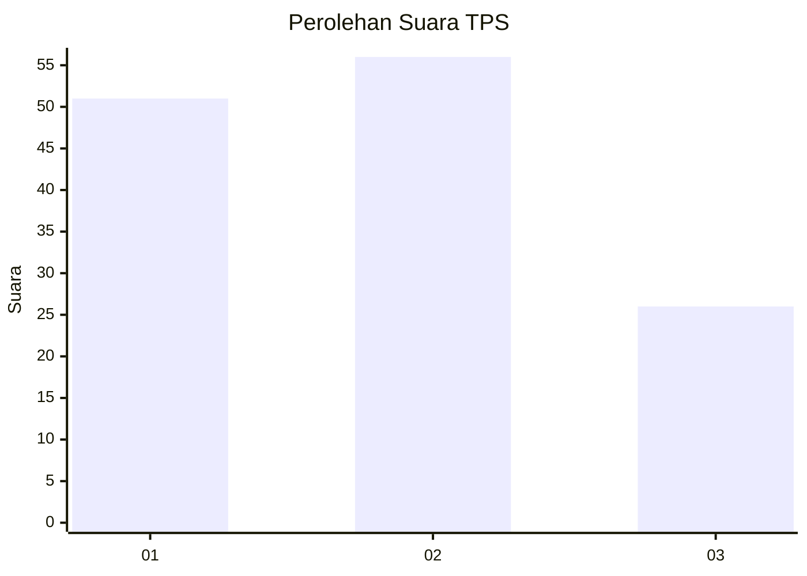
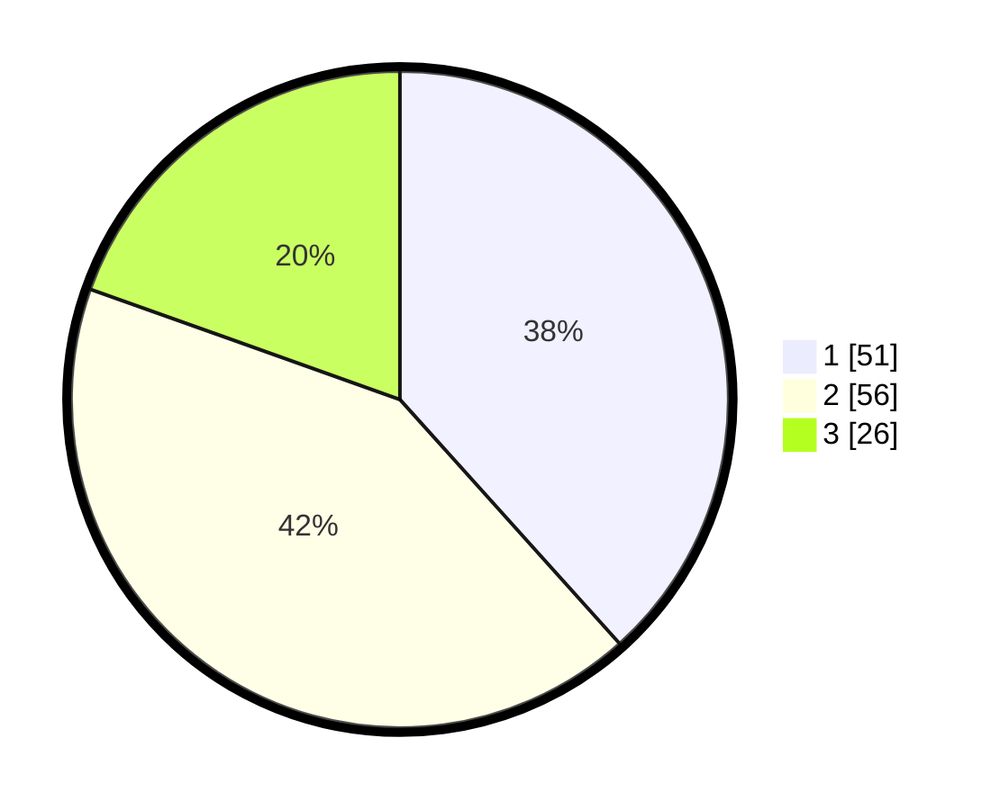

# Hasil

## Grafik

## Tabel

| No. | Nama Paslon    | Suara | Suara (raw) | Persentase |
|:--- |:-------------- | -----:| -----------:| ----------:|
| 1   | ANIES MUHAIMIN | 51    | [51][p-1]   | 38,35      |
| 2   | PRABOWO GIBRAN | 56    | [56][p-2]   | 42,11      |
| 3   | GANJAR MAHFUD  | 26    | [26][p-3]   | 19,55      |

[p-1]: https://github.com/gigit-pemilu/pemilu-2024-99-luar-negeri/blob/main/pilpres/hitung-suara/sub/99-luar-negeri/sub/24-budapest-hongaria/sub/01-budapest-hongaria/sub/0001-budapest-hongaria/sub/005-tps-004/sub/paslon-1.txt
[p-2]: https://github.com/gigit-pemilu/pemilu-2024-99-luar-negeri/blob/main/pilpres/hitung-suara/sub/99-luar-negeri/sub/24-budapest-hongaria/sub/01-budapest-hongaria/sub/0001-budapest-hongaria/sub/005-tps-004/sub/paslon-2.txt
[p-3]: https://github.com/gigit-pemilu/pemilu-2024-99-luar-negeri/blob/main/pilpres/hitung-suara/sub/99-luar-negeri/sub/24-budapest-hongaria/sub/01-budapest-hongaria/sub/0001-budapest-hongaria/sub/005-tps-004/sub/paslon-3.txt

## Foto C Plano

https://sirekap-obj-formc.kpu.go.id/b894/pemilu/ppwp/99/24/01/00/01/9924010001005-20240214-230812--96a83b48-bf11-42e9-8b9e-c3a1fcbc653a.jpg

https://sirekap-obj-formc.kpu.go.id/b894/pemilu/ppwp/99/24/01/00/01/9924010001005-20240214-230836--0f4f1336-7d1f-4541-8319-0018a43cebfe.jpg

https://sirekap-obj-formc.kpu.go.id/b894/pemilu/ppwp/99/24/01/00/01/9924010001005-20240214-230911--23d756f0-531f-4917-b1c8-e457049e5bd2.jpg

## Metadata

| Key        | Value               |
| ---------- | ------------------- |
| Time Stamp | 2024-02-15 12:00:28 |

## DATA PEMILIH TETAP

Jumlah pemilih dalam DPT: **164**.
 * L: **109**.
 * P: **55**.

## DATA PENGGUNA HAK PILIH

Jumlah pengguna hak pilih dalam DPT: **78**.
 * L: **44**.
 * P: **34**.

Jumlah pengguna hak pilih dalam DPTb: **32**.
 * L: **21**.
 * P: **11**.

Jumlah pengguna hak pilih dalam DPK: **28**.
 * L: **18**.
 * P: **10**.

Jumlah pengguna hak pilih: **138**.
 * L: **83**.
 * P: **55**.

## JUMLAH SUARA SAH DAN TIDAK SAH

JUMLAH SELURUH SUARA SAH: **133**.

JUMLAH SUARA TIDAK SAH: **5**.

JUMLAH SELURUH SUARA SAH DAN SUARA TIDAK SAH: **138**.

