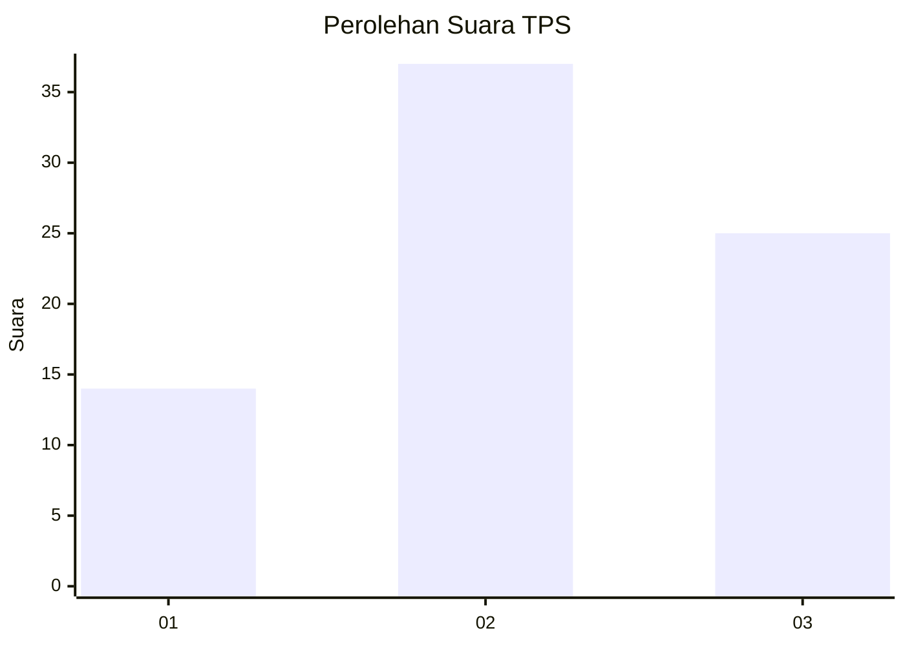
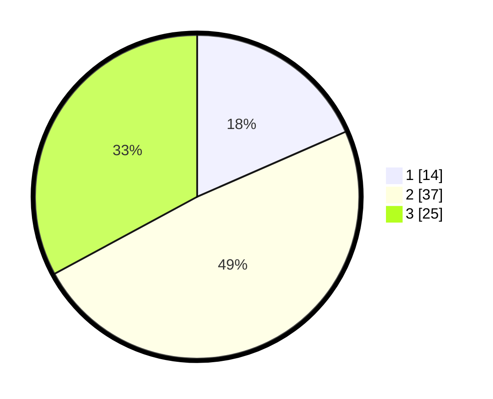

# Hasil

## Grafik

## Tabel

| No. | Nama Paslon    | Suara | Suara (raw) | Persentase |
|:--- |:-------------- | -----:| -----------:| ----------:|
| 1   | ANIES MUHAIMIN | 14    | [14][p-1]   | 18,42      |
| 2   | PRABOWO GIBRAN | 37    | [37][p-2]   | 48,68      |
| 3   | GANJAR MAHFUD  | 25    | [25][p-3]   | 32,89      |

[p-1]: https://github.com/gigit-pemilu/pemilu-2024-99-luar-negeri/blob/main/pilpres/hitung-suara/sub/99-luar-negeri/sub/25-buenos-aires-argentina/sub/01-buenos-aires-argentina/sub/0001-buenos-aires-argentina/sub/001-pos-001/sub/paslon-1.txt
[p-2]: https://github.com/gigit-pemilu/pemilu-2024-99-luar-negeri/blob/main/pilpres/hitung-suara/sub/99-luar-negeri/sub/25-buenos-aires-argentina/sub/01-buenos-aires-argentina/sub/0001-buenos-aires-argentina/sub/001-pos-001/sub/paslon-2.txt
[p-3]: https://github.com/gigit-pemilu/pemilu-2024-99-luar-negeri/blob/main/pilpres/hitung-suara/sub/99-luar-negeri/sub/25-buenos-aires-argentina/sub/01-buenos-aires-argentina/sub/0001-buenos-aires-argentina/sub/001-pos-001/sub/paslon-3.txt

## Foto C Plano

https://sirekap-obj-formc.kpu.go.id/a67c/pemilu/ppwp/99/25/01/00/01/9925010001001-20240216-002305--b9de7cfc-a81f-4f94-9e58-4934dbf1214e.jpg

https://sirekap-obj-formc.kpu.go.id/a67c/pemilu/ppwp/99/25/01/00/01/9925010001001-20240216-002308--cd802121-151c-444e-88a8-4f34ce112482.jpg

https://sirekap-obj-formc.kpu.go.id/a67c/pemilu/ppwp/99/25/01/00/01/9925010001001-20240216-002307--12e32010-5670-4875-97ed-b49c9aad6cc7.jpg

## Metadata

| Key        | Value               |
| ---------- | ------------------- |
| Time Stamp | 2024-02-16 13:30:32 |

## DATA PEMILIH TETAP

Jumlah pemilih dalam DPT: **90**.
 * L: **79**.
 * P: **11**.

## DATA PENGGUNA HAK PILIH

Jumlah pengguna hak pilih dalam DPT: **70**.
 * L: **61**.
 * P: **9**.

Jumlah pengguna hak pilih dalam DPTb: **6**.
 * L: **6**.
 * P: **0**.

Jumlah pengguna hak pilih dalam DPK: **0**.
 * L: **0**.
 * P: **0**.

Jumlah pengguna hak pilih: **76**.
 * L: **67**.
 * P: **9**.

## JUMLAH SUARA SAH DAN TIDAK SAH

JUMLAH SELURUH SUARA SAH: **76**.

JUMLAH SUARA TIDAK SAH: **0**.

JUMLAH SELURUH SUARA SAH DAN SUARA TIDAK SAH: **76**.

