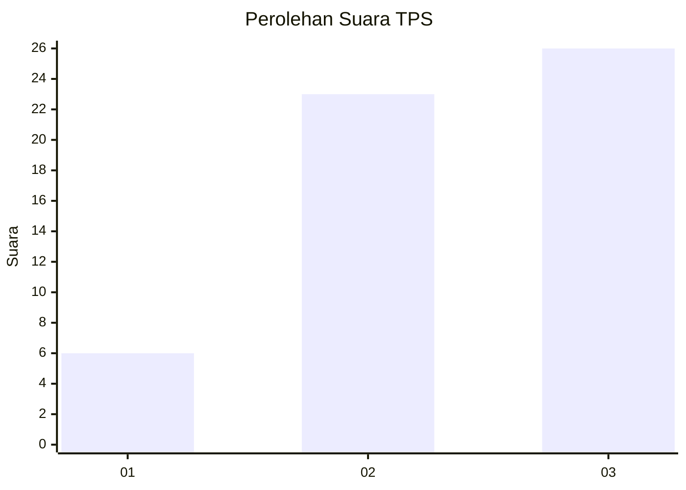
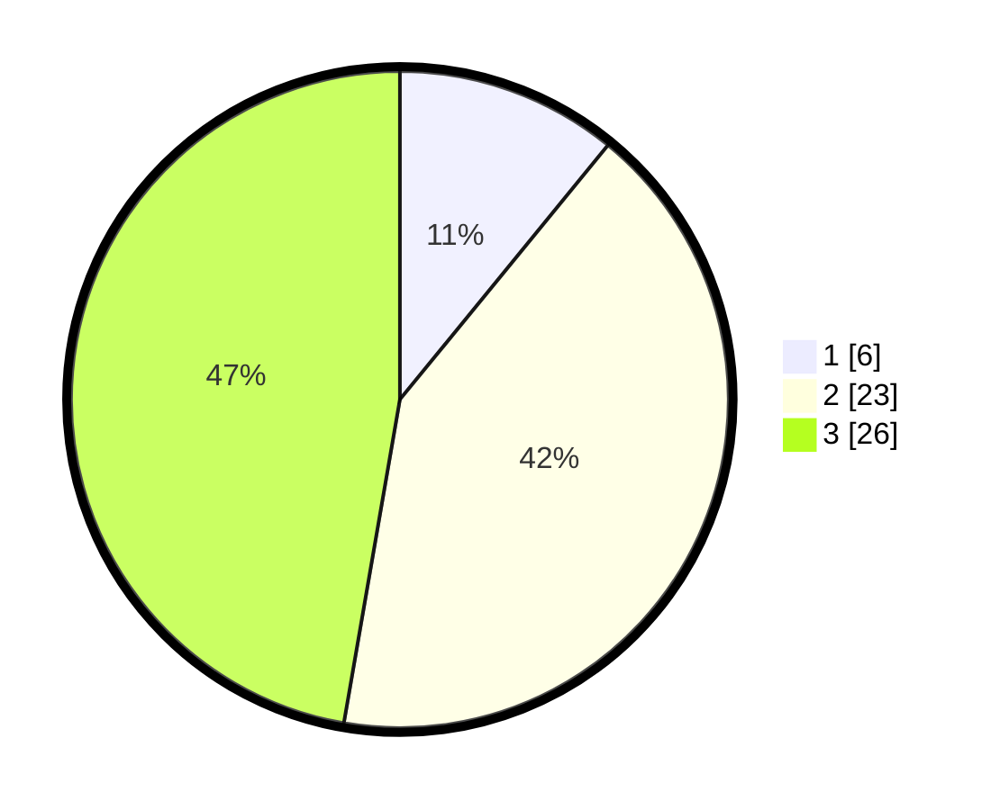

# Hasil

## Grafik

## Tabel

| No. | Nama Paslon    | Suara | Suara (raw) | Persentase |
|:--- |:-------------- | -----:| -----------:| ----------:|
| 1   | ANIES MUHAIMIN | 6     | [6][p-1]    | 10,91      |
| 2   | PRABOWO GIBRAN | 23    | [23][p-2]   | 41,82      |
| 3   | GANJAR MAHFUD  | 26    | [26][p-3]   | 47,27      |

[p-1]: https://github.com/gigit-pemilu/pemilu-2024-99-luar-negeri/blob/main/pilpres/hitung-suara/sub/99-luar-negeri/sub/25-buenos-aires-argentina/sub/01-buenos-aires-argentina/sub/0001-buenos-aires-argentina/sub/002-tps-001/sub/paslon-1.txt
[p-2]: https://github.com/gigit-pemilu/pemilu-2024-99-luar-negeri/blob/main/pilpres/hitung-suara/sub/99-luar-negeri/sub/25-buenos-aires-argentina/sub/01-buenos-aires-argentina/sub/0001-buenos-aires-argentina/sub/002-tps-001/sub/paslon-2.txt
[p-3]: https://github.com/gigit-pemilu/pemilu-2024-99-luar-negeri/blob/main/pilpres/hitung-suara/sub/99-luar-negeri/sub/25-buenos-aires-argentina/sub/01-buenos-aires-argentina/sub/0001-buenos-aires-argentina/sub/002-tps-001/sub/paslon-3.txt

## Foto C Plano

https://sirekap-obj-formc.kpu.go.id/5558/pemilu/ppwp/99/25/01/00/01/9925010001002-20240215-020519--54edd30d-71f0-4dd2-b109-b88be96be6cb.jpg

https://sirekap-obj-formc.kpu.go.id/5558/pemilu/ppwp/99/25/01/00/01/9925010001002-20240215-023447--e13a2d9c-e8ea-4eac-99a3-8f91ca5ecb57.jpg

https://sirekap-obj-formc.kpu.go.id/5558/pemilu/ppwp/99/25/01/00/01/9925010001002-20240215-020852--624409f4-01e2-4e6e-8d79-014182fa9508.jpg

## Metadata

| Key        | Value               |
| ---------- | ------------------- |
| Time Stamp | 2024-02-16 23:00:00 |

## DATA PEMILIH TETAP

Jumlah pemilih dalam DPT: **56**.
 * L: **27**.
 * P: **29**.

## DATA PENGGUNA HAK PILIH

Jumlah pengguna hak pilih dalam DPT: **50**.
 * L: **25**.
 * P: **25**.

Jumlah pengguna hak pilih dalam DPTb: **4**.
 * L: **2**.
 * P: **2**.

Jumlah pengguna hak pilih dalam DPK: **1**.
 * L: **0**.
 * P: **1**.

Jumlah pengguna hak pilih: **55**.
 * L: **27**.
 * P: **28**.

## JUMLAH SUARA SAH DAN TIDAK SAH

JUMLAH SELURUH SUARA SAH: **55**.

JUMLAH SUARA TIDAK SAH: **0**.

JUMLAH SELURUH SUARA SAH DAN SUARA TIDAK SAH: **55**.

