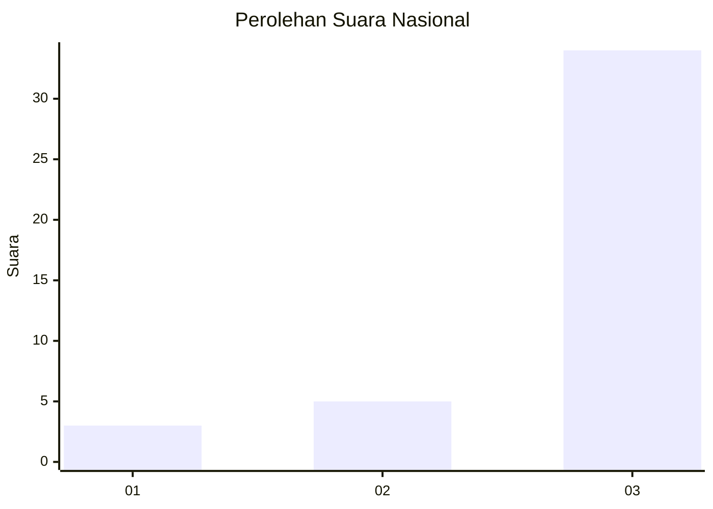
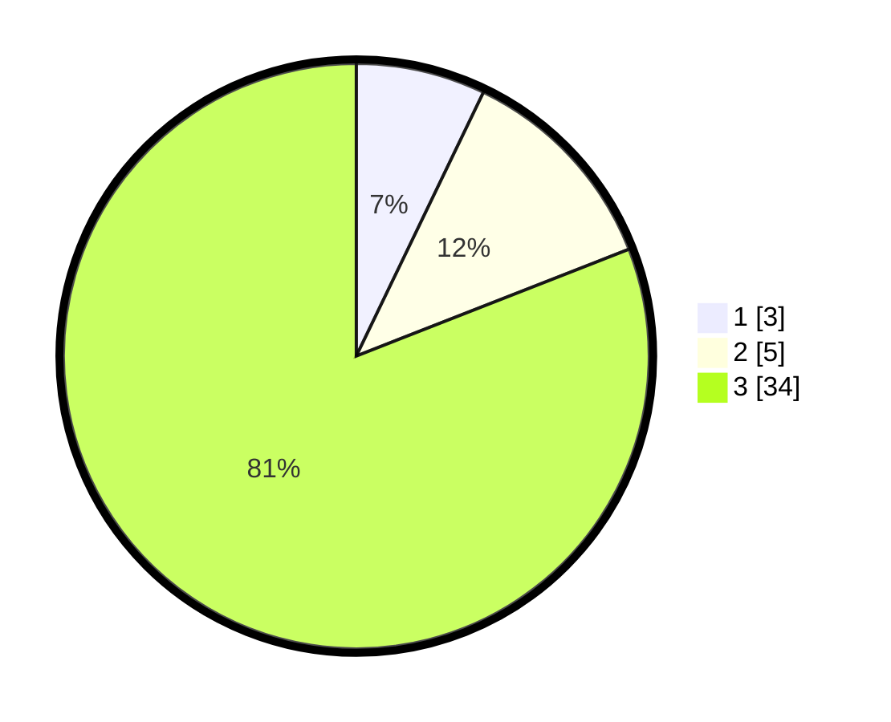

# Hasil

## Grafik

## Tabel

| No. | Nama Paslon    | Suara | Suara (raw) | Persentase |
|:--- |:-------------- | -----:| -----------:| ----------:|
| 1   | ANIES MUHAIMIN | 3     | [3][p-1]    | 7,14       |
| 2   | PRABOWO GIBRAN | 5     | [5][p-2]    | 11,90      |
| 3   | GANJAR MAHFUD  | 34    | [34][p-3]   | 80,95      |

[p-1]: https://github.com/gigit-pemilu/pemilu-2024/blob/main/pilpres/hitung-suara/sub/99-luar-negeri/sub/25-buenos-aires-argentina/sub/01-buenos-aires-argentina/sub/0001-buenos-aires-argentina/sub/003-ksk-001/sub/paslon-1.txt
[p-2]: https://github.com/gigit-pemilu/pemilu-2024/blob/main/pilpres/hitung-suara/sub/99-luar-negeri/sub/25-buenos-aires-argentina/sub/01-buenos-aires-argentina/sub/0001-buenos-aires-argentina/sub/003-ksk-001/sub/paslon-2.txt
[p-3]: https://github.com/gigit-pemilu/pemilu-2024/blob/main/pilpres/hitung-suara/sub/99-luar-negeri/sub/25-buenos-aires-argentina/sub/01-buenos-aires-argentina/sub/0001-buenos-aires-argentina/sub/003-ksk-001/sub/paslon-3.txt

## Foto C Plano

https://sirekap-obj-formc.kpu.go.id/83aa/pemilu/ppwp/99/25/01/00/01/9925010001003-20240214-205853--667dfc57-ef37-4e7e-9ada-6481828b1b72.jpg

https://sirekap-obj-formc.kpu.go.id/83aa/pemilu/ppwp/99/25/01/00/01/9925010001003-20240214-205818--5fe9b6a3-b458-475c-9a51-b2486c8d5894.jpg

https://sirekap-obj-formc.kpu.go.id/83aa/pemilu/ppwp/99/25/01/00/01/9925010001003-20240214-210018--fd515c13-5941-4639-8926-aee8250dc628.jpg

## Metadata

| Key        | Value               |
| ---------- | ------------------- |
| Time Stamp | 2024-02-16 23:00:00 |

## DATA PEMILIH TETAP

Jumlah pemilih dalam DPT: **101**.
 * L: **89**.
 * P: **12**.

## DATA PENGGUNA HAK PILIH

Jumlah pengguna hak pilih dalam DPT: **30**.
 * L: **19**.
 * P: **11**.

Jumlah pengguna hak pilih dalam DPTb: **5**.
 * L: **4**.
 * P: **1**.

Jumlah pengguna hak pilih dalam DPK: **7**.
 * L: **6**.
 * P: **1**.

Jumlah pengguna hak pilih: **42**.
 * L: **29**.
 * P: **13**.

## JUMLAH SUARA SAH DAN TIDAK SAH

JUMLAH SELURUH SUARA SAH: **42**.

JUMLAH SUARA TIDAK SAH: **0**.

JUMLAH SELURUH SUARA SAH DAN SUARA TIDAK SAH: **42**.

