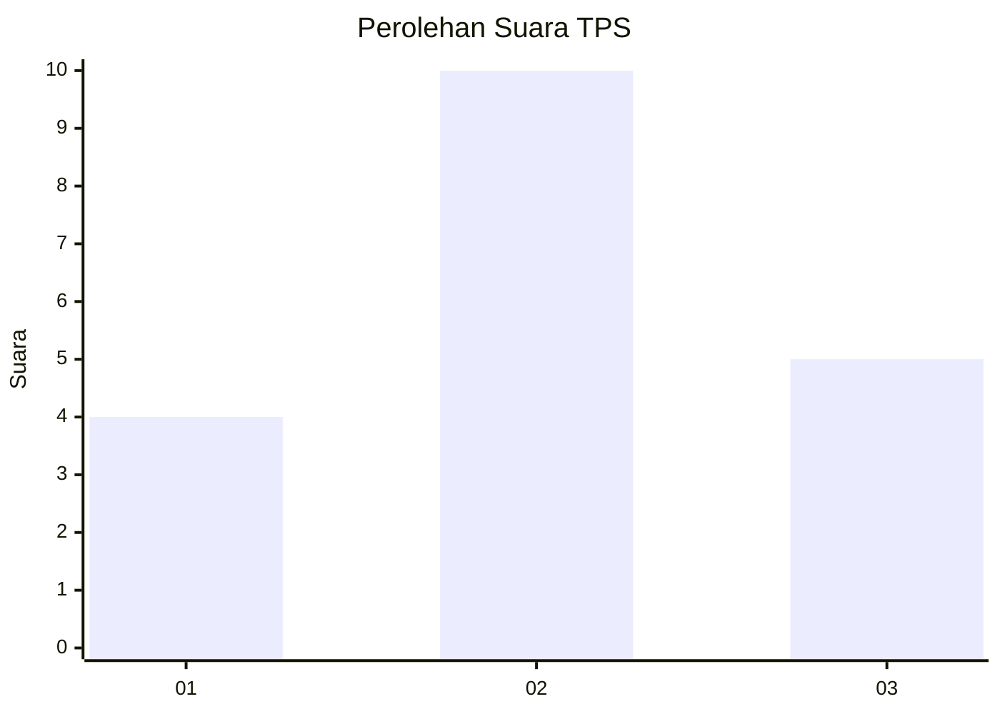
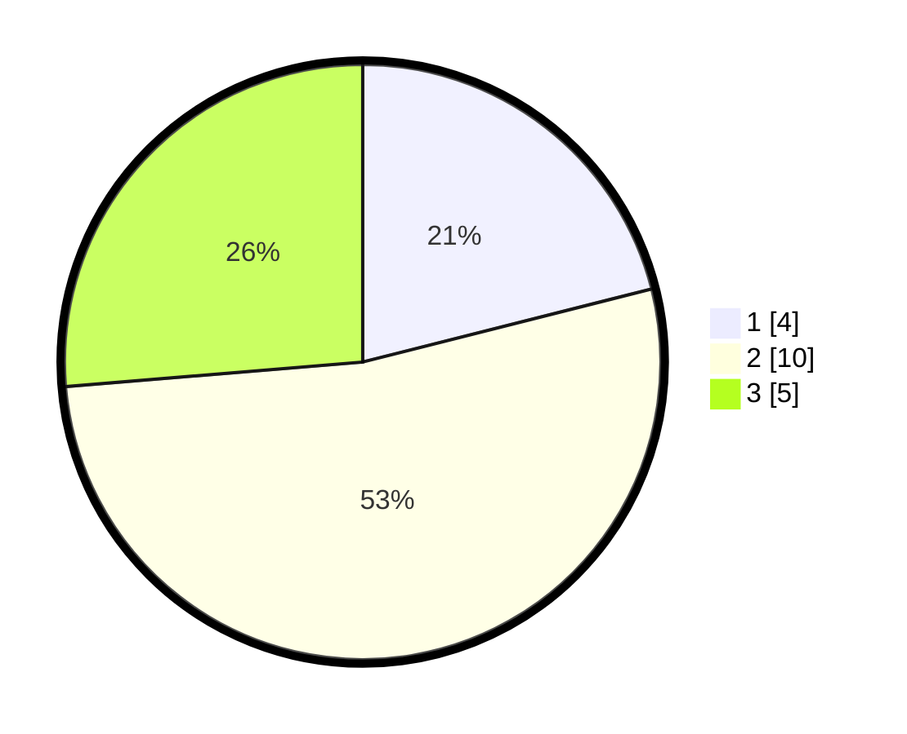

# Hasil

## Grafik

## Tabel

| No. | Nama Paslon    | Suara | Suara (raw) | Persentase |
|:--- |:-------------- | -----:| -----------:| ----------:|
| 1   | ANIES MUHAIMIN | 4     | [4][p-1]    | 21,05      |
| 2   | PRABOWO GIBRAN | 10    | [10][p-2]   | 52,63      |
| 3   | GANJAR MAHFUD  | 5     | [5][p-3]    | 26,32      |

[p-1]: https://github.com/gigit-pemilu/pemilu-2024-99-luar-negeri/blob/main/pilpres/hitung-suara/sub/99-luar-negeri/sub/26-canberra-australia/sub/01-canberra-australia/sub/0001-canberra-australia/sub/001-pos-001/sub/paslon-1.txt
[p-2]: https://github.com/gigit-pemilu/pemilu-2024-99-luar-negeri/blob/main/pilpres/hitung-suara/sub/99-luar-negeri/sub/26-canberra-australia/sub/01-canberra-australia/sub/0001-canberra-australia/sub/001-pos-001/sub/paslon-2.txt
[p-3]: https://github.com/gigit-pemilu/pemilu-2024-99-luar-negeri/blob/main/pilpres/hitung-suara/sub/99-luar-negeri/sub/26-canberra-australia/sub/01-canberra-australia/sub/0001-canberra-australia/sub/001-pos-001/sub/paslon-3.txt

## Foto C Plano

https://sirekap-obj-formc.kpu.go.id/5595/pemilu/ppwp/99/26/01/00/01/9926010001001-20240215-143332--e8a35f73-404a-4b34-87b4-1bdcdc7f43da.jpg

https://sirekap-obj-formc.kpu.go.id/5595/pemilu/ppwp/99/26/01/00/01/9926010001001-20240215-143520--b193f57f-1958-4707-9fef-651c50e371f0.jpg

https://sirekap-obj-formc.kpu.go.id/5595/pemilu/ppwp/99/26/01/00/01/9926010001001-20240219-135913--443c7851-3d69-4249-9ef1-400ea687b6a2.jpg

## Metadata

| Key        | Value               |
| ---------- | ------------------- |
| Time Stamp | 2024-02-19 14:00:00 |

