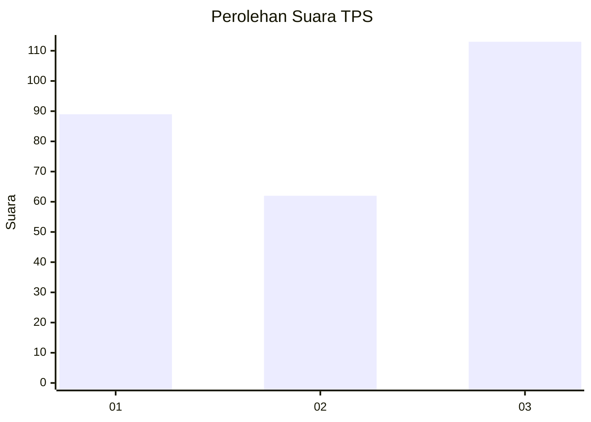
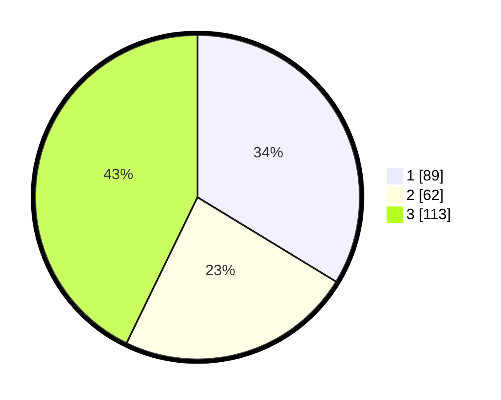

# Hasil

## Grafik

## Tabel

| No. | Nama Paslon    | Suara | Suara (raw) | Persentase |
|:--- |:-------------- | -----:| -----------:| ----------:|
| 1   | ANIES MUHAIMIN | 89    | [89][p-1]   | 33,71      |
| 2   | PRABOWO GIBRAN | 62    | [62][p-2]   | 23,48      |
| 3   | GANJAR MAHFUD  | 113   | [113][p-3]  | 42,80      |

[p-1]: https://github.com/gigit-pemilu/pemilu-2024-99-luar-negeri/blob/main/pilpres/hitung-suara/sub/99-luar-negeri/sub/26-canberra-australia/sub/01-canberra-australia/sub/0001-canberra-australia/sub/002-tps-001/sub/paslon-1.txt
[p-2]: https://github.com/gigit-pemilu/pemilu-2024-99-luar-negeri/blob/main/pilpres/hitung-suara/sub/99-luar-negeri/sub/26-canberra-australia/sub/01-canberra-australia/sub/0001-canberra-australia/sub/002-tps-001/sub/paslon-2.txt
[p-3]: https://github.com/gigit-pemilu/pemilu-2024-99-luar-negeri/blob/main/pilpres/hitung-suara/sub/99-luar-negeri/sub/26-canberra-australia/sub/01-canberra-australia/sub/0001-canberra-australia/sub/002-tps-001/sub/paslon-3.txt

## Foto C Plano

https://sirekap-obj-formc.kpu.go.id/584d/pemilu/ppwp/99/26/01/00/01/9926010001002-20240214-185917--ffcbef26-95e8-4efa-9b3e-ed5d1df8f801.jpg

https://sirekap-obj-formc.kpu.go.id/584d/pemilu/ppwp/99/26/01/00/01/9926010001002-20240214-191427--b7e8d92e-457e-4b3b-8621-1990436ffc0f.jpg

https://sirekap-obj-formc.kpu.go.id/584d/pemilu/ppwp/99/26/01/00/01/9926010001002-20240214-192236--0d0d5ea5-4f97-419f-be16-20e813cbdef4.jpg

## Metadata

| Key        | Value               |
| ---------- | ------------------- |
| Time Stamp | 2024-02-14 21:46:01 |

## DATA PEMILIH TETAP

Jumlah pemilih dalam DPT: **343**.
 * L: **141**.
 * P: **202**.

## DATA PENGGUNA HAK PILIH

Jumlah pengguna hak pilih dalam DPT: **186**.
 * L: **79**.
 * P: **107**.

Jumlah pengguna hak pilih dalam DPTb: **62**.
 * L: **25**.
 * P: **37**.

Jumlah pengguna hak pilih dalam DPK: **19**.
 * L: **4**.
 * P: **15**.

Jumlah pengguna hak pilih: **267**.
 * L: **108**.
 * P: **159**.

## JUMLAH SUARA SAH DAN TIDAK SAH

JUMLAH SELURUH SUARA SAH: **264**.

JUMLAH SUARA TIDAK SAH: **3**.

JUMLAH SELURUH SUARA SAH DAN SUARA TIDAK SAH: **267**.

