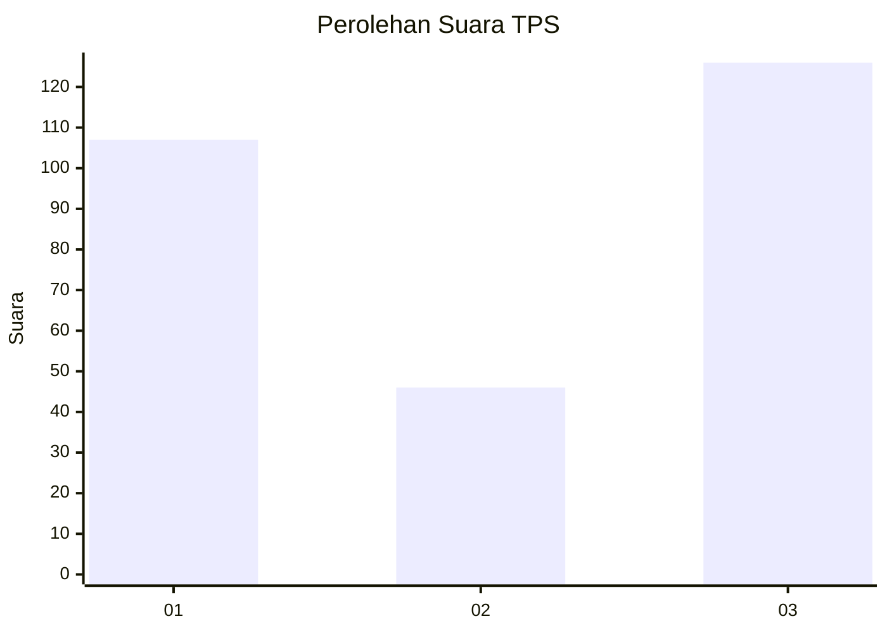
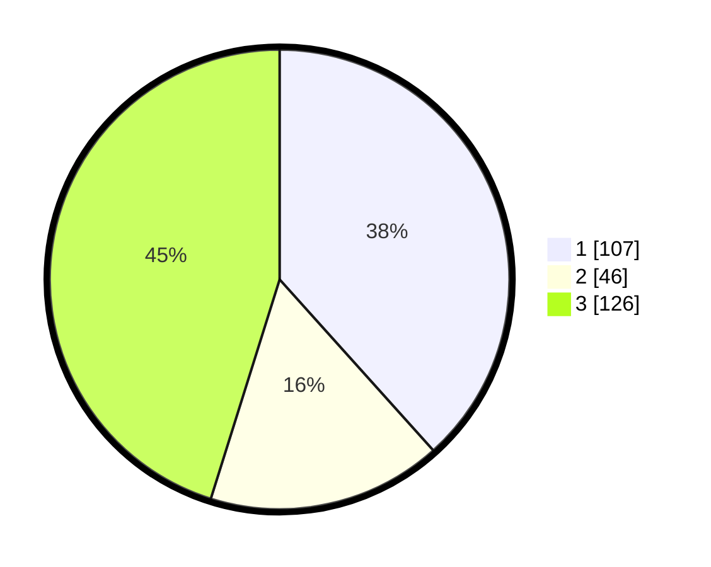

# Hasil

## Grafik

## Tabel

| No. | Nama Paslon    | Suara | Suara (raw) | Persentase |
|:--- |:-------------- | -----:| -----------:| ----------:|
| 1   | ANIES MUHAIMIN | 107   | [107][p-1]  | 38,35      |
| 2   | PRABOWO GIBRAN | 46    | [46][p-2]   | 16,49      |
| 3   | GANJAR MAHFUD  | 126   | [126][p-3]  | 45,16      |

[p-1]: https://github.com/gigit-pemilu/pemilu-2024-99-luar-negeri/blob/main/pilpres/hitung-suara/sub/99-luar-negeri/sub/26-canberra-australia/sub/01-canberra-australia/sub/0001-canberra-australia/sub/003-tps-002/sub/paslon-1.txt
[p-2]: https://github.com/gigit-pemilu/pemilu-2024-99-luar-negeri/blob/main/pilpres/hitung-suara/sub/99-luar-negeri/sub/26-canberra-australia/sub/01-canberra-australia/sub/0001-canberra-australia/sub/003-tps-002/sub/paslon-2.txt
[p-3]: https://github.com/gigit-pemilu/pemilu-2024-99-luar-negeri/blob/main/pilpres/hitung-suara/sub/99-luar-negeri/sub/26-canberra-australia/sub/01-canberra-australia/sub/0001-canberra-australia/sub/003-tps-002/sub/paslon-3.txt

## Foto C Plano

https://sirekap-obj-formc.kpu.go.id/b302/pemilu/ppwp/99/26/01/00/01/9926010001003-20240214-222942--d9b54e0c-b5e7-4c9d-b237-efeabdbdce3e.jpg

https://sirekap-obj-formc.kpu.go.id/b302/pemilu/ppwp/99/26/01/00/01/9926010001003-20240214-223028--660a5a2e-d79a-419b-af84-389820430bbb.jpg

https://sirekap-obj-formc.kpu.go.id/b302/pemilu/ppwp/99/26/01/00/01/9926010001003-20240214-215150--d6ec35e0-ba23-43bb-bded-9126fc02a99c.jpg

## Metadata

| Key        | Value               |
| ---------- | ------------------- |
| Time Stamp | 2024-02-15 15:00:29 |

