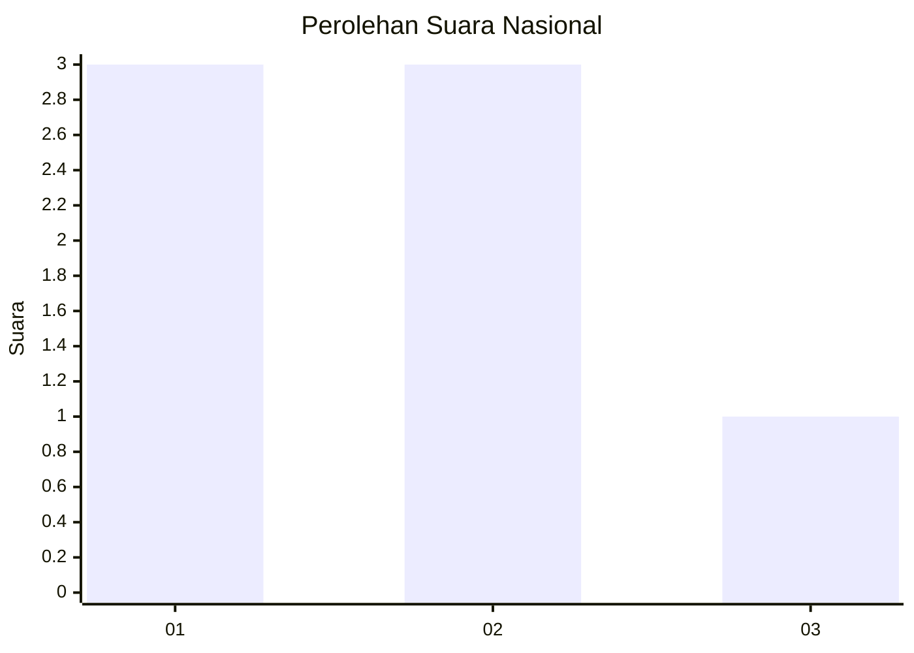
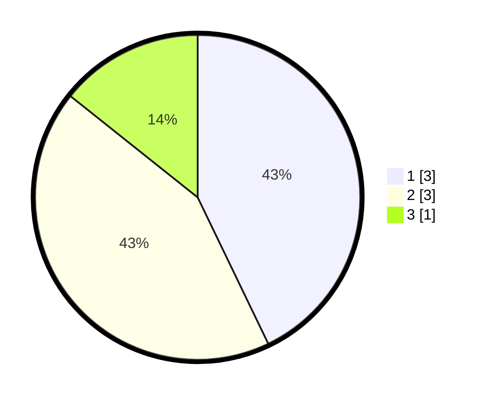

# Hasil

## Grafik

## Tabel

| No. | Nama Paslon    | Suara | Suara (raw) | Persentase |
|:--- |:-------------- | -----:| -----------:| ----------:|
| 1   | ANIES MUHAIMIN | 3     | [3][p-1]    | 42,86      |
| 2   | PRABOWO GIBRAN | 3     | [3][p-2]    | 42,86      |
| 3   | GANJAR MAHFUD  | 1     | [1][p-3]    | 14,29      |

[p-1]: https://github.com/gigit-pemilu/pemilu-2024/blob/main/pilpres/hitung-suara/sub/99-luar-negeri/sub/27-cape-town-afrika-selatan/sub/01-cape-town-afrika-selatan/sub/0001-cape-town-afrika-selatan/sub/001-pos-001/sub/paslon-1.txt
[p-2]: https://github.com/gigit-pemilu/pemilu-2024/blob/main/pilpres/hitung-suara/sub/99-luar-negeri/sub/27-cape-town-afrika-selatan/sub/01-cape-town-afrika-selatan/sub/0001-cape-town-afrika-selatan/sub/001-pos-001/sub/paslon-2.txt
[p-3]: https://github.com/gigit-pemilu/pemilu-2024/blob/main/pilpres/hitung-suara/sub/99-luar-negeri/sub/27-cape-town-afrika-selatan/sub/01-cape-town-afrika-selatan/sub/0001-cape-town-afrika-selatan/sub/001-pos-001/sub/paslon-3.txt

## Foto C Plano

https://sirekap-obj-formc.kpu.go.id/6a6b/pemilu/ppwp/99/27/01/00/01/9927010001001-20240215-173515--7a65e42a-80d9-4358-9d33-7e5585ff1e12.jpg

https://sirekap-obj-formc.kpu.go.id/6a6b/pemilu/ppwp/99/27/01/00/01/9927010001001-20240215-165443--50cbeed0-4dd4-4b90-9cd3-aaec4fbfdf4a.jpg

https://sirekap-obj-formc.kpu.go.id/6a6b/pemilu/ppwp/99/27/01/00/01/9927010001001-20240215-165633--910635c0-75ae-425c-993d-a121eaad9657.jpg

## Metadata

| Key        | Value               |
| ---------- | ------------------- |
| Time Stamp | 2024-02-17 03:30:02 |

## DATA PEMILIH TETAP

Jumlah pemilih dalam DPT: **12**.
 * L: **0**.
 * P: **12**.

## DATA PENGGUNA HAK PILIH

Jumlah pengguna hak pilih dalam DPT: **8**.
 * L: **0**.
 * P: **8**.

Jumlah pengguna hak pilih dalam DPTb: **0**.
 * L: **0**.
 * P: **0**.

Jumlah pengguna hak pilih dalam DPK: **0**.
 * L: **0**.
 * P: **0**.

Jumlah pengguna hak pilih: **8**.
 * L: **0**.
 * P: **8**.

## JUMLAH SUARA SAH DAN TIDAK SAH

JUMLAH SELURUH SUARA SAH: **7**.

JUMLAH SUARA TIDAK SAH: **0**.

JUMLAH SELURUH SUARA SAH DAN SUARA TIDAK SAH: **7**.

