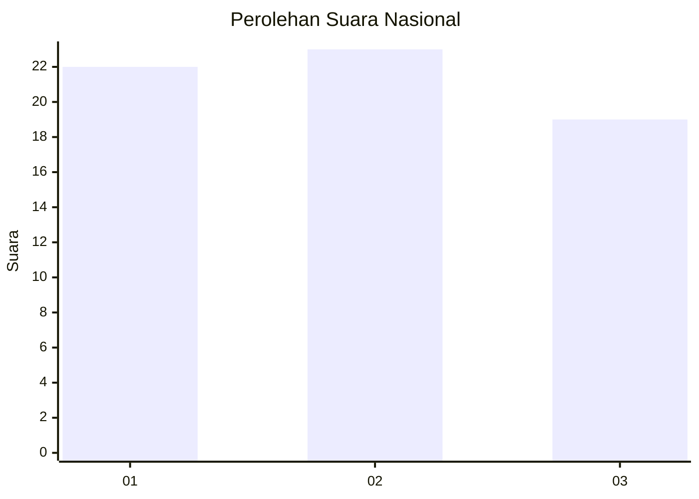
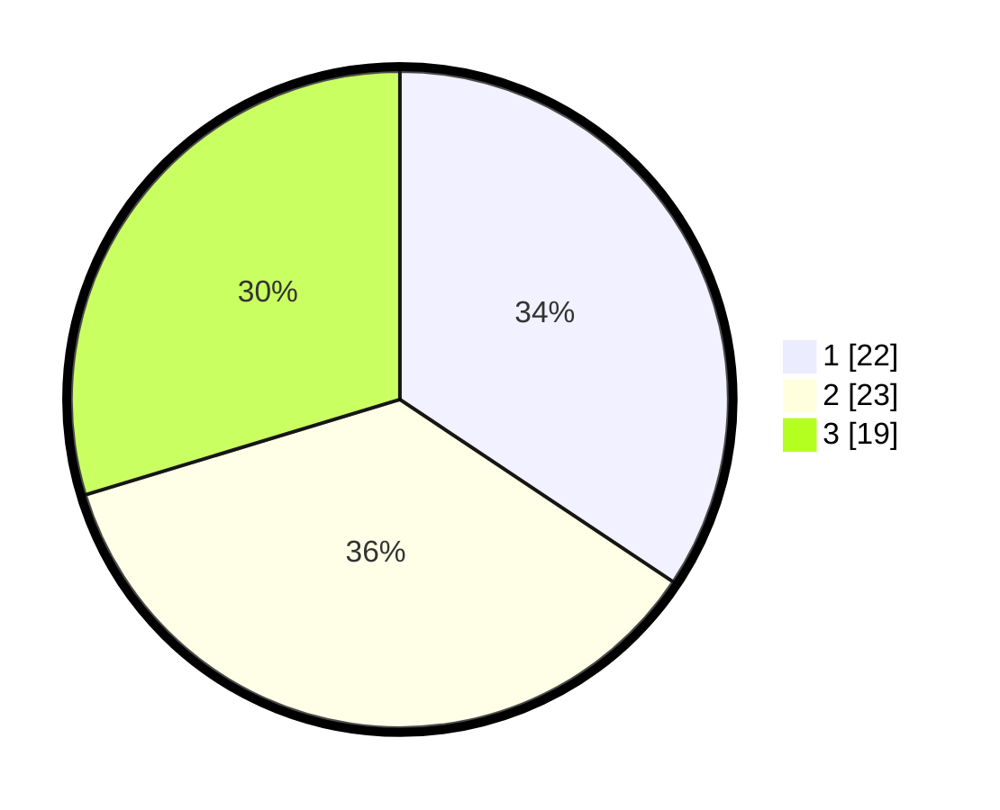

# Hasil

## Grafik

## Tabel

| No. | Nama Paslon    | Suara | Suara (raw) | Persentase |
|:--- |:-------------- | -----:| -----------:| ----------:|
| 1   | ANIES MUHAIMIN | 22    | [22][p-1]   | 34,38      |
| 2   | PRABOWO GIBRAN | 23    | [23][p-2]   | 35,94      |
| 3   | GANJAR MAHFUD  | 19    | [19][p-3]   | 29,69      |

[p-1]: https://github.com/gigit-pemilu/pemilu-2024/blob/main/pilpres/hitung-suara/sub/99-luar-negeri/sub/27-cape-town-afrika-selatan/sub/01-cape-town-afrika-selatan/sub/0001-cape-town-afrika-selatan/sub/002-tps-001/sub/paslon-1.txt
[p-2]: https://github.com/gigit-pemilu/pemilu-2024/blob/main/pilpres/hitung-suara/sub/99-luar-negeri/sub/27-cape-town-afrika-selatan/sub/01-cape-town-afrika-selatan/sub/0001-cape-town-afrika-selatan/sub/002-tps-001/sub/paslon-2.txt
[p-3]: https://github.com/gigit-pemilu/pemilu-2024/blob/main/pilpres/hitung-suara/sub/99-luar-negeri/sub/27-cape-town-afrika-selatan/sub/01-cape-town-afrika-selatan/sub/0001-cape-town-afrika-selatan/sub/002-tps-001/sub/paslon-3.txt

## Foto C Plano

https://sirekap-obj-formc.kpu.go.id/263d/pemilu/ppwp/99/27/01/00/01/9927010001002-20240216-150509--c4bdaf2c-a501-4c8b-89c9-ce7ec65bf733.jpg

https://sirekap-obj-formc.kpu.go.id/263d/pemilu/ppwp/99/27/01/00/01/9927010001002-20240216-150510--437769ef-f17f-4928-9546-31137c7bd89a.jpg

https://sirekap-obj-formc.kpu.go.id/263d/pemilu/ppwp/99/27/01/00/01/9927010001002-20240214-210122--29ab649e-a46f-4d4c-b989-2119f8f5c015.jpg

## Metadata

| Key        | Value               |
| ---------- | ------------------- |
| Time Stamp | 2024-02-17 03:30:02 |

## DATA PEMILIH TETAP

Jumlah pemilih dalam DPT: **75**.
 * L: **17**.
 * P: **58**.

## DATA PENGGUNA HAK PILIH

Jumlah pengguna hak pilih dalam DPT: **50**.
 * L: **11**.
 * P: **39**.

Jumlah pengguna hak pilih dalam DPTb: **11**.
 * L: **4**.
 * P: **7**.

Jumlah pengguna hak pilih dalam DPK: **3**.
 * L: **2**.
 * P: **1**.

Jumlah pengguna hak pilih: **64**.
 * L: **17**.
 * P: **47**.

## JUMLAH SUARA SAH DAN TIDAK SAH

JUMLAH SELURUH SUARA SAH: **64**.

JUMLAH SUARA TIDAK SAH: **0**.

JUMLAH SELURUH SUARA SAH DAN SUARA TIDAK SAH: **64**.

