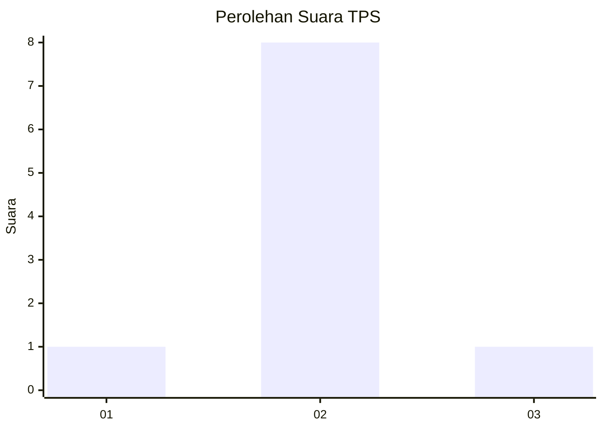
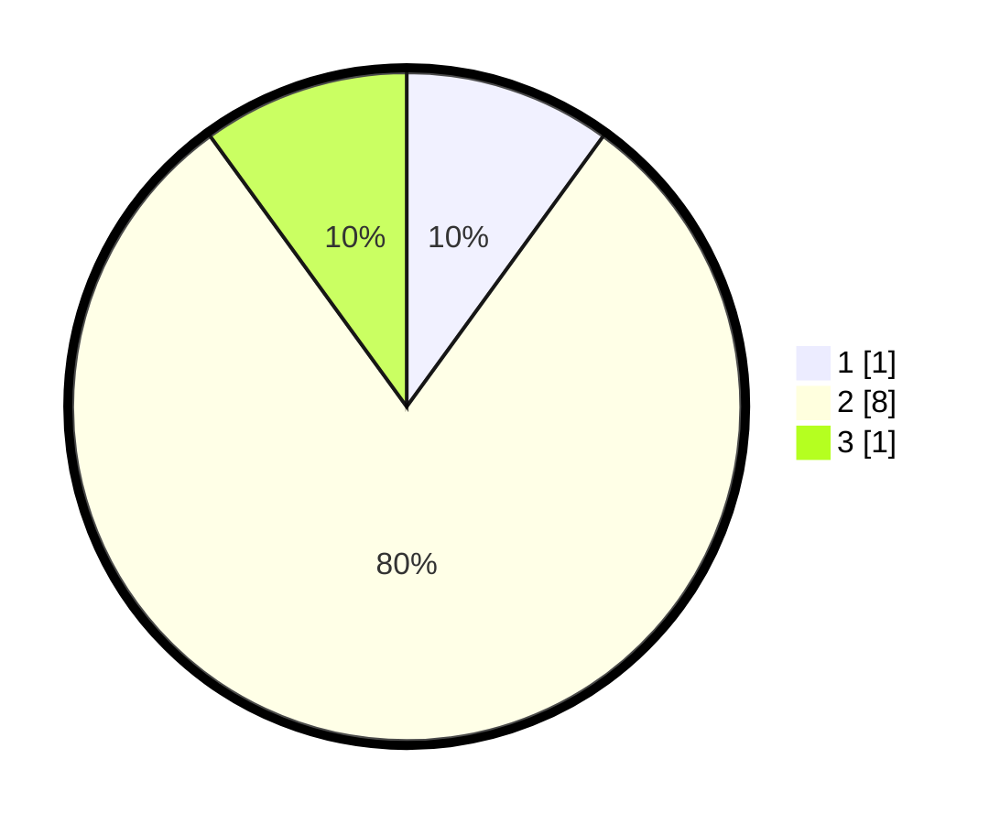

# Hasil

## Grafik

## Tabel

| No. | Nama Paslon    | Suara | Suara (raw) | Persentase |
|:--- |:-------------- | -----:| -----------:| ----------:|
| 1   | ANIES MUHAIMIN | 1     | [1][p-1]    | 10,00      |
| 2   | PRABOWO GIBRAN | 8     | [8][p-2]    | 80,00      |
| 3   | GANJAR MAHFUD  | 1     | [1][p-3]    | 10,00      |

[p-1]: https://github.com/gigit-pemilu/pemilu-2024-99-luar-negeri/blob/main/pilpres/hitung-suara/sub/99-luar-negeri/sub/27-cape-town-afrika-selatan/sub/01-cape-town-afrika-selatan/sub/0001-cape-town-afrika-selatan/sub/003-ksk-001/sub/paslon-1.txt
[p-2]: https://github.com/gigit-pemilu/pemilu-2024-99-luar-negeri/blob/main/pilpres/hitung-suara/sub/99-luar-negeri/sub/27-cape-town-afrika-selatan/sub/01-cape-town-afrika-selatan/sub/0001-cape-town-afrika-selatan/sub/003-ksk-001/sub/paslon-2.txt
[p-3]: https://github.com/gigit-pemilu/pemilu-2024-99-luar-negeri/blob/main/pilpres/hitung-suara/sub/99-luar-negeri/sub/27-cape-town-afrika-selatan/sub/01-cape-town-afrika-selatan/sub/0001-cape-town-afrika-selatan/sub/003-ksk-001/sub/paslon-3.txt

## Foto C Plano

https://sirekap-obj-formc.kpu.go.id/4543/pemilu/ppwp/99/27/01/00/01/9927010001003-20240214-190742--170c8a15-ccbd-4e7a-9fb9-12c63e2f1811.jpg

https://sirekap-obj-formc.kpu.go.id/4543/pemilu/ppwp/99/27/01/00/01/9927010001003-20240214-190808--18776dc3-78e7-4907-a1b3-80debf22e67e.jpg

https://sirekap-obj-formc.kpu.go.id/4543/pemilu/ppwp/99/27/01/00/01/9927010001003-20240214-190849--a3f11d7b-ec60-4a61-a1eb-7ad9780347b9.jpg

## Metadata

| Key        | Value               |
| ---------- | ------------------- |
| Time Stamp | 2024-02-14 21:46:01 |

## DATA PEMILIH TETAP

Jumlah pemilih dalam DPT: **38**.
 * L: **38**.
 * P: **0**.

## DATA PENGGUNA HAK PILIH

Jumlah pengguna hak pilih dalam DPT: **5**.
 * L: **5**.
 * P: **0**.

Jumlah pengguna hak pilih dalam DPTb: **5**.
 * L: **5**.
 * P: **0**.

Jumlah pengguna hak pilih dalam DPK: **0**.
 * L: **0**.
 * P: **0**.

Jumlah pengguna hak pilih: **10**.
 * L: **10**.
 * P: **0**.

## JUMLAH SUARA SAH DAN TIDAK SAH

JUMLAH SELURUH SUARA SAH: **10**.

JUMLAH SUARA TIDAK SAH: **0**.

JUMLAH SELURUH SUARA SAH DAN SUARA TIDAK SAH: **10**.

