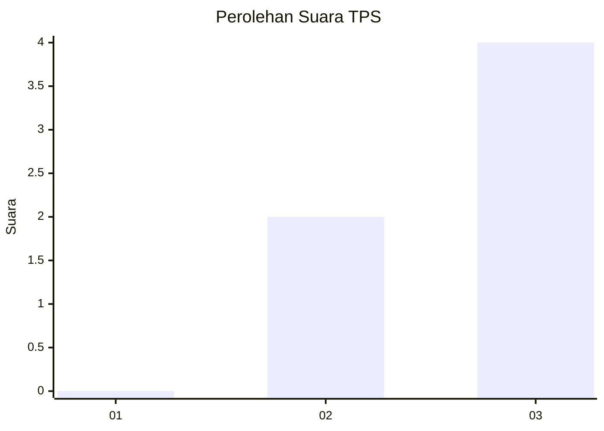
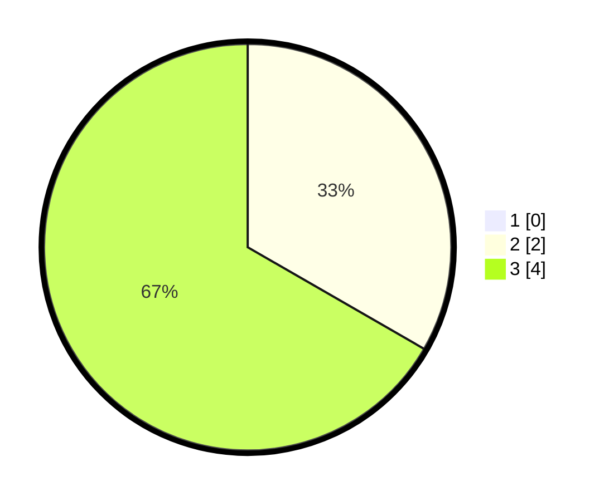

# Hasil

## Grafik

## Tabel

| No. | Nama Paslon    | Suara | Suara (raw) | Persentase |
|:--- |:-------------- | -----:| -----------:| ----------:|
| 1   | ANIES MUHAIMIN | 0     | [0][p-1]    | 0,00       |
| 2   | PRABOWO GIBRAN | 2     | [2][p-2]    | 33,33      |
| 3   | GANJAR MAHFUD  | 4     | [4][p-3]    | 66,67      |

[p-1]: https://github.com/gigit-pemilu/pemilu-2024-99-luar-negeri/blob/main/pilpres/hitung-suara/sub/99-luar-negeri/sub/28-caracas-venezuela/sub/01-caracas-venezuela/sub/0001-caracas-venezuela/sub/001-pos-001/sub/paslon-1.txt
[p-2]: https://github.com/gigit-pemilu/pemilu-2024-99-luar-negeri/blob/main/pilpres/hitung-suara/sub/99-luar-negeri/sub/28-caracas-venezuela/sub/01-caracas-venezuela/sub/0001-caracas-venezuela/sub/001-pos-001/sub/paslon-2.txt
[p-3]: https://github.com/gigit-pemilu/pemilu-2024-99-luar-negeri/blob/main/pilpres/hitung-suara/sub/99-luar-negeri/sub/28-caracas-venezuela/sub/01-caracas-venezuela/sub/0001-caracas-venezuela/sub/001-pos-001/sub/paslon-3.txt

## Foto C Plano

https://sirekap-obj-formc.kpu.go.id/bb50/pemilu/ppwp/99/28/01/00/01/9928010001001-20240217-071255--64c49dda-dd76-42f6-ab39-52184841e3cd.jpg

https://sirekap-obj-formc.kpu.go.id/bb50/pemilu/ppwp/99/28/01/00/01/9928010001001-20240217-071338--9402eb6b-efbc-4d80-a88f-ed9dc369a4a7.jpg

https://sirekap-obj-formc.kpu.go.id/bb50/pemilu/ppwp/99/28/01/00/01/9928010001001-20240217-071545--f524b5dc-937d-4bb7-a2eb-6d8635d8b374.jpg

## Metadata

| Key        | Value               |
| ---------- | ------------------- |
| Time Stamp | 2024-02-17 08:30:03 |

## DATA PEMILIH TETAP

Jumlah pemilih dalam DPT: **6**.
 * L: **2**.
 * P: **4**.

## DATA PENGGUNA HAK PILIH

Jumlah pengguna hak pilih dalam DPT: **6**.
 * L: **2**.
 * P: **4**.

Jumlah pengguna hak pilih dalam DPTb: **0**.
 * L: **0**.
 * P: **0**.

Jumlah pengguna hak pilih dalam DPK: **0**.
 * L: **0**.
 * P: **0**.

Jumlah pengguna hak pilih: **6**.
 * L: **2**.
 * P: **4**.

## JUMLAH SUARA SAH DAN TIDAK SAH

JUMLAH SELURUH SUARA SAH: **6**.

JUMLAH SUARA TIDAK SAH: **0**.

JUMLAH SELURUH SUARA SAH DAN SUARA TIDAK SAH: **6**.

